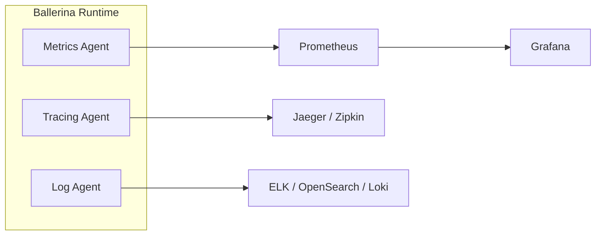

# Observability Overview

Observability is essential for understanding the behavior, performance, and health of your integrations in production. WSO2 Integrator provides built-in support for the three pillars of observability: metrics, logging, and distributed tracing. Choose from WSO2-managed solutions, self-managed open-source stacks, or commercial platforms based on your deployment model and requirements.

## The Three Pillars of Observability

| Pillar | Purpose | Key Metrics | Built-in Support |
|--------|---------|-------------|-----------------|
| **Metrics** | Quantitative measurements of system behavior | Request counts, latency, error rates, throughput | Prometheus-compatible endpoint |
| **Logging** | Structured event records for debugging and auditing | Log entries with context, error details, request tracing | Ballerina `log` module with configurable levels |
| **Distributed Tracing** | End-to-end request flow across services | Span duration, service dependencies, bottlenecks | OpenTelemetry-based tracing |

## Architecture

## WSO2 Provided Solutions

WSO2 provides fully managed observability solutions for integrations deployed on the WSO2 platform.

| Solution | Best For | Features | Setup Complexity |
|----------|----------|----------|------------------|
| **[Integration Control Plane (ICP)](integration-control-plane-icp.md)** | On-premise & hybrid deployments | Service inventory, real-time monitoring, log aggregation, deployment tracking | Low |
| **[WSO2 Integration Platform](https://wso2.com/devant/docs/monitoring-and-insights/observability-overview/)** | Cloud-native integrations | Built-in dashboards, alerting, live logs, distributed tracing, diagnostics | Very Low |
| **[Moesif](moesif-api-analytics.md)** | API analytics & monitoring | API usage tracking, request/response inspection, usage-based billing, alerting | Very Low |

### When to choose WSO2 solutions:
- You want zero or minimal setup for observability
- You need built-in integration with WSO2 platform
- You require compliance with WSO2 enterprise support
- For API analytics (Moesif), you need deep insight into API usage patterns and customer behavior

---

## Self-Managed Solutions (Open Source)

Deploy and manage your own observability stack. Ideal for organizations with existing infrastructure investments or specific compliance requirements.

### Metrics (Prometheus)
- **[Metrics Overview](metrics-overview.md)** – Enable Prometheus metrics, configure scraping, and define custom metrics

**When to use:** Open-source, self-hosted metrics collection from your Ballerina integrations.

### Logging
- **[Logging Overview](logging-overview.md)** – Configure structured logging and log aggregation approaches

**When to use:** Full-text log search, complex log processing, multi-service log correlation.

### Distributed Tracing (Jaeger or Zipkin)
- **[Jaeger Setup](jaeger-distributed-tracing.md)** – Production-grade distributed tracing
- **[Zipkin Setup](zipkin-tracing.md)** – Lightweight distributed tracing alternative

**When to use:** Trace requests across service boundaries, identify latency bottlenecks, debug request failures.

---

## Commercial Managed Solutions

Deploy your integration on managed cloud platforms with built-in observability. Lower operational overhead, SLA guarantees, and dedicated support.

| Platform | Best For | Metrics | Logging | Tracing | Setup |
|----------|----------|---------|---------|---------|-------|
| **[New Relic](new-relic-integration.md)** | Multi-cloud environments | ✅ Via OTLP | ✅ Via forwarder | ✅ Via OTLP | Low |

---

## Recipes: End-to-End Solutions

Choose a recipe based on your deployment scenario and infrastructure.

### Recipe 1: Datadog Full-Stack Observability
**Tech Stack:** Datadog Agent + Datadog Cloud

Managed cloud observability with minimal setup.

- Install Datadog Agent as sidecar
- Automatic metric, log, and trace collection
- Datadog dashboards and monitors
- Native APM and service maps

**[View Recipe](recipe-datadog-setup.md)**
