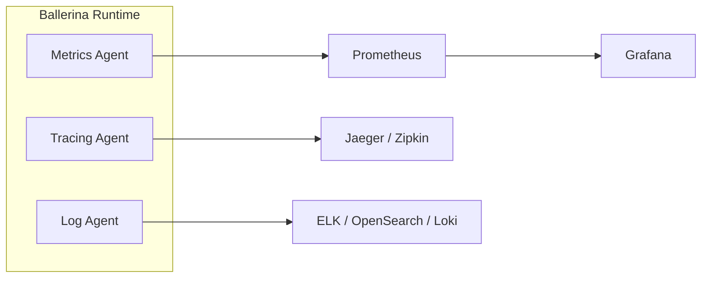

# Observability Overview

Observability is essential for understanding the behavior, performance, and health of your integrations in production. WSO2 Integrator provides built-in support for the three pillars of observability: metrics, logging, and distributed tracing.

## The Three Pillars

| Pillar | Purpose | Built-in Support |
|--------|---------|-----------------|
| **Metrics** | Quantitative measurements of system behavior (request counts, latency, error rates) | Prometheus-compatible metrics endpoint |
| **Logging** | Structured event records for debugging and auditing | Ballerina `log` module with configurable levels |
| **Tracing** | End-to-end request flow across services | OpenTelemetry-based distributed tracing |

## Enabling Observability

Add the observability flag at build time:

```bash
bal build --observability-included
```

Or include it at runtime:

```bash
bal run --observability-included
```

Configure observability in `Config.toml`:

```toml
[ballerina.observe]
metricsEnabled = true
metricsReporter = "prometheus"
tracingEnabled = true
tracingProvider = "jaeger"
```

## Architecture



## Supported Integrations

| Tool | Category | Page |
|------|----------|------|
| WSO2 Devant | Full-stack observability | [Devant](devant.md) |
| Prometheus | Metrics collection | [Prometheus](prometheus.md) |
| Grafana | Metrics visualization | [Grafana](grafana.md) |
| Jaeger | Distributed tracing | [Jaeger](jaeger.md) |
| Zipkin | Distributed tracing | [Zipkin](zipkin.md) |
| Datadog | Full-stack observability | [Datadog](datadog.md) |
| New Relic | Full-stack observability | [New Relic](new-relic.md) |
| Elastic Stack (ELK) | Log aggregation & search | [Elastic](elastic.md) |
| OpenSearch | Log aggregation & search | [OpenSearch](opensearch.md) |
| Moesif | API analytics | [Moesif](moesif.md) |

## Default Metrics

When observability is enabled, the following metrics are automatically collected:

| Metric | Type | Description |
|--------|------|-------------|
| `http_requests_total` | Counter | Total HTTP requests received |
| `http_request_duration_seconds` | Histogram | Request latency distribution |
| `http_response_errors_total` | Counter | Total error responses (4xx, 5xx) |
| `http_active_connections` | Gauge | Currently active connections |
| `ballerina_sql_query_duration_seconds` | Histogram | Database query latency |
| `ballerina_kafka_messages_total` | Counter | Kafka messages produced/consumed |

## Quick Start

Enable observability with Prometheus and Jaeger in four steps:

1. Import the Prometheus extension in your `main.bal`:

```ballerina
import ballerinax/prometheus as _;
```

2. Add observability to your `Ballerina.toml`:

```toml
[build-options]
observabilityIncluded = true
```

3. Configure `Config.toml`:

```toml
[ballerina.observe]
metricsEnabled = true
metricsReporter = "prometheus"
tracingEnabled = true
tracingProvider = "jaeger"

[ballerinax.jaeger]
agentHostname = "localhost"
agentPort = 6831
```

4. Run the integration:

```bash
bal run --observability-included
```

Metrics are available at `http://localhost:9797/metrics`.

For Grafana visualization, import dashboard ID **5841** to get pre-built panels for Ballerina metrics.

## What's Next

- [Prometheus](prometheus.md) -- Set up metrics collection
- [Grafana](grafana.md) -- Visualize metrics with dashboards
- [Jaeger](jaeger.md) -- Enable distributed tracing
- [Logging & Structured Logs](logging.md) -- Configure structured logging
