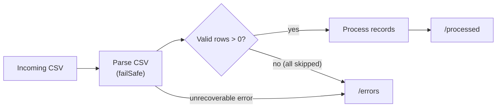

# CSV Fault Tolerance

Real-world CSV files often contain malformed rows — missing columns, wrong data types, or corrupted values. By default, a single bad row fails the entire file. Fault-tolerant processing skips invalid rows, logs errors, and continues with valid data.

This page covers the **integration pattern** for wiring fail-safe CSV parsing into an FTP/SFTP file handler. For the parser configuration itself (`csv:parseList`, `failSafe` options, `enableConsoleLogs`, `fileOutputMode`), see [CSV processing](../../transform/csv-flat-file.md).

## How it works

The fault-tolerance pattern combines three mechanisms:

1. **Fail-safe parsing** — `csv:parseList` with the `failSafe` option skips rows that cannot be bound to the target record type, instead of returning an error.
2. **Zero-records check** — After parsing, verify that at least one valid record exists. If all rows were skipped, explicitly return an error so the file routes to the error path.
3. **Automatic file routing** — `@ftp:FunctionConfig` with `afterProcess` and `afterError` moves files to `/processed` or `/errors` based on whether the handler returns `nil` or `error`.



## Example

The handler receives CSV content as `string[][]` (raw rows), parses them into typed records with `failSafe`, and lets `@ftp:FunctionConfig` handle file routing.

1. Create an FTP/SFTP service following the steps in [Creating an FTP service](ftp-sftp.md#creating-an-ftp-service).
2. Add a file handler with **File Format** set to **CSV** and **Rows** selected. Under **After File Processing**, set **Success** to **Move** with destination `/processed` and **Error** to **Move** with destination `/errors`.
3. In the handler logic, use a **CSV Parse** step with fail-safe enabled to parse rows into your target record type.

```ballerina
import ballerina/data.csv;
import ballerina/ftp;
import ballerina/log;

type InventoryRecord record {|
    string warehouseId;
    string sku;
    string productName;
    int quantity;
    decimal unitPrice;
    string lastUpdated;
|};

listener ftp:Listener ftpListener = new (
    protocol = ftp:FTP,
    host = ftpHost,
    port = ftpPort,
    auth = {credentials: {username: ftpUser, password: ftpPassword}},
    pollingInterval = 10
);

@ftp:ServiceConfig {
    path: "/incoming",
    fileNamePattern: ".*\\.csv"
}
service on ftpListener {

    @ftp:FunctionConfig {
        afterProcess: {moveTo: "/processed"},
        afterError: {moveTo: "/errors"}
    }
    remote function onFileCsv(string[][] content, ftp:FileInfo fileInfo) returns error? {
        log:printInfo(string `Processing file: ${fileInfo.name}`);

        do {
            InventoryRecord[] records = check csv:parseList(content, {
                customHeaders: ["warehouseId", "sku", "productName",
                                "quantity", "unitPrice", "lastUpdated"],
                failSafe: {
                    enableConsoleLogs: true,
                    fileOutputMode: {
                        filePath: "./logs/csv-errors.log",
                        contentType: csv:METADATA,
                        fileWriteOption: csv:APPEND
                    }
                }
            });

            // Zero-records check — if every row was skipped, route to /errors
            if records.length() == 0 {
                return error(string `No valid records in ${fileInfo.name}`);
            }

            // Process valid records
            foreach InventoryRecord item in records {
                log:printInfo(string `SKU: ${item.sku}, Qty: ${item.quantity}`);
            }
        } on fail error err {
            log:printError(string `Failed: ${fileInfo.name}`, 'error = err);
            return err;
        }
    }
}
```

### Key points

- **`onFileCsv(string[][] content, ...)`** — Receives rows as a raw string array. This gives you control over parsing with fail-safe options rather than relying on automatic data binding.
- **`failSafe`** — Malformed rows (for example, `"INVALID"` in an `int` column) are skipped. Errors are logged to the console and written to an error log file.
- **`customHeaders`** — Maps positional columns to record field names since `string[][]` content does not include header names.
- **Zero-records check** — Without this, the handler would succeed with an empty array and the file would move to `/processed` instead of `/errors`.
- **`do/on fail`** — Catches unrecoverable errors during parsing or processing and re-returns them so `afterError` triggers.

## When to use

| Scenario | Approach |
|---|---|
| Most rows are valid, occasional bad data | Enable `failSafe`, log errors, process the rest |
| Bad data must block the entire file | Don't use `failSafe`; the handler returns an error and `afterError` routes the file |
| Every row must be accounted for | Use `failSafe` with a log file, then compare `records.length()` against `content.length()` |

## What's next

- [CSV processing](../../transform/csv-flat-file.md) — fail-safe parser configuration, custom delimiters, projections
- [Streaming large files](streaming-large-files.md) — process CSV files row-by-row without loading into memory
- [FTP / SFTP](ftp-sftp.md) — service configuration, authentication, and post-processing reference
- [CSV FTP processing tutorial](../../../tutorials/walkthroughs/csv-ftp-processing.md) — end-to-end walkthrough with sample data and Docker FTP server
