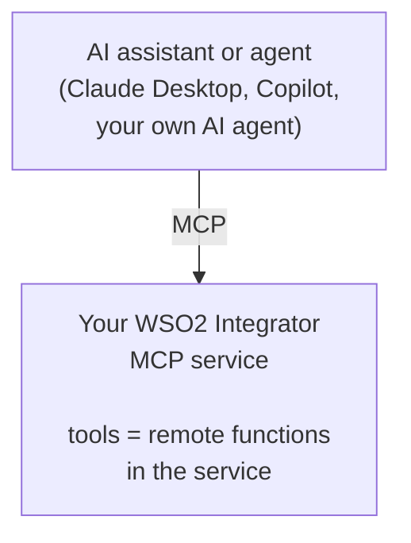
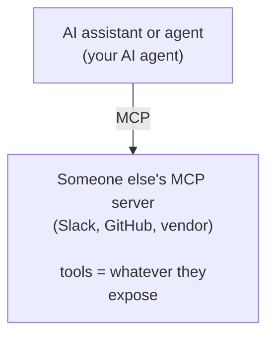

# MCP integration

The **Model Context Protocol** (MCP) is an open standard that lets AI assistants discover and call tools exposed by external servers. See the [MCP specification](https://modelcontextprotocol.io) for the protocol details.

WSO2 Integrator can act as both an **MCP server** (exposing your integrations as standardized tools for AI assistants) and an **MCP client** (using tools published by other MCP servers from inside your own AI agents).

## Features at a glance

| Feature | What it is | Where you find it |
|---|---|---|
| [Exposing a service as MCP](exposing-as-mcp.md) | Build an MCP service in WSO2 Integrator. Pick a listener, add tools, and configure each tool's name, description, and parameters. | **Artifacts** > **AI Integration** > **MCP Service**. |
| [Consuming MCP from an agent](consuming-mcp-from-agent.md) | Add an MCP server as a tool source for an AI Agent, optionally filtered to specific tools. | Agent canvas > **+ Add Tool** > **Use MCP Server**. |

## When to use MCP

| Use MCP when... | Look elsewhere when... |
|---|---|
| You want your integration's capabilities reusable by Claude Desktop, GitHub Copilot, or any other MCP client. | Only your own agents will consume the tools. Local function tools work fine. |
| You want to consume tools published by community or vendor MCP servers. | The tools live behind a normal HTTP API and a connector already covers them. |
| You need a standard, governed boundary between the AI surface and your tools (auth, rate limits, audit). | Tooling is internal-only and ephemeral. |

## How the two sides fit together

*Exposing as MCP*

*Consuming MCP from an agent*

You can do both in the same project. A single integration might expose a few tools (your CRM lookups) over MCP for outside assistants while also consuming Slack and GitHub MCP servers from its own AI agents.

## Where MCP lives in WSO2 Integrator

The MCP feature surface is split between the artifact catalogue and the agent's Add Tool dialog:

| Surface | What it does | Created where |
|---|---|---|
| **MCP Service** artifact | A top-level artifact that publishes tools over MCP. Listed under **AI Integration** alongside AI Chat Agent. | Artifacts > AI Integration > MCP Service |
| **`mcp:Listener`** | The listener an MCP service runs on. Created when you add the first MCP service, and reusable across services. | Listeners > `mcpListener` |
| **`mcp:Service` and `mcp:AdvancedService`** | The service body. `mcp:Service` derives tools from `remote function`s. `mcp:AdvancedService` lets you implement `onListTools` and `onCallTool` for dynamic tool sets. | Inside the MCP Service editor |
| **Add MCP Server panel** | The tool-source picker on the agent canvas. Generates an `ai:McpBaseToolKit` that pulls tools from a remote MCP server. | Agent canvas > + Add Tool > Use MCP Server |
| **Tool Configuration panel** | Per-tool editor inside an MCP service. Sets name, description, parameters, and return type. | MCP Service editor > + Add Tool |

## Transport

WSO2 Integrator's MCP support runs over **Streamable HTTP**, the modern web-friendly MCP transport. The listener exposes a single endpoint (for example, `http://localhost:8080/mcp`). Clients connect to it, and the protocol multiplexes tool listing and tool calls over the same connection.

Because the transport is HTTP, the listener accepts any `http:ListenerConfiguration` option, including TLS, request limits, and timeouts. See [Listener configuration](exposing-as-mcp.md#listener-configuration).

## Common pitfalls

| Symptom | Likely cause | Fix |
|---|---|---|
| MCP client connects but sees no tools. | The `mcp:Service` has no `remote function`s yet, or no tools were added through the editor. | Click **+ Add Tool** in the MCP Service editor. |
| Client gets HTTP 404. | Wrong URL. Base path or listener port mismatch. | Check the listener port (`mcpListener` in the project sidebar) and the service base path (`/mcp` by default). |
| Tool call returns `Invalid parameters: ...`. | The arguments sent by the client do not match the tool's parameter types, so the framework rejects the call before invoking the tool. | Loosen the parameter type if it is too strict, or sharpen the parameter description so the model sends the right shape. |
| Agent picks the wrong MCP tool. | Tool descriptions are too generic or overlap. | Tighten each tool's first sentence. State *what* and *when*. See [Writing a good tool description](exposing-as-mcp.md#writing-a-good-tool-description). |
| Agent prompt becomes large after adding an MCP server. | The server advertises many tools and **Tools to Include** is set to `All`. | Filter **Tools to Include** to just the names you need. See [Filtering tools](consuming-mcp-from-agent.md#filtering-tools). |
| MCP calls time out from a remote agent. | The Add MCP Server panel's default 30-second timeout is too short for slow tools. | Raise **Timeout** on the agent's Add MCP Server panel. |

## What's next

- **[Exposing a service as MCP](exposing-as-mcp.md)** — turn your integration into an MCP server.
- **[Consuming MCP from an agent](consuming-mcp-from-agent.md)** — let your agent use tools from any MCP server.
- **[MCP specification](https://modelcontextprotocol.io)** — the protocol spec.
