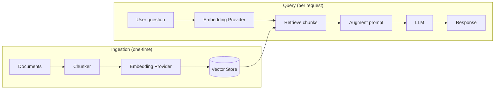

# RAG

RAG (Retrieval-Augmented Generation) grounds LLM responses in your own documents. Instead of relying solely on the model's training data, which can be outdated or incomplete, RAG retrieves relevant content from your knowledge base at query time and injects it into the prompt.

This solves two common problems with direct LLM calls:

- **Hallucinations** — the model produces plausible-sounding but incorrect answers because it doesn't have access to your specific content.
- **Stale knowledge** — the model's training data has a cutoff and won't reflect your latest documentation or data.

## How it works

RAG operates in two stages:

1. **Ingestion**: Documents are split into chunks, converted into vector embeddings, and stored in a vector store.
2. **Query**: When a user asks a question, the most relevant chunks are retrieved by semantic similarity and injected into the prompt alongside the question. The model answers using only that retrieved context.

## RAG in WSO2 Integrator

WSO2 Integrator provides both stages as built-in pipeline components:

- **[RAG ingestion](rag-ingestion.md)**: Load documents, chunk them, generate embeddings, and store vectors in a knowledge base.
- **[RAG query](rag-query.md)**: Retrieve the most relevant chunks, augment the user query, and generate a grounded response.
