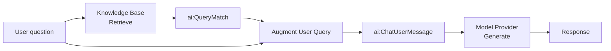

# RAG Query

The query pipeline runs on every user request. It retrieves relevant chunks from the vector knowledge base populated during ingestion, combines them with the user's question, and calls the LLM to produce a grounded response.

This page covers building the query pipeline in the WSO2 Integrator: wiring up retrieve, augment, and generate nodes, and testing the endpoint.

> Before you start, complete [RAG Ingestion](rag-ingestion.md). The query pipeline reads from the same Knowledge Base that ingestion writes to.

---

## What the pipeline does



The four nodes — **Retrieve**, **Augment User Query**, **Generate**, and **Return** — map directly to Steps 2–6 below.

---

## Prerequisites

- The ingestion pipeline from [RAG Ingestion](rag-ingestion.md) has been run at least once so the Knowledge Base contains vectors.
- The same Knowledge Base and Embedding Provider used during ingestion are available in this project.
- A configured model provider. The default WSO2 provider works out of the box — run `Ballerina: Configure default WSO2 model provider` if you haven't already.
- An **HTTP service** with a `POST /query` resource and a `userQuery` string payload parameter. See Step 1 below.

---

## Step 1: Create an HTTP service

1. Click **+ Add Artifact** in the project view and select **HTTP Service**.
2. Change the HTTP method to **POST** and rename the resource to `query`.
3. Add a payload parameter named `userQuery` of type `string`.


---

## Step 2: Retrieve from the knowledge base

The **Retrieve** action queries the Knowledge Base for chunks most similar to the user's question.

1. In the flow editor, click **+** to open the **Add Node** panel.
2. Go to **AI → RAG → Knowledge Base** and select the **Retrieve** action.

    > If you don't have a Knowledge Base yet, create one first by following [Knowledge Bases](/docs/genai/develop/components/knowledge-bases).


3. Configure the node:

| Field | Required | Value |
|---|---|---|
| **Knowledge Base** | Yes | The same Knowledge Base created during ingestion — e.g. `knowledgeBase`. |
| **Query** | Yes | Bind to the incoming user question — e.g. `userQuery`. |
| **Top K** | No | Number of chunks to return. Default is `10`. Increase if relevant content is being missed; use `-1` to return all. |
| **Filters** | No | Metadata filters to restrict results — useful for multi-tenant scenarios where users should only see their own documents. |
| **Result variable** | — | e.g. `context` |

4. Click **Save**.


The result is an array of `ai:QueryMatch` values. Each entry contains a chunk and its similarity score against the query.

> **Use the same Knowledge Base as ingestion.** Retrieve is the read-side counterpart to Ingest — it must point to the same Knowledge Base and the same Embedding Provider. Pointing to a different one returns no useful results.


---

## Step 3: Augment the user query

The **Augment User Query** node combines the retrieved chunks with the original question into a single formatted `ai:ChatUserMessage` ready for the LLM.

1. Click **+** after the Retrieve node.
2. Go to **AI → RAG → Augment Query**.
3. Configure the node:

| Field | Required | Value |
|---|---|---|
| **Context** | Yes | The retrieval results — e.g. `context`. |
| **Query** | Yes | The original user question — e.g. `userQuery`. |
| **Result variable** | — | e.g. `augmentedUserMsg` |

4. Click **Save**.


This step handles prompt construction automatically — you do not need to manually interleave chunks and questions.


---

## Step 4: Add a model provider

1. Click **+** after the Augment node.
2. Go to **AI → Model Provider**.
3. Select a model provider — e.g. **Default Model Provider (WSO2)** — and set the name to `defaultModel`.
4. Click **Save**.


---

## Step 5: Generate the response

The **Generate** action calls the LLM with the augmented message and returns the model's answer.

1. Click **+** after the model provider node.
2. Select the `defaultModel` variable and choose the **Generate** action.


3. Configure the node:

| Field | Required | Value |
|---|---|---|
| **Prompt** | Yes | The augmented message content — e.g. `check augmentedUserMsg.content.ensureType()`. |
| **Expected type** | No | Set to `string` for plain-text responses. Use a record type to get a structured response. |
| **Result variable** | — | e.g. `response` |

4. Click **Save**.


---

## Step 6: Return the response

1. Click **+** after the Generate node.
2. Select **Return**.
3. Set the expression to `response`.
4. Click **Save**.


---

## Running and testing

Click **Run** at the top right. Once the integration starts, test the endpoint:

```bash
curl -X POST http://localhost:9090/query \
  -H "Content-Type: application/json" \
  -d '"<your question>"'
```

The response will be grounded in the documents you ingested.

---

## Tuning retrieval quality

| Parameter | Where | What it does |
|---|---|---|
| **Top K** | Retrieve node | Controls how many chunks are passed to the LLM. Too few and relevant content is missed; too many and the model gets noisy context. Start at `5`–`10`. |
| **Filters** | Retrieve node | Restrict results by metadata. Use a `source` or `tenantId` field to isolate results per user or document set. |
| **Chunker** | Knowledge Base (ingestion) | Affects chunk boundaries and size. Switch from `ai:AUTO` to a structure-aware chunker (Markdown, HTML) if retrieval quality is poor. Re-ingest after changing. |

---

## What's next

- **[RAG Ingestion](rag-ingestion.md)** — populate the knowledge base the query pipeline reads from.
- **[Knowledge Bases](/docs/genai/develop/components/knowledge-bases)** — retrieve, delete-by-filter, and tuning reference.
- **[Embedding Providers](/docs/genai/develop/components/embedding-providers)** — available providers and dimension requirements.
- **[Chunkers](/docs/genai/develop/components/chunkers)** — controlling how documents are split for better retrieval.
