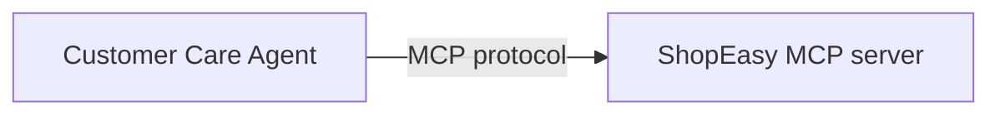

# Build a customer care agent with MCP

## What you'll build



A customer care agent that connects to a ShopEasy MCP server and answers product availability, order status, and return questions over a chat API.

This tutorial shows how to build an agent that consumes an external MCP server using `ai:McpToolKit`. You do not build the MCP server here. It is provided as a running service. Your job is to wire the agent to it, write the system prompt, and expose a chat endpoint.

The agent receives customer messages over HTTP, reasons about which tool to call, invokes the MCP server, and returns a natural language answer.

:::info Prerequisites
- [WSO2 Integrator set up for AI](../getting-started/setting-up-ai.md)
- The **ShopEasy MCP server** running locally. Clone the repo and follow its README to start it: [github.com/wso2/integration-samples](https://github.com/wso2/integration-samples/tree/main/integrator-default-profile/samples/customer-care-agent/mcp).

## Step 1: Create the agent

1. Open WSO2 Integrator and create or select your project.
2. Select **Add Artifact**.
3. Under **AI Integration**, select **AI Chat Agent**.
4. Set the **Name** to `Customer Care Agent` and select **Create**.

<ThemedImage
    alt="The Add Artifact panel with AI Chat Agent selected under the AI Integration section"
    sources={{
        light: useBaseUrl('/img/genai/tutorials/customer-care-agent-mcp/create-agent-1.png'),
        dark: useBaseUrl('/img/genai/tutorials/customer-care-agent-mcp/create-agent-1.png'),
    }}
/>

The visual designer opens with the agent flow: a **Start** node, an **AI Agent** node, and a **Return** node.

## Step 2: Configure the agent

### 2.1 Open the agent configuration

Select the **AI Agent** node to open the configuration panel on the right.

<ThemedImage
    alt="The AI Chat Agent visual designer showing the agent flow with Start, AI Agent, and Return nodes"
    sources={{
        light: useBaseUrl('/img/genai/tutorials/customer-care-agent-mcp/configure-agent-1.png'),
        dark: useBaseUrl('/img/genai/tutorials/customer-care-agent-mcp/configure-agent-1.png'),
    }}
/>

### 2.2 Write the system prompt

1. Set the **Role** to `Customer Support Agent`.
2. Paste the following into **Instructions**:

```
You are a helpful customer support agent for ShopEasy, an online retailer.
Help customers with product availability, order tracking, and return requests.
Always use the available tools to look up accurate information — never guess.
Keep responses friendly and concise. Include relevant IDs (order ID, return ID) in your responses.
```

<ThemedImage
    alt="The agent configuration panel showing the Role and Instructions fields filled in"
    sources={{
        light: useBaseUrl('/img/genai/tutorials/customer-care-agent-mcp/configure-agent-2.png'),
        dark: useBaseUrl('/img/genai/tutorials/customer-care-agent-mcp/configure-agent-2.png'),
    }}
/>

### 2.3 Set advanced configurations

1. Expand **Advanced Configurations**.
2. Set **Maximum Iterations** to `10`.
3. Select **Save**.

<ThemedImage
    alt="The advanced configuration panel showing Maximum Iterations set to 10"
    sources={{
        light: useBaseUrl('/img/genai/tutorials/customer-care-agent-mcp/configure-agent-3.png'),
        dark: useBaseUrl('/img/genai/tutorials/customer-care-agent-mcp/configure-agent-3.png'),
    }}
/>

:::info Why set Maximum Iterations to 10?
The default is based on the number of toolkit objects, not individual tools. With one MCP toolkit wrapping three tools, the default is 2, which is too low for multi-step queries. Setting it to 10 gives the agent enough room to reason, call a tool, and respond.

## Step 3: Add the MCP server as a tool

### 3.1 Select the tool type

1. Select **+** on the **AI Agent** node.
2. Select **Use MCP Server**.

<ThemedImage
    alt="The Add Tool panel with Use MCP Server highlighted"
    sources={{
        light: useBaseUrl('/img/genai/tutorials/customer-care-agent-mcp/add-mcp-1.png'),
        dark: useBaseUrl('/img/genai/tutorials/customer-care-agent-mcp/add-mcp-1.png'),
    }}
/>

### 3.2 Configure the server URL

1. Set **Server URL** to `http://localhost:8080/mcp`.
2. Leave **Requires Authentication** off.
3. Select **Save**.

<ThemedImage
    alt="The Add MCP Server panel with the server URL set to http://localhost:8080/mcp"
    sources={{
        light: useBaseUrl('/img/genai/tutorials/customer-care-agent-mcp/add-mcp-2.png'),
        dark: useBaseUrl('/img/genai/tutorials/customer-care-agent-mcp/add-mcp-2.png'),
    }}
/>

The MCP toolkit appears as `aiMcpbasetoolkit` attached to the agent node in the visual designer. The agent will discover the available tools from the server at startup.

<ThemedImage
    alt="The completed agent flow showing the AI Agent node connected to the aiMcpbasetoolkit"
    sources={{
        light: useBaseUrl('/img/genai/tutorials/customer-care-agent-mcp/add-mcp-3.png'),
        dark: useBaseUrl('/img/genai/tutorials/customer-care-agent-mcp/add-mcp-3.png'),
    }}
/>

## Step 4: Run and test

Make sure the ShopEasy MCP server is running, then click the **Play** button in the top-right corner of the WSO2 Integrator IDE to start the agent.

Once the agent is running, click **Chat** in the toolbar (next to **Tracing: Off**) to open the built-in chat panel. Type your message in the input field and press **Enter** to send it.

Try the following messages to exercise all three tools:

- *"Do you have any wireless headphones in stock?"*
- *"What is the status of my order ORD-042?"*
- *"I want to return ORD-001. The item arrived damaged."*

<ThemedImage
    alt="The agent running in the WSO2 Integrator IDE with the MCP toolkit connected and the Ballerina Debug indicator active"
    sources={{
        light: useBaseUrl('/img/genai/tutorials/customer-care-agent-mcp/run-and-test.gif'),
        dark: useBaseUrl('/img/genai/tutorials/customer-care-agent-mcp/run-and-test.gif'),
    }}
/>

For more detail on using the chat panel, see [Testing chat agents](../../develop/test/built-in-try-it-tool#testing-chat-agents).

**`connections.bal`**: model provider and MCP toolkit connection:

```ballerina
import ballerina/ai;

final ai:Wso2ModelProvider wso2ModelProvider = check ai:getDefaultModelProvider();

final AiMcpbasetoolkit aiMcpbasetoolkit = check new ("http://localhost:8080/mcp");
```

**`agents.bal`**: agent definition:

```ballerina
import ballerina/ai;
import ballerina/mcp;

final ai:Agent customerCareAgent = check new (
    systemPrompt = {
        role: string `Customer Care Agent`,
        instructions: string `You are a helpful customer support agent for ShopEasy, an online retailer.
Help customers with product availability, order tracking, and return requests.
Always use the available tools to look up accurate information. Never guess.
Keep responses friendly and concise. Include relevant IDs (order ID, return ID) in your responses.`
    }, maxIter = 10, model = wso2ModelProvider, tools = [aiMcpbasetoolkit]
);

isolated class AiMcpbasetoolkit {
    *ai:McpBaseToolKit;
    private final mcp:StreamableHttpClient mcpClient;
    private final readonly & ai:ToolConfig[] tools;

    public isolated function init(string serverUrl, mcp:Implementation info = {name: "MCP", version: "1.0.0"},
            *mcp:StreamableHttpClientTransportConfig config) returns ai:Error? {
        do {
            self.mcpClient = check new mcp:StreamableHttpClient(serverUrl, config);
            self.tools = check ai:getPermittedMcpToolConfigs(self.mcpClient, info, self.callTool).cloneReadOnly();
        } on fail error e {
            return error ai:Error("Failed to initialize MCP toolkit", e);
        }
    }

    public isolated function getTools() returns ai:ToolConfig[] => self.tools;

    @ai:AgentTool
    public isolated function callTool(mcp:CallToolParams params) returns mcp:CallToolResult|error {
        return self.mcpClient->callTool(params);
    }
}
```

**`main.bal`**: HTTP chat service:

```ballerina
import ballerina/ai;
import ballerina/http;

listener ai:Listener chatAgentListener = new (listenOn = check http:getDefaultListener());

service /customerCareAgent on chatAgentListener {
    resource function post chat(@http:Payload ai:ChatReqMessage request) returns ai:ChatRespMessage|error {
        string stringResult = check customerCareAgent.run(request.message, request.sessionId);
        return {message: stringResult};
    }
}
```

To run and test the agent, follow the same steps in the **Visual Designer** tab under [Step 4: Run and test](#step-4-run-and-test).

## What you built

- Connected an agent to a live MCP server using `ai:McpToolKit`
- The agent dynamically discovered three tools (`searchProducts`, `getOrderStatus`, `submitReturnRequest`) at startup with no hardcoded tool definitions
- Exposed the agent as an HTTP chat service with session-scoped memory

## What's next

- [Exposing a service as an MCP server](../develop/mcp/exposing-as-mcp) — Build your own MCP server like the one used in this tutorial
- [Consuming MCP from an agent](../develop/mcp/consuming-mcp-from-agent) — Deeper reference for `ai:McpToolKit` options
- [Adding memory to an agent](../develop/agents/memory) — Persist conversation history across sessions
- [AI agent observability](../develop/agents/observability) — Trace tool calls and monitor agent performance
