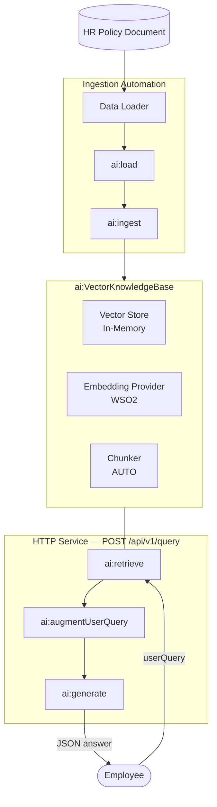

# Building an HR knowledge base with RAG

**Time:** 30 minutes | **Level:** Intermediate | **What you'll build:** Two artifacts in a single integration. An Automation that ingests HR policy documents, and an HTTP Service that answers employee questions with retrieval-augmented generation.

Build a complete HR retrieval-augmented generation pipeline visually in the WSO2 Integrator visual designer. The Automation ingests an HR policy document into a vector knowledge base. The HTTP Service answers employee questions over HTTP, grounded in the ingested chunks.

**What you'll learn:**

- How to load and ingest documents into a vector knowledge base.
- How to configure a vector store, embedding provider, and chunker visually.
- How to retrieve relevant chunks and ground an LLM response with them.
- How to expose the result over HTTP as a reusable service.

## Prerequisites

- An HR policy document in plain-text form (for example, a leave policy or code of conduct). A short `.md` file is enough to follow the tutorial.

:::info Default model and embedding providers
The default WSO2 model provider and embedding provider share the same access token. WSO2 Integrator prompts you to run **Ballerina: Configure default WSO2 model provider** from the Command Palette (`Cmd+Shift+P` / `Ctrl+Shift+P`) the first time you create either provider in a flow. Sign in with your WSO2 account when prompted, and WSO2 Integrator wires the configuration into your project automatically.


The access token expires after a few hours. If a request to the default model provider or embedding provider starts failing, rerun **Ballerina: Configure default WSO2 model provider** from the Command Palette to refresh the token.

## Architecture



The Automation flow walks documents through a chunker, embedding model, and vector store. The query flow walks an employee question through retrieval, augmentation, generation, and a JSON response.

## Step 1: Open the integration

Open or create an integration project in WSO2 Integrator. The empty integration view shows an **+ Add Artifact** button. That's your starting point for the whole tutorial.


Click **+ Add Artifact**. The artifact catalog opens, grouping the artifact types by category.


You will create two artifacts in this catalog. An **Automation** (under *Automation*) for ingestion, then an **HTTP Service** (under *Integration as API*) for querying.

## Step 2: Create the ingestion automation

### 2.1 Pick the automation artifact

Click the **Automation** card. WSO2 Integrator opens the **Create New Automation** dialog. Accept the defaults and click **Create**.


The automation flow editor opens with an empty `Start` node and an `Error Handler` end node. Click the **+** between them to open the node palette.

The palette groups every node type, including **Statement** (Declare/Update Variable, Call Function, Map Data), **Control** (If, Match, While, Foreach, Return), **AI** (Direct LLM, RAG, Agent), and so on.


### 2.2 Add a data loader

Under **AI > RAG**, click **Data Loader**. The **Data Loaders** panel opens.


Click **+ Add Data Loader**. The picker lists the available loader types. Pick **Text Data Loader**.


The **ai : Data Loader** side panel opens. Set **Data Loader Name** to `textDocumentLoader`. **Result Type** stays at the auto-filled `ai:TextDataLoader`.


Configure the **Paths** field with a configurable so the file path can be changed without editing the flow:

1. Click **+ Initialize Array** under **Paths**.

    

2. Click into the empty path expression. The helper pane opens with **Inputs**, **Variables**, and **Configurables**.

    

3. Select **Configurables**, then click **+ New Configurable**.

    

4. In the **New Configurable** dialog, fill in:
   - **Variable Name**: `path`
   - **Variable Type**: `string`
   - **Documentation**: *Path of the HR policy document to ingest.*

   

5. Click **Save**.

Save the configurable and complete the Data Loader form:

- **Paths**: ``path`` (uses the configurable)
- **Data Loader Name**: `textDocumentLoader`
- **Result Type**: `ai:TextDataLoader`


Click **Save**.

:::tip Ingesting more than one document
The **Paths** field is an array of file paths, not a folder. To ingest several HR documents, add another path expression to the array for each file you want to load.

### 2.3 Add the `ai : load` node

After you save the data loader, the **Data Loaders** panel reopens and lists the `textDocumentLoader` connection you just created.


Click `textDocumentLoader` to expand it and reveal its **Load** action: *"Loads documents as TextDocuments from a source."*. Click **Load**.


The **ai : load** form opens. Set:

- **Result**: `hrDocuments`
- **Result Type**: `ai:Document[] | ai:Document`


Click **Save**. The `ai:load` node is added to the flow between the `Start` node and the `Error Handler`.


### 2.4 Create the vector knowledge base

Click the **+** below the `ai:load` node to add the next node.


The node palette opens. Under **AI > RAG**, click **Knowledge Base**.


The **Knowledge Bases** panel opens. Click **+ Add Knowledge Base**.


The picker lists the supported knowledge base types. Pick **Vector Knowledge Base**.


The **ai : Vector Knowledge Base** form opens with all fields empty. It has three required building blocks: **Vector Store**, **Embedding Model**, and **Chunker**. Each can be created inline.


Build them one at a time.

#### 2.4.1 Create the vector store

Click **+ Create New Vector Store**. The supported vector store types are listed.


Pick **In Memory Vector Store**. No external infrastructure is required for this tutorial. The **Create Vector Store** form opens. Fill in:

- **Vector Store Name**: `aiInmemoryvectorstore`
- **Result Type**: `ai:InMemoryVectorStore`


Click **Save**. You are returned to the **ai : Vector Knowledge Base** form with the **Vector Store** field now filled with `aiInmemoryvectorstore`. The new connection also appears in the left **Connections** tree.


#### 2.4.2 Create the embedding provider

Back on the Vector Knowledge Base form, click **+ Create New Embedding Model**. The supported embedding providers are listed.


Pick **Default Embedding Provider (WSO2)**. It is provisioned through your Copilot login, so no API key is required. The **Create Embedding Provider** form opens. Fill in:

- **Embedding Provider Name**: `aiWso2embeddingprovider`
- **Result Type**: `ai:Wso2EmbeddingProvider`


Click **Save**. You are returned to the **ai : Vector Knowledge Base** form with the **Embedding Model** field now filled with `aiWso2embeddingprovider`. The new connection also appears in the left **Connections** tree.


#### 2.4.3 Pick (or create) a chunker

Back on the Vector Knowledge Base form, the **Chunker** field defaults to `AUTO`. The runtime selects a chunker based on document type. For most HR text documents this is fine.

If you want to control chunking explicitly, click **+ Create New Chunker**. The supported chunker types are listed.


For this tutorial, leave the chunker at `AUTO`.

#### 2.4.4 Save the knowledge base

The Vector Knowledge Base form is now fully populated:

- **Vector Store**: `aiInmemoryvectorstore`
- **Embedding Model**: `aiWso2embeddingprovider`
- **Chunker**: `AUTO`
- **Knowledge Base Name**: `aiVectorknowledgebase`
- **Result Type**: `ai:VectorKnowledgeBase`


Click **Save**. The left **Connections** tree now lists `aiInmemoryvectorstore`, `aiWso2embeddingprovider`, and `aiVectorknowledgebase`. These connections are reusable from any artifact in the project.

### 2.5 Add the `ai : ingest` node

After you save the Vector Knowledge Base form, the **Knowledge Bases** panel reopens and lists the `aiVectorknowledgebase` connection you just created.


Click `aiVectorknowledgebase` to expand it and reveal its actions: **Ingest**, **Retrieve**, **Delete By Filter**. Click **Ingest**. The description reads *"Indexes a collection of chunks. Converts each chunk to an embedding and stores it in the vector store, making the chunk searchable through the retriever."*


The **ai : ingest** form opens. The **Documents** field defaults to **Record** mode with an empty record shape.


Switch the **Documents** field to **Expression** mode so you can reference the `hrDocuments` array loaded earlier.


Click into the **Documents** field. The helper pane opens with **Inputs**, **Variables**, **Configurables**, and **Functions**.


Select **Variables**, then pick `hrDocuments`.


The **Documents** field is now set to `hrDocuments`.


Click **Save**. The `ai:ingest` node is added to the flow between `ai:load` and the `Error Handler`.


### 2.6 Log completion (optional)

Click the **+** below the `ai:ingest` node.


The node palette opens. Under **Logging**, click **Log Info**.


The **log : printInfo** form opens. Set **Msg** to `Ingestion Completed!` so you can confirm in the run log when ingestion has actually finished. This is useful before kicking off any queries against the store. Click **Save**.


### 2.7 Review the completed ingestion flow

Your ingestion automation now contains:

```bash
Start -> ai:load (hrDocuments) -> ai:ingest -> log:printInfo -> Error Handler
```


When the automation runs, it loads the file at `path`, chunks it, embeds it, and populates `aiInmemoryvectorstore`. You'll run it together with the HTTP Service at the end of the tutorial.

:::tip In-memory store is volatile
Restart the runtime and you must re-ingest. For a persistent store, swap the vector store for Pinecone, Milvus, Pgvector, or Weaviate. The rest of the flow stays the same.

## Step 3: Create the query HTTP service

### 3.1 Add the HTTP service artifact

Go back to the project overview and click **+ Add Artifact** again. Under **Integration as API**, pick **HTTP Service**.


The **Create HTTP Service** form opens. Keep **Service Contract** at **Design From Scratch** and set **Service Base Path** to `/api/v1`. Click **Create**.


The HTTP Service designer opens with the default listener `httpDefaultListener` and your base path `/api/v1`. The **Resources** section is empty.


### 3.2 Add the `query` resource

Click **+ Add Resource**. The **Select HTTP Method to Add** panel opens. Pick **POST**.


The **New Resource Configuration** panel opens with **HTTP Method** set to **POST**. Set:

- **Resource Path**: `query`
- **Responses**: keep the default `201` returning `json` and `500` returning `error`


Click **+ Define Payload**. The **Define Payload** dialog opens on the **Import** tab.


Paste the following JSON sample into **Sample data** and set **Type Name** to `QueryPayload`. Click **Import Type**.

```json
{
  "userQuery": "What is the leave policy for new joiners?"
}
```


The payload is added as `QueryPayload payload`, and the new `QueryPayload` record type appears under **Types** in the left tree.


Click **Save** on the **New Resource Configuration** panel. The resource flow editor opens with an empty `Start` node and an `Error Handler` end node. The user's question is available inside the flow as `payload.userQuery`.


### 3.3 Retrieve relevant chunks

Click the **+** in the resource flow. The node palette opens. Under **AI > RAG**, click **Knowledge Base**.


The **Knowledge Bases** panel lists `aiVectorknowledgebase` (the same connection you created in the Automation).


Click `aiVectorknowledgebase` to expand it and reveal its actions. Click **Retrieve**: *"Retrieves relevant chunk for the given query."*


The **ai : retrieve** form opens. Click into the **Query** field and the helper pane should open with **Inputs**, **Variables**, and **Configurables**.


Select **Inputs**. The `payload` input is listed (typed as `QueryPayload`).


Drill into `payload` and pick `userQuery`.


The **Query** field is now set to `payload.userQuery`. Set **Result** to `queryMatch`. **Result Type** stays at the auto-filled `ai:QueryMatch[]`.


Click **Save**. The `ai:retrieve` node is added to the flow.


### 3.4 Augment the user query

Click the **+** below the `ai:retrieve` node to add the next node.


The node palette opens. Under **AI > RAG**, click **Augment Query**. It packages the employee's question together with the retrieved chunks into a `ChatUserMessage` ready for the LLM, with no manual prompt-templating required.


The **ai : augmentUserQuery** form opens. **Result** is pre-filled with `aiChatusermessage` and **Result Type** with `ai:ChatUserMessage`. The **Context** field defaults to **Array** mode.


Switch the **Context** field to **Expression** mode so you can reference the array variable directly.


Click into the **Context** expression. The helper pane opens with **Inputs**, **Variables**, **Configurables**, and **Functions**.


Select **Variables** and pick `queryMatch`.


The **Context** field is now set to `queryMatch`.


Click into the **Query** field. The helper pane opens.


Select **Inputs**. The `payload` input is listed.


Drill into `payload` and pick `userQuery`.


The **Query** field is now set to `payload.userQuery`. Both fields are populated.


Click **Save**. The `ai:augmentUserQuery` node is added to the flow.


### 3.5 Add a model provider

Click the **+** below the `ai:augmentUserQuery` node to add the next node.


The node palette opens. Under **AI > Direct LLM**, click **Model Provider**.


The **Model Providers** panel opens with no existing connections. Click **+ Add Model Provider**.


The supported model providers are listed. Pick **Default Model Provider (WSO2)**.


The **Create Model Provider** form opens. Fill in:

- **Model Provider Name**: `aiWso2modelprovider`
- **Result Type**: `ai:Wso2ModelProvider`


Click **Save**. You are returned to the **Model Providers** panel with `aiWso2modelprovider` listed. The new connection also appears in the left **Connections** tree.


:::tip Sign in to use the default WSO2 model provider
If you have not signed into WSO2 Integrator Copilot yet, a sign-in prompt appears at this point. Sign in so the Copilot can configure the default model provider.

### 3.6 Generate the answer

Click `aiWso2modelprovider` to expand it and reveal its actions: **Chat** and **Generate**. Click **Generate**: *"Sends a chat request to the model and generates a value that belongs to the type corresponding to the type descriptor argument."*


The **generate** form opens. Fill in:

- **Prompt** (Expression mode):
  ```ballerina
  check aiChatusermessage.content.ensureType()
  ```
  The `content` field on `ai:ChatUserMessage` is typed as `string|ai:Prompt`. `ai:augmentUserQuery` populates it with one or the other depending on the augmentation strategy. The `generate` node's **Prompt** expects a Ballerina template literal (`string`-compatible), so use `ensureType()` to assert the `string` branch at runtime. `check` propagates any conversion error to the resource's error handler.
- **Result**: `result`
- **Expected Type**: `string`


Click **Save**. The `ai:generate` node is added to the flow, with the `aiWso2modelprovider` connection shown alongside it.


### 3.7 Return the answer

Click the **+** below the `ai:generate` node. The node palette opens. Under **Control**, click **Return**.


The **Return** form opens. Click into the **Expression** field. The helper pane opens with **Inputs**, **Variables**, **Configurables**, and **Functions**.


Select **Variables** and pick `result`.


The **Expression** field is now set to `result`.


Click **Save**. The completed query flow walks the request through `ai:retrieve`, `ai:augmentUserQuery`, `ai:generate`, and finally returns `result`.


## Step 4: Run and try it

Open the project overview. The integration shows the HTTP Service with the `[POST] /query` resource, the Automation, and all the connections wired together. Click **Run** in the top-right.


WSO2 Integrator detects that the `path` configurable has no value yet and prompts you for the missing configuration. Click **Update Configurations**.


The **Configurable Variables** view opens. Set `path` to your HR policy document file, for example `documents/leave-policy.md`.


Save the configuration and click **Run** again. The Automation runs first and populates the in-memory vector store. Wait for the `Ingestion Completed!` log line before continuing. The HTTP Service then starts on `httpDefaultListener` (port `9090` by default).

A prompt appears at the bottom right: *"1 service found in the integration. Test with Try It Client?"* Click **Test**.


The **Try Service** panel opens at `http://localhost:9090/api/v1` with a `POST /query` request template.


Edit the request body to ask a question about a topic in the documents you ingested:

```json
{
  "userQuery": "What is the leave policy for new joiners?"
}
```


Send the request. The response is the LLM's answer grounded in the chunks retrieved from your HR knowledge base.


If the answer comes back as *"I don't have that information"*, double-check that the Automation finished ingesting and that the question matches a topic actually present in the source documents.

You can also test from the command line with `curl`:

```bash
curl -X POST http://localhost:9090/api/v1/query \
  -H "Content-Type: application/json" \
  -d '{"userQuery": "What is the leave policy for new joiners?"}'
```

## Summary

You now have a fully visual HR RAG pipeline that grounds an LLM in your actual policies, with no glue code. Every connection is reusable across other artifacts in the same project.

| Component | Where | Purpose |
|---|---|---|
| `path` (Configurable) | Configurations | HR document file to ingest |
| `textDocumentLoader` (Data Loader) | Automation | Reads the HR document at `path` |
| `aiInmemoryvectorstore` (Vector Store) | Connections | Stores embeddings |
| `aiWso2embeddingprovider` (Embedding Model) | Connections | Generates vector representations |
| `aiVectorknowledgebase` (Vector Knowledge Base) | Connections | Combines store, embedder, and chunker |
| `aiWso2modelprovider` (Model Provider) | Connections | Calls the LLM |
| `ai:load` / `ai:ingest` | Automation | Loads, chunks, embeds, and writes documents |
| `ai:retrieve` | HTTP Service | Top-K vector search |
| `ai:augmentUserQuery` | HTTP Service | Builds the grounded chat message |
| `ai:generate` | HTTP Service | Generates the typed answer |

## What's next

- [AI Connections and Stores → Vector Stores](/docs/genai/develop/components/vector-stores) — Swap the in-memory store for a persistent backend (Pinecone, Milvus, Pgvector, Weaviate).
- [AI Connections and Stores → Chunkers](/docs/genai/develop/components/chunkers) — Tune chunk size and overlap, or plug in a custom chunker.
- [RAG → The Query Flow](/docs/genai/develop/rag/overview#the-query-flow) — Customize retrieval (top-K, filters, hybrid search).
- [AI Customer Support Agent](ai-customer-support-agent.md) — Reuse `aiVectorknowledgebase` from a chat agent as a tool.
- [Multi-Agent Workflow](multi-agent-workflow.md) — Combine RAG with other agents in a larger workflow.
