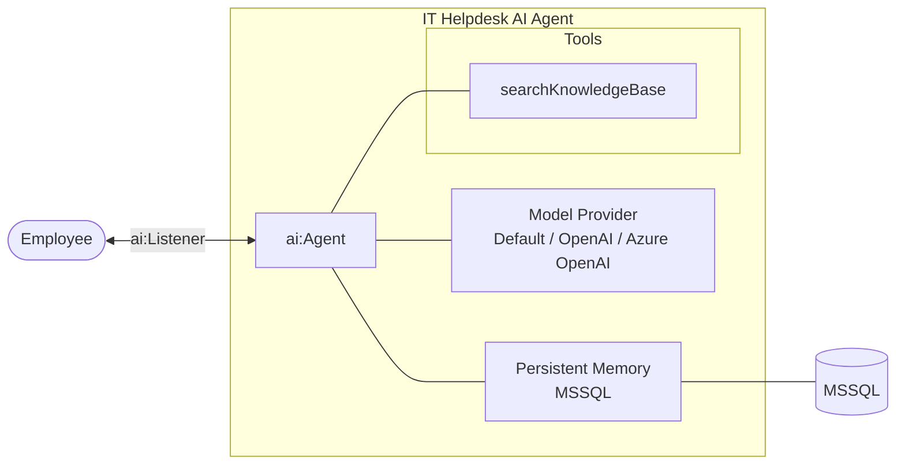

# Building an IT Helpdesk AI Agent with Persistent Memory

## What you will build

In this tutorial, you will build an IT helpdesk AI agent that assists employees with technical support issues and remembers conversations across service restarts using persistent MSSQL-backed memory.

The AI agent exposes a chat interface using `ai:Listener`, responds to employee questions, searches an internal knowledge base for troubleshooting guidance, and maintains conversation history using `ballerinax/ai.memory.mssql`.

By persisting chat history using a database-backed memory store, employees can continue conversations using the same `sessionId` without repeating previously shared information, even after the integration service restarts.

## What you will learn

In this tutorial, you will learn how to:

- Create an AI agent using `ai:Agent`
- Expose the agent through `ai:Listener`
- Persist conversation history across service restarts using MSSQL-backed memory
- Maintain employee-specific conversations using `sessionId`

## Prerequisites

Before getting started, ensure that the following requirements are met:

- Install the [WSO2 Integrator VS Code extension](/docs/get-started/install)
- Set up an MSSQL database for agent memory persistence
- Have a basic understanding of memory configuration concepts. For more information, refer to [Memory Configuration](/docs/genai/agents/memory-configuration)

## Architecture



## Build the integration

In this section, you will create the integration project and configure the AI agent for the IT helpdesk system.

### Step 1: Create the integration project

Create a new integration project by following the instructions in [Create a project](develop/create-integrations/create-a-project.md).

### Step 2: Define the data types

Define the following data types.

```ballerina
# types.bal
type KbArticle record {|
    string articleId;
    string title;
    string content;
    string category;
    string[] tags;
    float relevanceScore;
|};
```

### Step 3: Create the AI agent

Create the AI agent named `itHelpDeskAgent` by following the instructions in [Create an Agent](genai/develop/agents/creating-an-agent.md).

### Step 4: Update the system prompt

- Click the created agent and add the following instructions.


```ballerina
# agents.bal
final ai:Agent itHelpDeskAgent = check new (
    systemPrompt = {
        role: string `itHelpDesk`,
        instructions: string `
            You are an IT Helpdesk Assistant.

            Rules:
            - ALWAYS call searchKnowledgeBase first.
            - ONLY use information returned by tools.
            - Do NOT generate additional troubleshooting steps.
            - Keep responses short.
            - Remember previous conversations.`
    },
    model = wso2ModelProvider,
    tools = []
);
```

### Step 5: Add a tool to the agent

Add the following tool to the agent by following the instructions in [Create custom tool — hand-crafted definitions](genai/develop/agents/tools.md#4-create-custom-tool--hand-crafted-definitions).

```ballerina
# agents.bal
@ai:AgentTool
isolated function searchKnowledgeBase(string query) returns string {

    string normalizedQuery = query.toLowerAscii();

    if normalizedQuery.includes("vpn") {
        return "VPN Troubleshooting: Restart the VPN client and reconnect.";
    }

    if normalizedQuery.includes("password") {
        return "Use the self-service password reset portal.";
    }

    return "No matching knowledge base article found.";
}
```

### Step 6: Add persistent memory to the agent

Add persistent memory by following the instructions in [Memory](genai/develop/agents/memory).

```ballerina
# agents.bal
import ballerinax/ai.memory.mssql;

final mssql:ShortTermMemoryStore mssqlMemoryStore = check new ({
    host: "localhost",
    port: 1433,
    user: "sa",
    password: "Test123#",
    database: "helpdesk"
}, tableName = "chatHistory");

final ai:ShortTermMemory persistentMemory =
    check new (mssqlMemoryStore);
```

Update the agent configuration to use the persistent memory instance.

```ballerina
# agents.bal
final ai:Agent itHelpDeskAgent = check new (
    systemPrompt = {
        role: string `itHelpDesk`,
        instructions: string `
            You are an IT Helpdesk Assistant.

            Rules:
            - ALWAYS call searchKnowledgeBase first.
            - ONLY use information returned by tools.
            - Do NOT generate additional troubleshooting steps.
            - Keep responses short.
            - Remember previous conversations.`
    },
    model = wso2ModelProvider,
    memory = persistentMemory,
    tools = [searchKnowledgeBase]
);
```

### Step 8: Run and test the integration

1. Run the agent integration.


2. Ask a question as an employee:

```bash
curl -X POST http://localhost:9090/hthr/chat \
  -H "Content-Type: application/json" \
  -d '{
        "sessionId":"EMP-1001",
        "message":"My VPN is not working"
      }'
```

Example response:

```json
{
  "message":"To address your VPN issue, please restart the VPN client and try reconnecting. If you have already done this, let me know for further assistance!"
}
```

3. Continue the conversation using the same `sessionId`:

```bash
curl -X POST http://localhost:9090/hthr/chat \
  -H "Content-Type: application/json" \
  -d '{
        "sessionId":"EMP-1001",
        "message":"I already restarted it"
      }'
```

Example response:

```json
{
  "message":"It seems I only have the information about restarting the VPN client. Since you've already done that, please consider these additional steps:

1. Check your internet connection.
2. Update the VPN client to the latest version.
3. Verify your VPN settings are correct.
4. Check firewall or antivirus settings, as they might block the VPN.

If you need more help, just let me know!"
}
```

4. Continue the conversation again using the same `sessionId`:

```bash
curl -X POST http://localhost:9090/hthr/chat \
  -H "Content-Type: application/json" \
  -d '{
        "sessionId":"EMP-1001",
        "message":"Any other suggestions?"
      }'
```

Example response:

```json
{
  "message":"I currently don't have any further suggestions from the knowledge base. However, you might try these:

1. Reboot your device.
2. Connect to a different server in your VPN client, if available.
3. Check for service outages on your VPN provider's status page.
4. Contact your VPN provider's support for more assistance.

Let me know if you need anything else!"
}
```

5. Restart the service and reconnect using the same `sessionId`:

```bash
curl -X POST http://localhost:9090/hthr/chat \
  -H "Content-Type: application/json" \
  -d '{
        "sessionId":"EMP-1001",
        "message":"Do you remember my issue?"
      }'
```

Example response:

```json
{
  "message":"Yes, your issue is that your VPN is not working, and you've already restarted the client. Would you like me to assist you with anything specific regarding that?"
}
```

The AI agent remembers previous conversations because the conversation history is stored in persistent MSSQL-backed memory and retrieved using the same `sessionId`.

## What's next

- [Memory Configuration](/docs/genai/agents/memory-configuration) — Explore memory options in depth
- [Chat Agents](/docs/genai/agents/chat-agents) — Learn more about chat agent patterns
- [Agent Tracing](/docs/genai/agent-observability/agent-tracing) — Add observability and debugging
- [Troubleshooting](/docs/genai/reference/troubleshooting) — Common issues and solutions
