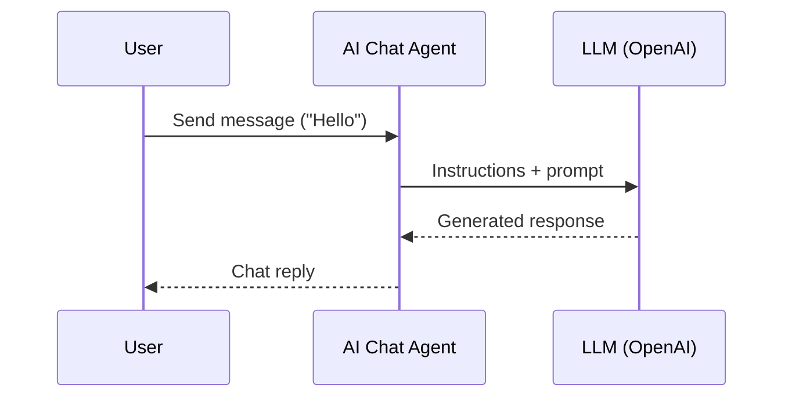

# Build an AI Agent

**Time:** Under 15 minutes | **What you'll build:** An AI agent that connects to an LLM, uses tools, and responds to user queries in chat.

## Prerequisites

- [WSO2 Integrator extension installed](install.md)
- Optional: An API key for your LLM provider (recommended to avoid provider API restrictions)

If you use an API key, configure it before running the integration, either in `Config.toml` or through environment variables.

## Architecture

## Step 1: Create the Project

1. Open WSO2 Integrator.
2. Select **Create**.
3. Set **Integration Name** to `AI Agent`.
4. Set **Project Name** to `Quick_Start`.
5. Select **Browse**.
6. Select the project location and select **Open**.
7. Select **Create Integration**.

<ThemedImage
    alt="Create the Project"
    sources={{
        light: useBaseUrl('/img/get-started/quick-start-ai-agent/create-the-project-light.gif'),
        dark: useBaseUrl('/img/get-started/quick-start-ai-agent/create-the-project-dark.gif'),
    }}
/>

## Step 2: Add an AI Chat Agent

1. Select **AI Agent**.
2. In the design view, select **+ Add Artifact**.
3. Scroll down and select **AI Chat Agent** under **AI Integration**.
4. Set **Name** to `Wso2 Integrator Assistant`.
5. Select **Create**.

<ThemedImage
    alt="Add an AI Chat Agent"
    sources={{
        light: useBaseUrl('/img/get-started/quick-start-ai-agent/add-a-file-integration-artifact-light.gif'),
        dark: useBaseUrl('/img/get-started/quick-start-ai-agent/add-a-file-integration-artifact-dark.gif'),
    }}
/>

## Step 3: Configure the AI Agent

1. Select **AI Agent**.
2. Set **Instructions** to `You are a highly skilled WSO2 Integration Architect. Your goal is to assist developers in building, debugging, and optimizing integration flows.`.
3. Select **Save**.

<ThemedImage
    alt="Configure the AI Agent"
    sources={{
        light: useBaseUrl('/img/get-started/quick-start-ai-agent/configure-the-ai-agent-light.gif'),
        dark: useBaseUrl('/img/get-started/quick-start-ai-agent/configure-the-ai-agent-dark.gif'),
    }}
/>

## Step 4: Run and test

1. Select **Run**.
2. Select **Chat**.
3. Type `Hello` to check if it works.

<ThemedImage
    alt="Run and test"
    sources={{
        light: useBaseUrl('/img/get-started/quick-start-ai-agent/run-and-test-light.gif'),
        dark: useBaseUrl('/img/get-started/quick-start-ai-agent/run-and-test-dark.gif'),
    }}
/>

## Next steps

- [Quick start: Automation](quick-start-automation.md) -- Build a scheduled job
- [Quick start: Integration as API](quick-start-api.md) -- Build an HTTP service
- [Quick start: Event-driven integration](quick-start-event.md) -- React to messages from brokers
- [Quick start: File-driven integration](quick-start-file.md) -- Process files from FTP or local directories
- [GenAI overview](/docs/genai/overview) -- Full guide to AI capabilities
