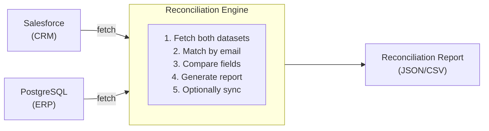

# Multi-System Data Reconciliation

## What You'll Build

A scheduled automation that compares customer records between a CRM (Salesforce) and an ERP database (PostgreSQL), identifies mismatches, generates a reconciliation report, and optionally syncs the discrepancies.



## What You'll Learn

- Building a scheduled automation in WSO2 Integrator
- Fetching data from Salesforce and a relational database in parallel
- Comparing records across systems and identifying mismatches
- Generating structured reconciliation reports
- Handling large datasets efficiently with streaming

## Prerequisites

- WSO2 Integrator VS Code extension installed
- Salesforce developer account with API access
- PostgreSQL database with customer data

**Time estimate:** 30--45 minutes

## Step-by-Step Walkthrough

### Step 1: Create the Project

1. Open VS Code and run **WSO2 Integrator: Create New Project**.
2. Name the project `data-reconciliation`.
3. Add configuration in `Config.toml`:

```toml
[reconciliation]
reportDir = "./reports"

[reconciliation.salesforce]
baseUrl = "https://your-instance.salesforce.com"
clientId = "<SF_CLIENT_ID>"
clientSecret = "<SF_CLIENT_SECRET>"
refreshToken = "<SF_REFRESH_TOKEN>"

[reconciliation.db]
host = "localhost"
port = 5432
database = "erp"
user = "admin"
password = "admin"
```

### Step 2: Define the Data Types

Create `types.bal` with records for both system schemas:

```ballerina
// types.bal

// Unified customer record used for comparison.
type Customer record {|
    string email;
    string firstName;
    string lastName;
    string phone;
    string address;
|};

// A single field mismatch within a record.
type FieldMismatch record {|
    string fieldName;
    string salesforceValue;
    string erpValue;
|};

// One record-level discrepancy.
type Discrepancy record {|
    string email;
    string discrepancyType;   // "field_mismatch" | "missing_in_erp" | "missing_in_sf"
    FieldMismatch[] fieldMismatches;
|};

// The full reconciliation report.
type ReconciliationReport record {|
    string generatedAt;
    int totalSalesforceRecords;
    int totalErpRecords;
    int matchedRecords;
    int mismatchedRecords;
    int missingInErp;
    int missingInSalesforce;
    Discrepancy[] discrepancies;
|};
```

### Step 3: Build the Data Fetchers

Create `data_sources.bal` to retrieve data from both systems:

```ballerina
// data_sources.bal
import ballerinax/salesforce as sf;
import ballerinax/postgresql;

configurable string sfBaseUrl = ?;
configurable string sfClientId = ?;
configurable string sfClientSecret = ?;
configurable string sfRefreshToken = ?;
configurable string dbHost = ?;
configurable int dbPort = ?;
configurable string dbName = ?;
configurable string dbUser = ?;
configurable string dbPassword = ?;

final sf:Client salesforceClient = check new ({
    baseUrl: sfBaseUrl,
    auth: {
        clientId: sfClientId,
        clientSecret: sfClientSecret,
        refreshToken: sfRefreshToken,
        refreshUrl: "https://login.salesforce.com/services/oauth2/token"
    }
});

final postgresql:Client erpDb = check new (dbHost, dbUser, dbPassword, dbName, dbPort);

// Fetch all contacts from Salesforce via SOQL.
function fetchSalesforceCustomers() returns map|error {
    string soql = "SELECT Email, FirstName, LastName, Phone, MailingStreet FROM Contact WHERE Email != null";
    stream<record {}, error?> results = check salesforceClient->query(soql);

    map customers = {};
    check from record {} rec in results
        do {
            string email = (check rec["Email"]).toString().toLowerAscii();
            customers[email] = {
                email,
                firstName: (check rec["FirstName"]).toString(),
                lastName: (check rec["LastName"]).toString(),
                phone: (check rec["Phone"]).toString(),
                address: (check rec["MailingStreet"]).toString()
            };
        };
    return customers;
}

// Fetch all customers from the ERP database.
function fetchErpCustomers() returns map|error {
    stream<Customer, error?> customerStream = erpDb->query(
        `SELECT email, first_name AS firstName, last_name AS lastName,
                phone, address FROM customers`
    );
    map customers = {};
    check from Customer c in customerStream
        do {
            customers[c.email.toLowerAscii()] = c;
        };
    return customers;
}
```

### Step 4: Build the Reconciliation Engine

Create `reconciler.bal` with the comparison logic:

```ballerina
// reconciler.bal
import ballerina/time;

// Compare two customer maps and produce a reconciliation report.
function reconcile(map sfCustomers, map erpCustomers) returns ReconciliationReport {
    Discrepancy[] discrepancies = [];

    // Check each Salesforce record against ERP.
    foreach [string, Customer] [email, sfCustomer] in sfCustomers.entries() {
        Customer? erpCustomer = erpCustomers[email];
        if erpCustomer is () {
            discrepancies.push({
                email,
                discrepancyType: "missing_in_erp",
                fieldMismatches: []
            });
            continue;
        }
        // Compare individual fields.
        FieldMismatch[] mismatches = compareFields(sfCustomer, erpCustomer);
        if mismatches.length() > 0 {
            discrepancies.push({
                email,
                discrepancyType: "field_mismatch",
                fieldMismatches: mismatches
            });
        }
    }

    // Find records in ERP that are missing from Salesforce.
    foreach string email in erpCustomers.keys() {
        if !sfCustomers.hasKey(email) {
            discrepancies.push({
                email,
                discrepancyType: "missing_in_sf",
                fieldMismatches: []
            });
        }
    }

    int missingInErp = discrepancies.filter(d => d.discrepancyType == "missing_in_erp").length();
    int missingInSf = discrepancies.filter(d => d.discrepancyType == "missing_in_sf").length();
    int fieldMismatches = discrepancies.filter(d => d.discrepancyType == "field_mismatch").length();

    return {
        generatedAt: time:utcToString(time:utcNow()),
        totalSalesforceRecords: sfCustomers.length(),
        totalErpRecords: erpCustomers.length(),
        matchedRecords: sfCustomers.length() - missingInErp - fieldMismatches,
        mismatchedRecords: fieldMismatches,
        missingInErp,
        missingInSalesforce: missingInSf,
        discrepancies
    };
}

// Compare two Customer records field by field.
function compareFields(Customer sf, Customer erp) returns FieldMismatch[] {
    FieldMismatch[] mismatches = [];
    if sf.firstName != erp.firstName {
        mismatches.push({fieldName: "firstName", salesforceValue: sf.firstName, erpValue: erp.firstName});
    }
    if sf.lastName != erp.lastName {
        mismatches.push({fieldName: "lastName", salesforceValue: sf.lastName, erpValue: erp.lastName});
    }
    if sf.phone != erp.phone {
        mismatches.push({fieldName: "phone", salesforceValue: sf.phone, erpValue: erp.phone});
    }
    if sf.address != erp.address {
        mismatches.push({fieldName: "address", salesforceValue: sf.address, erpValue: erp.address});
    }
    return mismatches;
}
```

### Step 5: Schedule the Automation

Wire everything together in `main.bal` with a scheduled trigger:

```ballerina
// main.bal
import ballerina/log;
import ballerina/io;
import ballerina/task;
import ballerina/time;

configurable string reportDir = "./reports";

// Run reconciliation every day at 2:00 AM.
@task:AppointmentConfig {
    cronExpression: "0 0 2 * * ?"
}
function runReconciliation() returns error? {
    log:printInfo("Starting data reconciliation...");

    // Fetch data from both systems in parallel using workers.
    map sfCustomers;
    map erpCustomers;

    worker sfWorker returns map|error {
        return fetchSalesforceCustomers();
    }
    worker erpWorker returns map|error {
        return fetchErpCustomers();
    }

    sfCustomers = check wait sfWorker;
    erpCustomers = check wait erpWorker;

    log:printInfo(string `Fetched ${sfCustomers.length()} SF records, ${erpCustomers.length()} ERP records`);

    // Run reconciliation.
    ReconciliationReport report = reconcile(sfCustomers, erpCustomers);

    // Write the report to a JSON file.
    string timestamp = time:utcToString(time:utcNow());
    string fileName = string `${reportDir}/reconciliation-${timestamp}.json`;
    check io:fileWriteJson(fileName, report.toJson());
    log:printInfo(string `Report written to ${fileName}`);

    // Log summary.
    log:printInfo(string `Reconciliation complete: ${report.matchedRecords} matched, ` +
                  string `${report.mismatchedRecords} mismatched, ` +
                  string `${report.missingInErp} missing in ERP, ` +
                  string `${report.missingInSalesforce} missing in SF`);
}
```

### Step 6: Handle Errors

Add retry logic and error notifications in `error_handler.bal`:

```ballerina
// error_handler.bal
import ballerina/log;
import ballerina/email;

configurable string alertEmail = "ops-team@acme.com";

function notifyReconciliationFailure(error err) {
    log:printError("Reconciliation failed", err);

    email:SmtpClient|error smtp = new ("smtp.acme.com", 587, "alerts@acme.com", "password");
    if smtp is error {
        log:printError("Failed to create SMTP client for alert", smtp);
        return;
    }
    email:Error? sendResult = smtp->send({
        to: alertEmail,
        subject: "Data Reconciliation Failed",
        body: string `Reconciliation failed at ${time:utcToString(time:utcNow())}. Error: ${err.message()}`
    });
    if sendResult is email:Error {
        log:printError("Failed to send alert email", sendResult);
    }
}
```

### Step 7: Test It

1. Start the automation:

```bash
bal run
```

2. Trigger a manual reconciliation (add an HTTP endpoint for testing):

```bash
curl -X POST http://localhost:8090/reconciliation/trigger
```

3. Check the generated report in the `reports/` directory.

4. Run automated tests:

```bash
bal test
```

## Extend It

- **Add auto-sync** to push corrections back to the source systems when mismatches are found.
- **Send Slack notifications** with a daily summary of discrepancies.
- **Add a dashboard** by writing reports to a database and querying via the ICP.
- **Support incremental reconciliation** by tracking the last run timestamp and only comparing updated records.

## Full Source Code

Find the complete working project on GitHub:
[wso2/integrator-samples/data-reconciliation](https://github.com/wso2/integrator-samples/tree/main/data-reconciliation)
