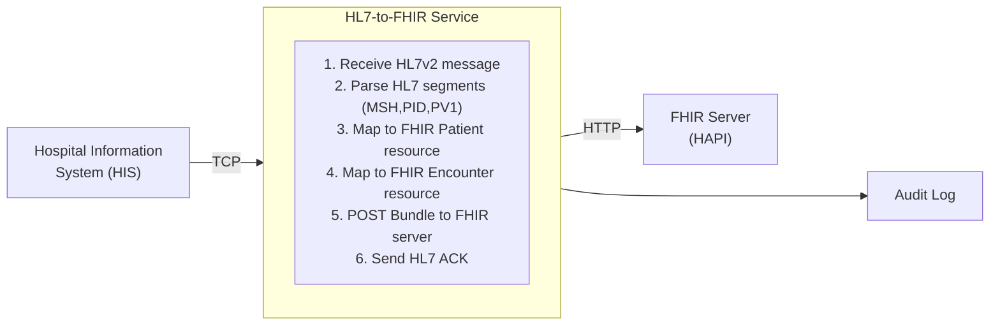

# Healthcare HL7/FHIR Integration

## What You'll Build

A healthcare integration service that receives HL7v2 ADT (Admit-Discharge-Transfer) messages from a hospital information system, transforms them into FHIR R4 Patient and Encounter resources, and publishes the FHIR resources to a FHIR server.



## What You'll Learn

- Receiving and parsing HL7v2 messages over TCP
- Extracting patient demographics from PID segments
- Mapping HL7v2 fields to FHIR R4 resource structures
- Building and posting a FHIR Bundle (transaction)
- Sending HL7 ACK/NACK responses

## Prerequisites

- WSO2 Integrator VS Code extension installed
- A FHIR R4 server (e.g., [HAPI FHIR](https://hapifhir.io/) running locally via Docker)
- Basic familiarity with HL7v2 message structure and FHIR resources

**Time estimate:** 30--45 minutes

## Step-by-Step Walkthrough

### Step 1: Create the Project

1. Open VS Code and run **WSO2 Integrator: Create New Project**.
2. Name the project `healthcare-hl7-fhir`.
3. Start a local FHIR server for development:

```bash
docker run -p 8080:8080 hapiproject/hapi:latest
```

4. Configure `Config.toml`:

```toml
[healthcare]
hl7Port = 9010

[healthcare.fhir]
serverUrl = "http://localhost:8080/fhir"

[healthcare.audit]
enabled = true
logDir = "./audit-logs"
```

### Step 2: Define the FHIR Types

Create `types.bal` with FHIR-compatible record types:

```ballerina
// types.bal

// FHIR R4 Patient resource (simplified for this tutorial).
type FhirPatient record {|
    string resourceType = "Patient";
    FhirIdentifier[] identifier;
    FhirHumanName[] name;
    string gender;          // "male" | "female" | "other" | "unknown"
    string birthDate;       // YYYY-MM-DD
    FhirAddress[] address;
    FhirContactPoint[] telecom;
|};

type FhirIdentifier record {|
    string system;
    string value;
|};

type FhirHumanName record {|
    string family;
    string[] given;
|};

type FhirAddress record {|
    string[] line;
    string city;
    string state;
    string postalCode;
    string country;
|};

type FhirContactPoint record {|
    string system;     // "phone" | "email"
    string value;
|};

// FHIR R4 Encounter resource (simplified).
type FhirEncounter record {|
    string resourceType = "Encounter";
    string status;
    FhirCoding 'class;
    FhirReference subject;
    FhirPeriod period;
    FhirIdentifier[] identifier;
|};

type FhirCoding record {|
    string system;
    string code;
    string display;
|};

type FhirReference record {|
    string reference;
|};

type FhirPeriod record {|
    string 'start;
|};

// FHIR Bundle for transaction submissions.
type FhirBundle record {|
    string resourceType = "Bundle";
    string 'type = "transaction";
    FhirBundleEntry[] entry;
|};

type FhirBundleEntry record {|
    json 'resource;
    FhirBundleRequest request;
|};

type FhirBundleRequest record {|
    string method;
    string url;
|};
```

### Step 3: Build the HL7 Parser

Create `hl7_parser.bal` to extract data from HL7v2 segments:

```ballerina
// hl7_parser.bal
import ballerina/regex;

// Parsed HL7v2 message with relevant segments.
type ParsedHl7Message record {|
    map<string> msh;    // Message header
    map<string> pid;    // Patient identification
    map<string> pv1;    // Patient visit
    string messageType;
    string messageId;
|};

// Parse a raw HL7v2 message into structured segments.
function parseHl7Message(string rawMessage) returns ParsedHl7Message|error {
    string[] segments = regex:split(rawMessage, "\r");

    map<string> msh = {};
    map<string> pid = {};
    map<string> pv1 = {};

    foreach string segment in segments {
        string[] fields = regex:split(segment, "\\|");
        if fields.length() == 0 {
            continue;
        }
        match fields[0] {
            "MSH" => {
                msh = {
                    "sendingApp": fields.length() > 2 ? fields[2] : "",
                    "sendingFacility": fields.length() > 3 ? fields[3] : "",
                    "messageType": fields.length() > 8 ? fields[8] : "",
                    "messageId": fields.length() > 9 ? fields[9] : "",
                    "dateTime": fields.length() > 6 ? fields[6] : ""
                };
            }
            "PID" => {
                pid = {
                    "patientId": fields.length() > 3 ? fields[3] : "",
                    "name": fields.length() > 5 ? fields[5] : "",
                    "birthDate": fields.length() > 7 ? fields[7] : "",
                    "gender": fields.length() > 8 ? fields[8] : "",
                    "address": fields.length() > 11 ? fields[11] : "",
                    "phone": fields.length() > 13 ? fields[13] : ""
                };
            }
            "PV1" => {
                pv1 = {
                    "patientClass": fields.length() > 2 ? fields[2] : "",
                    "admitDate": fields.length() > 44 ? fields[44] : "",
                    "visitNumber": fields.length() > 19 ? fields[19] : ""
                };
            }
        }
    }

    return {
        msh,
        pid,
        pv1,
        messageType: msh["messageType"] ?: "",
        messageId: msh["messageId"] ?: ""
    };
}

// Map HL7 gender code to FHIR gender string.
function mapGender(string hl7Gender) returns string {
    match hl7Gender {
        "M" => { return "male"; }
        "F" => { return "female"; }
        "O" => { return "other"; }
        _ => { return "unknown"; }
    }
}

// Convert HL7 date (YYYYMMDD) to FHIR date (YYYY-MM-DD).
function formatHl7Date(string hl7Date) returns string {
    if hl7Date.length() >= 8 {
        return string `${hl7Date.substring(0, 4)}-${hl7Date.substring(4, 6)}-${hl7Date.substring(6, 8)}`;
    }
    return hl7Date;
}
```

### Step 4: Build the FHIR Mapper

Create `fhir_mapper.bal` to convert parsed HL7 data to FHIR resources:

```ballerina
// fhir_mapper.bal
import ballerina/regex;

// Convert parsed HL7 patient data into a FHIR Patient resource.
function mapToFhirPatient(ParsedHl7Message msg) returns FhirPatient {
    map<string> pid = msg.pid;

    // Parse HL7 name format: "LastName^FirstName^MiddleName"
    string[] nameParts = regex:split(pid["name"] ?: "", "\\^");
    string lastName = nameParts.length() > 0 ? nameParts[0] : "";
    string firstName = nameParts.length() > 1 ? nameParts[1] : "";

    // Parse HL7 address: "Street^City^State^Zip^Country"
    string[] addrParts = regex:split(pid["address"] ?: "", "\\^");

    return {
        identifier: [{system: "urn:oid:2.16.840.1.113883.3.0", value: pid["patientId"] ?: ""}],
        name: [{family: lastName, given: [firstName]}],
        gender: mapGender(pid["gender"] ?: ""),
        birthDate: formatHl7Date(pid["birthDate"] ?: ""),
        address: [{
            line: addrParts.length() > 0 ? [addrParts[0]] : [],
            city: addrParts.length() > 1 ? addrParts[1] : "",
            state: addrParts.length() > 2 ? addrParts[2] : "",
            postalCode: addrParts.length() > 3 ? addrParts[3] : "",
            country: addrParts.length() > 4 ? addrParts[4] : "US"
        }],
        telecom: [{system: "phone", value: pid["phone"] ?: ""}]
    };
}

// Convert parsed HL7 visit data into a FHIR Encounter resource.
function mapToFhirEncounter(ParsedHl7Message msg, string patientRef) returns FhirEncounter {
    map<string> pv1 = msg.pv1;

    string encounterClass = match pv1["patientClass"] ?: "" {
        "I" => "inpatient"
        "O" => "outpatient"
        "E" => "emergency"
        _ => "other"
    };

    return {
        status: "in-progress",
        'class: {system: "http://terminology.hl7.org/CodeSystem/v3-ActCode", code: encounterClass, display: encounterClass},
        subject: {reference: patientRef},
        period: {'start: formatHl7Date(pv1["admitDate"] ?: "")},
        identifier: [{system: "urn:visitnumber", value: pv1["visitNumber"] ?: ""}]
    };
}

// Build a FHIR transaction Bundle from Patient and Encounter resources.
function buildFhirBundle(FhirPatient patient, FhirEncounter encounter) returns FhirBundle {
    return {
        entry: [
            {
                'resource: patient.toJson(),
                request: {method: "POST", url: "Patient"}
            },
            {
                'resource: encounter.toJson(),
                request: {method: "POST", url: "Encounter"}
            }
        ]
    };
}
```

### Step 5: Create the TCP Service

Wire everything together in `main.bal`:

```ballerina
// main.bal
import ballerina/tcp;
import ballerina/http;
import ballerina/log;
import ballerina/io;
import ballerina/time;

configurable int hl7Port = 9010;
configurable string fhirServerUrl = ?;
configurable boolean auditEnabled = true;
configurable string auditLogDir = "./audit-logs";

final http:Client fhirClient = check new (fhirServerUrl);

// TCP listener for HL7v2 messages.
service on new tcp:Listener(hl7Port) {

    remote function onConnect(tcp:Caller caller) returns tcp:ConnectionService {
        log:printInfo("HL7 client connected");
        return new Hl7ConnectionService(caller);
    }
}

service class Hl7ConnectionService {
    *tcp:ConnectionService;
    private final tcp:Caller caller;

    function init(tcp:Caller caller) {
        self.caller = caller;
    }

    // Called when data arrives on the TCP connection.
    remote function onBytes(readonly & byte[] data) returns error? {
        string rawMessage = check string:fromBytes(data);
        log:printInfo(string `Received HL7 message: ${rawMessage.length()} bytes`);

        // Step 1: Parse the HL7v2 message.
        ParsedHl7Message parsed = check parseHl7Message(rawMessage);
        log:printInfo(string `Parsed message type: ${parsed.messageType}, ID: ${parsed.messageId}`);

        // Step 2: Map to FHIR resources.
        FhirPatient patient = mapToFhirPatient(parsed);
        FhirEncounter encounter = mapToFhirEncounter(parsed, "Patient/" + patient.identifier[0].value);
        FhirBundle bundle = buildFhirBundle(patient, encounter);

        // Step 3: POST the Bundle to the FHIR server.
        http:Response fhirResponse = check fhirClient->post("/", bundle.toJson());
        log:printInfo(string `FHIR server responded: ${fhirResponse.statusCode}`);

        // Step 4: Send an HL7 ACK back.
        string ack = buildHl7Ack(parsed.messageId, fhirResponse.statusCode < 300);
        check self.caller->writeBytes(ack.toBytes());

        // Step 5: Audit log.
        if auditEnabled {
            check writeAuditLog(parsed, fhirResponse.statusCode);
        }
    }

    remote function onError(tcp:Error err) {
        log:printError("TCP connection error", err);
    }

    remote function onClose() {
        log:printInfo("HL7 client disconnected");
    }
}

// Build an HL7 ACK message.
function buildHl7Ack(string messageId, boolean success) returns string {
    string ackCode = success ? "AA" : "AE";
    string timestamp = time:utcToString(time:utcNow());
    return string `MSH|^~\\&|WSO2_INTEGRATOR||FHIR_GW||${timestamp}||ACK|${messageId}|P|2.5\rMSA|${ackCode}|${messageId}\r`;
}

// Write audit log entry.
function writeAuditLog(ParsedHl7Message msg, int statusCode) returns error? {
    string logEntry = string `${time:utcToString(time:utcNow())}|${msg.messageId}|${msg.messageType}|${statusCode}\n`;
    check io:fileWriteString(string `${auditLogDir}/audit.log`, logEntry, io:APPEND);
}
```

### Step 6: Test It

1. Start the service:

```bash
bal run
```

2. Send a test HL7 message using a TCP client (or netcat):

```bash
echo -e "MSH|^~\\&|HIS|HOSPITAL|WSO2|FHIR_GW|20240301120000||ADT^A01|MSG001|P|2.5\rPID|||PAT001||Doe^John||19850315|M|||123 Main St^Springfield^IL^62704^US|||555-1234\rPV1||I|ICU^101||||DR001^Smith^Jane|||||||||||V001" | nc localhost 9010
```

3. Verify the FHIR server received the resources:

```bash
curl http://localhost:8080/fhir/Patient?identifier=PAT001
```

4. Run automated tests:

```bash
bal test
```

## Extend It

- **Support additional HL7 message types** such as ORU (lab results) or ORM (orders).
- **Add FHIR validation** using the `ballerinax/health.fhir.r4` module before posting.
- **Route to multiple FHIR servers** based on message type or facility.
- **Add a dead-letter queue** for messages that fail to transform or post.
- **Implement HL7 batching** for bulk historical data migrations.

## Full Source Code

Find the complete working project on GitHub:
[wso2/integrator-samples/healthcare-hl7-fhir](https://github.com/wso2/integrator-samples/tree/main/healthcare-hl7-fhir)
