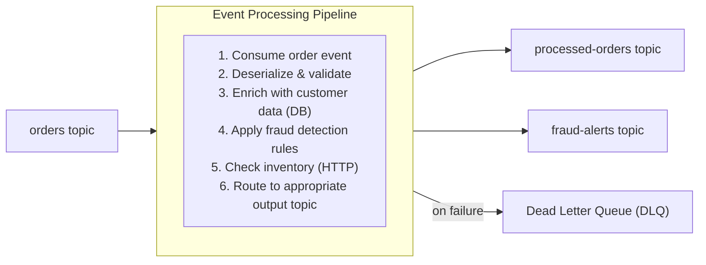

# Kafka Event Processing Pipeline

## What You'll Build

A real-time event processing pipeline that consumes order events from Kafka, enriches them with customer data from a database, applies business rules (fraud detection, inventory checks), and publishes processed events to downstream topics.



## What You'll Learn

- Configuring a Kafka consumer and producer in WSO2 Integrator
- Deserializing and validating event payloads
- Enriching events with data from external systems
- Implementing content-based routing for processed events
- Setting up dead-letter queue handling for failed events

## Prerequisites

- WSO2 Integrator VS Code extension installed
- Apache Kafka running locally (or use Docker Compose)
- PostgreSQL database with customer data

**Time estimate:** 30--45 minutes

## Step-by-Step Walkthrough

### Step 1: Create the Project

1. Open VS Code and run **WSO2 Integrator: Create New Project**.
2. Name the project `kafka-event-pipeline`.
3. Start Kafka locally with Docker Compose:

```yaml
# docker-compose.yml
version: '3.8'
services:
  kafka:
    image: confluentinc/cp-kafka:7.5.0
    ports:
      - "9092:9092"
    environment:
      KAFKA_NODE_ID: 1
      KAFKA_PROCESS_ROLES: broker,controller
      KAFKA_LISTENERS: PLAINTEXT://0.0.0.0:9092,CONTROLLER://0.0.0.0:9093
      KAFKA_ADVERTISED_LISTENERS: PLAINTEXT://localhost:9092
      KAFKA_CONTROLLER_QUORUM_VOTERS: 1@localhost:9093
      KAFKA_CONTROLLER_LISTENER_NAMES: CONTROLLER
      CLUSTER_ID: "MkU3OEVBNTcwNTJENDM2Qk"
```

4. Configure `Config.toml`:

```toml
[pipeline]
consumerGroupId = "order-processor"

[pipeline.kafka]
bootstrapServers = "localhost:9092"
inputTopic = "orders"
outputTopic = "processed-orders"
fraudTopic = "fraud-alerts"
dlqTopic = "orders-dlq"

[pipeline.db]
host = "localhost"
port = 5432
database = "customers"
user = "admin"
password = "admin"

[pipeline.inventory]
serviceUrl = "http://localhost:8085"
```

### Step 2: Define the Data Types

Create `types.bal`:

```ballerina
// types.bal

// Raw order event from the orders topic.
type OrderEvent record {|
    string orderId;
    string customerId;
    OrderItem[] items;
    decimal totalAmount;
    string currency;
    string timestamp;
    ShippingAddress shippingAddress;
|};

type OrderItem record {|
    string sku;
    string name;
    int quantity;
    decimal unitPrice;
|};

type ShippingAddress record {|
    string street;
    string city;
    string state;
    string zipCode;
    string country;
|};

// Customer data from the database used for enrichment.
type CustomerProfile record {|
    string customerId;
    string name;
    string email;
    string tier;          // "standard" | "premium" | "vip"
    int totalOrders;
    decimal lifetimeValue;
|};

// Enriched, processed order event.
type ProcessedOrder record {|
    string orderId;
    string customerId;
    string customerName;
    string customerTier;
    OrderItem[] items;
    decimal totalAmount;
    string currency;
    boolean fraudSuspected;
    string fraudReason;
    boolean inventoryConfirmed;
    string status;
    string processedAt;
|};

// Inventory check result.
type InventoryStatus record {|
    string sku;
    int available;
    boolean inStock;
|};
```

### Step 3: Build the Event Consumer

Create `consumer.bal`:

```ballerina
// consumer.bal
import ballerinax/kafka;
import ballerina/log;
import ballerina/time;

configurable string bootstrapServers = ?;
configurable string inputTopic = ?;
configurable string consumerGroupId = ?;

// Kafka listener subscribed to the orders topic.
listener kafka:Listener orderListener = check new ({
    bootstrapServers,
    groupId: consumerGroupId,
    topics: [inputTopic],
    pollingInterval: 1,
    autoCommit: false
});

service on orderListener {

    // Called for each batch of Kafka messages.
    remote function onConsumerRecord(kafka:Caller caller, kafka:ConsumerRecord[] records) returns error? {
        foreach kafka:ConsumerRecord rec in records {
            string|error messageStr = string:fromBytes(rec.value);
            if messageStr is error {
                log:printError("Failed to deserialize message", messageStr);
                check publishToDlq(rec.value, "deserialization_error");
                continue;
            }

            json|error messageJson = (<string>messageStr).fromJsonString();
            if messageJson is error {
                log:printError("Invalid JSON payload", messageJson);
                check publishToDlq(rec.value, "invalid_json");
                continue;
            }

            OrderEvent|error orderEvent = (<json>messageJson).cloneWithType();
            if orderEvent is error {
                log:printError("Payload does not match OrderEvent schema", orderEvent);
                check publishToDlq(rec.value, "schema_validation_failed");
                continue;
            }

            // Process the valid order event.
            error? processResult = processOrderEvent(orderEvent);
            if processResult is error {
                log:printError("Processing failed", processResult);
                check publishToDlq(rec.value, "processing_error: " + processResult.message());
                continue;
            }
        }
        // Commit offsets after successful processing.
        check caller->commit();
    }
}
```

### Step 4: Build the Processing Logic

Create `processor.bal` with enrichment, fraud detection, and routing:

```ballerina
// processor.bal
import ballerinax/postgresql;
import ballerina/http;
import ballerina/log;
import ballerina/time;

configurable string dbHost = ?;
configurable int dbPort = ?;
configurable string dbName = ?;
configurable string dbUser = ?;
configurable string dbPassword = ?;
configurable string inventoryServiceUrl = ?;

final postgresql:Client customerDb = check new (dbHost, dbUser, dbPassword, dbName, dbPort);
final http:Client inventoryClient = check new (inventoryServiceUrl);

// Main processing function for a single order event.
function processOrderEvent(OrderEvent order) returns error? {
    log:printInfo(string `Processing order ${order.orderId} for customer ${order.customerId}`);

    // Step 1: Enrich with customer data.
    CustomerProfile customer = check fetchCustomerProfile(order.customerId);

    // Step 2: Fraud detection.
    [boolean, string] [isFraud, fraudReason] = detectFraud(order, customer);

    // Step 3: Inventory check.
    boolean inventoryOk = check checkInventory(order.items);

    // Step 4: Build the processed event.
    ProcessedOrder processed = {
        orderId: order.orderId,
        customerId: order.customerId,
        customerName: customer.name,
        customerTier: customer.tier,
        items: order.items,
        totalAmount: order.totalAmount,
        currency: order.currency,
        fraudSuspected: isFraud,
        fraudReason,
        inventoryConfirmed: inventoryOk,
        status: isFraud ? "held_for_review" : (inventoryOk ? "confirmed" : "backorder"),
        processedAt: time:utcToString(time:utcNow())
    };

    // Step 5: Route to the appropriate topic.
    if isFraud {
        check publishFraudAlert(processed);
    }
    check publishProcessedOrder(processed);
    log:printInfo(string `Order ${order.orderId} processed: status=${processed.status}`);
}

// Fetch customer profile from the database.
function fetchCustomerProfile(string customerId) returns CustomerProfile|error {
    CustomerProfile customer = check customerDb->queryRow(
        `SELECT customer_id, name, email, tier, total_orders, lifetime_value
         FROM customers WHERE customer_id = ${customerId}`
    );
    return customer;
}

// Simple rule-based fraud detection.
function detectFraud(OrderEvent order, CustomerProfile customer) returns [boolean, string] {
    // Rule 1: New customer placing a large order.
    if customer.totalOrders < 2 && order.totalAmount > 500d {
        return [true, "New customer with high-value order"];
    }
    // Rule 2: Order amount significantly exceeds lifetime average.
    if customer.totalOrders > 0 {
        decimal avgOrder = customer.lifetimeValue / <decimal>customer.totalOrders;
        if order.totalAmount > avgOrder * 5d {
            return [true, "Order amount 5x above customer average"];
        }
    }
    // Rule 3: Suspicious quantity on a single item.
    foreach OrderItem item in order.items {
        if item.quantity > 100 {
            return [true, string `Unusually high quantity (${item.quantity}) for SKU ${item.sku}`];
        }
    }
    return [false, ""];
}

// Check inventory availability for all items in the order.
function checkInventory(OrderItem[] items) returns boolean|error {
    foreach OrderItem item in items {
        InventoryStatus status = check inventoryClient->get(string `/stock/${item.sku}`);
        if !status.inStock || status.available < item.quantity {
            return false;
        }
    }
    return true;
}
```

### Step 5: Build the Producers

Create `producer.bal` for publishing to output topics:

```ballerina
// producer.bal
import ballerinax/kafka;
import ballerina/log;

configurable string outputTopic = ?;
configurable string fraudTopic = ?;
configurable string dlqTopic = ?;

final kafka:Producer orderProducer = check new ({
    bootstrapServers
});

// Publish a processed order to the output topic.
function publishProcessedOrder(ProcessedOrder order) returns error? {
    check orderProducer->send({
        topic: outputTopic,
        key: order.orderId.toBytes(),
        value: order.toJsonString().toBytes()
    });
}

// Publish a fraud alert.
function publishFraudAlert(ProcessedOrder order) returns error? {
    log:printWarn(string `Fraud alert for order ${order.orderId}: ${order.fraudReason}`);
    check orderProducer->send({
        topic: fraudTopic,
        key: order.orderId.toBytes(),
        value: order.toJsonString().toBytes()
    });
}

// Publish a failed message to the dead-letter queue.
function publishToDlq(byte[] originalPayload, string reason) returns error? {
    json dlqMessage = {
        originalPayload: check string:fromBytes(originalPayload),
        failureReason: reason,
        timestamp: time:utcToString(time:utcNow())
    };
    check orderProducer->send({
        topic: dlqTopic,
        value: dlqMessage.toJsonString().toBytes()
    });
    log:printWarn(string `Message sent to DLQ: ${reason}`);
}
```

### Step 6: Test It

1. Create the Kafka topics:

```bash
kafka-topics --create --topic orders --bootstrap-server localhost:9092 --partitions 3
kafka-topics --create --topic processed-orders --bootstrap-server localhost:9092 --partitions 3
kafka-topics --create --topic fraud-alerts --bootstrap-server localhost:9092 --partitions 1
kafka-topics --create --topic orders-dlq --bootstrap-server localhost:9092 --partitions 1
```

2. Start the pipeline:

```bash
bal run
```

3. Publish a test order event:

```bash
echo '{"orderId":"ORD-001","customerId":"CUST-100","items":[{"sku":"SKU-A","name":"Widget","quantity":2,"unitPrice":25.00}],"totalAmount":50.00,"currency":"USD","timestamp":"2024-03-01T10:00:00Z","shippingAddress":{"street":"123 Main St","city":"Springfield","state":"IL","zipCode":"62704","country":"US"}}' | kafka-console-producer --topic orders --bootstrap-server localhost:9092
```

4. Consume the processed event:

```bash
kafka-console-consumer --topic processed-orders --bootstrap-server localhost:9092 --from-beginning
```

5. Run automated tests:

```bash
bal test
```

## Extend It

- **Add Avro or Protobuf serialization** with a Schema Registry for type-safe event contracts.
- **Implement windowed aggregation** to compute real-time order metrics per region.
- **Add exactly-once semantics** using Kafka transactions.
- **Connect a monitoring dashboard** that consumes from the processed-orders topic.
- **Scale horizontally** by increasing consumer group instances and topic partitions.

## Full Source Code

Find the complete working project on GitHub:
[wso2/integrator-samples/kafka-event-pipeline](https://github.com/wso2/integrator-samples/tree/main/kafka-event-pipeline)
