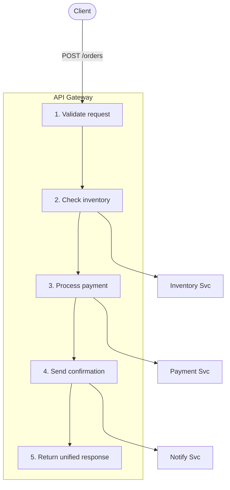

# API Gateway & Orchestration

## Problem

Clients need to interact with multiple backend services to complete a single business operation, but exposing all services directly creates tight coupling, inconsistent error handling, and forces clients to manage complex multi-call workflows. For example, placing an order might require calling an inventory service, a payment service, and a notification service in sequence -- with rollback logic if any step fails.

## Solution

Introduce an **API Gateway** service that acts as a single entry point for clients. The gateway accepts one request, orchestrates calls to multiple backend services in the required order, transforms and combines the results, and returns a unified response. The client sees one clean API while the gateway handles the complexity.



## When to Use It

- Multiple backend calls must happen in a specific **sequence** with dependencies between steps.
- You want to hide backend service topology from external clients.
- Different clients (mobile, web, partner) need different API shapes over the same backends.
- You need centralized cross-cutting concerns: authentication, rate limiting, logging, and request transformation.

Avoid this pattern when backend calls are independent and can be made in parallel with no ordering -- use [Scatter-Gather](scatter-gather.md) instead.

## Implementation

```ballerina
import ballerina/http;
import ballerina/log;

configurable string inventoryUrl = ?;
configurable string paymentUrl = ?;
configurable string notificationUrl = ?;

final http:Client inventoryClient = check new (inventoryUrl);
final http:Client paymentClient = check new (paymentUrl);
final http:Client notificationClient = check new (notificationUrl);

type OrderRequest record {|
    string customerId;
    string sku;
    int quantity;
    string paymentMethod;
|};

type OrderResponse record {|
    string orderId;
    string status;
    decimal amountCharged;
|};

service /api on new http:Listener(8090) {

    resource function post orders(OrderRequest req) returns OrderResponse|http:BadRequest|http:InternalServerError {
        // Step 1: Reserve inventory.
        record {|string reservationId; decimal unitPrice;|}|error reservation =
            inventoryClient->post("/reserve", {sku: req.sku, quantity: req.quantity});

        if reservation is error {
            log:printError("Inventory reservation failed", reservation);
            return <http:BadRequest>{body: {message: "Item not available"}};
        }

        decimal totalAmount = reservation.unitPrice * <decimal>req.quantity;

        // Step 2: Process payment.
        record {|string transactionId;|}|error payment =
            paymentClient->post("/charge", {
                customerId: req.customerId,
                amount: totalAmount,
                method: req.paymentMethod
            });

        if payment is error {
            log:printError("Payment failed, releasing reservation", payment);
            // Compensate: release the inventory reservation.
            http:Response|error releaseResult = inventoryClient->delete(
                string `/reserve/${reservation.reservationId}`
            );
            if releaseResult is error {
                log:printError("Failed to release reservation", releaseResult);
            }
            return <http:BadRequest>{body: {message: "Payment failed"}};
        }

        // Step 3: Create the order record and send notification.
        string orderId = string `ORD-${reservation.reservationId}`;
        _ = start notificationClient->post("/send", {
            to: req.customerId,
            template: "order_confirmation",
            data: {orderId, totalAmount}
        });

        return {orderId, status: "confirmed", amountCharged: totalAmount};
    }
}
```

Key aspects of this implementation:

- **Sequential orchestration**: Inventory is reserved before payment is attempted.
- **Compensation on failure**: If payment fails, the inventory reservation is released.
- **Fire-and-forget**: The notification is sent asynchronously using `start` so it does not block the response.
- **Unified response**: The client receives a single `OrderResponse` regardless of how many backends were involved.

## Considerations

- **Latency**: Each sequential backend call adds to total response time. Consider whether some calls can be parallelized.
- **Partial failure**: Design compensation logic for each step. If step N fails, undo steps 1 through N-1.
- **Idempotency**: Backend calls should be idempotent so retries do not cause duplicate side effects.
- **Timeouts**: Set per-backend timeouts to prevent one slow service from blocking the entire request.
- **Versioning**: The gateway can version its own API independently of backend service versions.

## Related Patterns

- [Saga / Compensation](saga-compensation.md) -- For long-running orchestrations where each step has an explicit compensating action.
- [Scatter-Gather](scatter-gather.md) -- When backend calls are independent and can run in parallel.
- [Circuit Breaker & Retry](circuit-breaker.md) -- To add resilience to individual backend calls within the orchestration.
