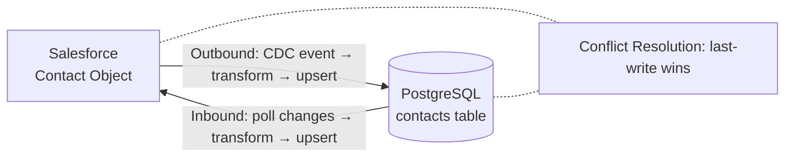

# Salesforce ↔ Database Sync

## What You'll Build

A bidirectional sync integration that keeps Salesforce contacts in sync with a PostgreSQL database. The integration listens for Salesforce Change Data Capture (CDC) events for real-time outbound sync and runs a scheduled poll for inbound sync from the database back to Salesforce.



## What You'll Learn

- Salesforce connector configuration and CDC event subscription
- Database connector usage with parameterized queries
- Bidirectional data synchronization with conflict resolution
- Data transformation between Salesforce and relational schemas
- Error handling and retry logic for sync failures

## Prerequisites

- WSO2 Integrator VS Code extension installed
- Salesforce developer account with API access and CDC enabled for the Contact object
- PostgreSQL database
- Basic familiarity with [Connectors](/docs/connectors/overview)

**Time estimate:** 30--45 minutes

## Step-by-Step Walkthrough

### Step 1: Create the Project

1. Open VS Code and run **WSO2 Integrator: Create New Project**.
2. Name the project `salesforce-db-sync`.
3. Enable Change Data Capture for the Contact object in Salesforce Setup.
4. Configure `Config.toml`:

```toml
[sync]
pollIntervalSeconds = 300

[sync.salesforce]
baseUrl = "https://your-instance.salesforce.com"
clientId = "<SF_CLIENT_ID>"
clientSecret = "<SF_CLIENT_SECRET>"
refreshToken = "<SF_REFRESH_TOKEN>"

[sync.db]
host = "localhost"
port = 5432
database = "crm"
user = "sync_user"
password = "sync_pass"
```

5. Create the database table:

```sql
CREATE TABLE contacts (
    id SERIAL PRIMARY KEY,
    salesforce_id VARCHAR(18) UNIQUE,
    email VARCHAR(255) UNIQUE NOT NULL,
    first_name VARCHAR(100),
    last_name VARCHAR(100),
    phone VARCHAR(50),
    title VARCHAR(100),
    company VARCHAR(200),
    last_synced_at TIMESTAMP DEFAULT NOW(),
    updated_at TIMESTAMP DEFAULT NOW(),
    source VARCHAR(20) DEFAULT 'database'
);
```

### Step 2: Define the Data Types

Create `types.bal`:

```ballerina
// types.bal

// Internal unified contact record for sync operations.
type Contact record {|
    string? salesforceId;
    string email;
    string firstName;
    string lastName;
    string phone;
    string title;
    string company;
    string updatedAt;
    string 'source;    // "salesforce" | "database"
|};

// Database contact row.
type DbContact record {|
    int id;
    string? salesforce_id;
    string email;
    string first_name;
    string last_name;
    string phone;
    string title;
    string company;
    string last_synced_at;
    string updated_at;
    string 'source;
|};

// Sync operation result.
type SyncResult record {|
    string direction;    // "sf_to_db" | "db_to_sf"
    int processed;
    int succeeded;
    int failed;
    int skipped;
    string[] errors;
|};
```

### Step 3: Build the Salesforce-to-Database Sync (Outbound)

Create `outbound_sync.bal` to handle CDC events:

```ballerina
// outbound_sync.bal
import ballerinax/salesforce as sf;
import ballerinax/postgresql;
import ballerina/log;
import ballerina/time;

configurable string sfBaseUrl = ?;
configurable string sfClientId = ?;
configurable string sfClientSecret = ?;
configurable string sfRefreshToken = ?;
configurable string dbHost = ?;
configurable int dbPort = ?;
configurable string dbName = ?;
configurable string dbUser = ?;
configurable string dbPassword = ?;

final sf:Client salesforceClient = check new ({
    baseUrl: sfBaseUrl,
    auth: {
        clientId: sfClientId,
        clientSecret: sfClientSecret,
        refreshToken: sfRefreshToken,
        refreshUrl: "https://login.salesforce.com/services/oauth2/token"
    }
});

final postgresql:Client syncDb = check new (dbHost, dbUser, dbPassword, dbName, dbPort);

// Listen for Salesforce CDC events on the Contact object.
listener sf:EventListener sfEventListener = check new ({
    baseUrl: sfBaseUrl,
    auth: {
        clientId: sfClientId,
        clientSecret: sfClientSecret,
        refreshToken: sfRefreshToken,
        refreshUrl: "https://login.salesforce.com/services/oauth2/token"
    },
    channelName: "/data/ContactChangeEvent"
});

service on sfEventListener {

    remote function onEvent(json cdcEvent) returns error? {
        log:printInfo(string `Received CDC event: ${cdcEvent.toJsonString()}`);

        json header = check cdcEvent.header;
        string changeType = (check header.changeType).toString();

        match changeType {
            "CREATE"|"UPDATE" => {
                check handleSfUpsert(cdcEvent);
            }
            "DELETE" => {
                check handleSfDelete(cdcEvent);
            }
            _ => {
                log:printInfo(string `Ignoring change type: ${changeType}`);
            }
        }
    }
}

function handleSfUpsert(json cdcEvent) returns error? {
    json payload = check cdcEvent.payload;
    string sfId = (check payload.Id).toString();
    string email = (check payload.Email).toString();
    string firstName = (check payload.FirstName).toString();
    string lastName = (check payload.LastName).toString();
    string phone = (check payload.Phone).toString();
    string title = (check payload.Title).toString();
    string company = (check payload.Company).toString();
    string now = time:utcToString(time:utcNow());

    _ = check syncDb->execute(
        `INSERT INTO contacts (salesforce_id, email, first_name, last_name, phone, title, company, last_synced_at, updated_at, source)
         VALUES (${sfId}, ${email}, ${firstName}, ${lastName}, ${phone}, ${title}, ${company}, ${now}, ${now}, 'salesforce')
         ON CONFLICT (salesforce_id) DO UPDATE SET
             email = EXCLUDED.email,
             first_name = EXCLUDED.first_name,
             last_name = EXCLUDED.last_name,
             phone = EXCLUDED.phone,
             title = EXCLUDED.title,
             company = EXCLUDED.company,
             last_synced_at = EXCLUDED.last_synced_at,
             updated_at = EXCLUDED.updated_at,
             source = 'salesforce'`
    );
    log:printInfo(string `Synced SF contact ${sfId} (${email}) to database`);
}

function handleSfDelete(json cdcEvent) returns error? {
    json header = check cdcEvent.header;
    json[] recordIds = check (check header.recordIds).ensureType();
    foreach json id in recordIds {
        string sfId = id.toString();
        _ = check syncDb->execute(
            `DELETE FROM contacts WHERE salesforce_id = ${sfId}`
        );
        log:printInfo(string `Deleted contact with SF ID ${sfId} from database`);
    }
}
```

### Step 4: Build the Database-to-Salesforce Sync (Inbound)

Create `inbound_sync.bal` for scheduled polling:

```ballerina
// inbound_sync.bal
import ballerina/task;
import ballerina/log;
import ballerina/time;

configurable int pollIntervalSeconds = 300;

// Track the last sync timestamp.
isolated string lastInboundSyncTime = "2000-01-01T00:00:00Z";

// Scheduled job that polls the database for changes.
@task:AppointmentConfig {
    cronExpression: "0 */5 * * * ?"  // Every 5 minutes
}
function syncDatabaseToSalesforce() returns error? {
    log:printInfo("Starting inbound sync (DB → Salesforce)...");

    string syncStartTime = time:utcToString(time:utcNow());

    // Fetch contacts updated in the database since the last sync,
    // excluding those whose source is "salesforce" (to avoid echo).
    stream<DbContact, error?> updatedContacts = syncDb->query(
        `SELECT id, salesforce_id, email, first_name, last_name, phone, title, company,
                last_synced_at, updated_at, source
         FROM contacts
         WHERE updated_at > ${lastInboundSyncTime}::timestamp
           AND source = 'database'
         ORDER BY updated_at ASC`
    );

    int processed = 0;
    int succeeded = 0;
    int failed = 0;

    check from DbContact dbContact in updatedContacts
        do {
            processed += 1;
            error? result = upsertToSalesforce(dbContact);
            if result is error {
                log:printError(string `Failed to sync contact ${dbContact.email} to SF`, result);
                failed += 1;
            } else {
                succeeded += 1;
                // Update last_synced_at in the database.
                _ = check syncDb->execute(
                    `UPDATE contacts SET last_synced_at = ${syncStartTime} WHERE id = ${dbContact.id}`
                );
            }
        };

    lock {
        lastInboundSyncTime = syncStartTime;
    }
    log:printInfo(string `Inbound sync complete: ${processed} processed, ${succeeded} succeeded, ${failed} failed`);
}

// Upsert a database contact to Salesforce.
function upsertToSalesforce(DbContact contact) returns error? {
    json sfContact = {
        "Email": contact.email,
        "FirstName": contact.first_name,
        "LastName": contact.last_name,
        "Phone": contact.phone,
        "Title": contact.title
    };

    if contact.salesforce_id is string {
        // Update existing Salesforce record.
        check salesforceClient->update("Contact", <string>contact.salesforce_id, sfContact);
    } else {
        // Create new Salesforce record and store the ID.
        string sfId = check salesforceClient->create("Contact", sfContact);
        _ = check syncDb->execute(
            `UPDATE contacts SET salesforce_id = ${sfId} WHERE id = ${contact.id}`
        );
    }
}
```

### Step 5: Add the HTTP Management Endpoint

Create `main.bal` with status and manual trigger endpoints:

```ballerina
// main.bal
import ballerina/http;
import ballerina/log;

service /sync on new http:Listener(8090) {

    // POST /sync/trigger/inbound — manually trigger inbound sync.
    resource function post trigger/inbound() returns record {|string message;|}|error {
        check syncDatabaseToSalesforce();
        return {message: "Inbound sync completed"};
    }

    // GET /sync/status — check sync health.
    resource function get status() returns record {|string status; string lastInboundSync;|} {
        return {status: "running", lastInboundSync: lastInboundSyncTime};
    }

    // GET /sync/health — health check.
    resource function get health() returns http:Ok {
        return http:OK;
    }
}
```

### Step 6: Handle Errors

Add retry logic in `error_handler.bal`:

```ballerina
// error_handler.bal
import ballerina/log;

// Retry a function up to maxRetries times with exponential backoff.
function retryWithBackoff(function () returns error? fn, int maxRetries = 3) returns error? {
    int attempt = 0;
    while attempt < maxRetries {
        error? result = fn();
        if result is () {
            return;
        }
        attempt += 1;
        if attempt >= maxRetries {
            log:printError(string `All ${maxRetries} retry attempts exhausted`);
            return result;
        }
        int delayMs = <int>(1000 * float:pow(2, <float>attempt));
        log:printWarn(string `Retry attempt ${attempt}/${maxRetries} after ${delayMs}ms`);
        // In production, use runtime:sleep(delayMs / 1000.0);
    }
}
```

### Step 7: Test It

1. Start the sync service:

```bash
bal run
```

2. Create a contact in Salesforce and watch the logs for the CDC event and database insert.

3. Insert a contact directly in the database:

```sql
INSERT INTO contacts (email, first_name, last_name, phone, title, company, source)
VALUES ('test@example.com', 'Test', 'User', '555-0000', 'Engineer', 'Acme', 'database');
```

4. Trigger inbound sync manually:

```bash
curl -X POST http://localhost:8090/sync/trigger/inbound
```

5. Verify the contact was created in Salesforce.

6. Check sync status:

```bash
curl http://localhost:8090/sync/status
```

7. Run automated tests:

```bash
bal test
```

## Extend It

- **Add conflict resolution strategies** beyond last-write-wins (e.g., field-level merge).
- **Sync additional Salesforce objects** such as Accounts, Opportunities, or Leads.
- **Add webhook-based inbound sync** using database triggers and LISTEN/NOTIFY in PostgreSQL.
- **Publish sync metrics** to the Integration Control Plane for monitoring.
- **Add data validation** to reject malformed records before syncing.

## Full Source Code

Find the complete working project on GitHub:
[wso2/integrator-samples/salesforce-db-sync](https://github.com/wso2/integrator-samples/tree/main/salesforce-db-sync)
