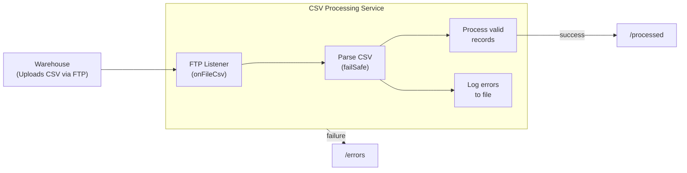

# Process CSV files from FTP with fail-safe error handling

Build an FTP file processing service that watches a directory for inventory CSV files, parses rows into typed records with fail-safe error handling, and automatically routes files to separate directories based on processing outcome.

## What you'll build

An FTP listener that monitors `/incoming` for CSV files uploaded by warehouse systems. Each file contains inventory records with fields like SKU, quantity, and unit price. The service parses every row into a typed `InventoryRecord`, skips malformed rows instead of failing the entire file, and logs errors to a local file. After processing, the FTP connector automatically moves the file to `/processed` on success or `/errors` on failure.

## What you'll learn

- Configuring an FTP listener to watch for CSV files with a file name pattern
- Using `onFileCsv` to receive CSV content and parsing it with `csv:parseList`
- Applying fail-safe CSV parsing options to skip invalid rows and log errors
- Using `@ftp:FunctionConfig` with `afterProcess` and `afterError` to auto-move files
- Handling processing errors with `do/on fail`

## Prerequisites

- WSO2 Integrator VS Code extension installed
- Basic familiarity with Ballerina syntax
- Docker installed (for the FTP server)

**Time estimate:** 30--45 minutes

## Architecture



## Step 1: Create the Ballerina project

Create a new Ballerina project:

```bash
bal new csv_ftp_processor
cd csv_ftp_processor
```

This creates a project directory with a `Ballerina.toml` and a default `main.bal`. You will replace the generated files with the ones below.

Add the `data.csv` dependency to `Ballerina.toml` to pin it to the version compatible with the FTP module:

```toml
[[dependency]]
org = "ballerina"
name = "data.csv"
version = "0.8.2"
```

## Step 2: Define the data types

Create `types.bal` in the project root with the record type for inventory data:

```ballerina
// types.bal

type InventoryRecord record {|
    string warehouseId;
    string sku;
    string productName;
    int quantity;
    decimal unitPrice;
    string lastUpdated;
|};
```

The closed record (`record {|...|}`) ensures that only these six fields are accepted. The `quantity` (int) and `unitPrice` (decimal) fields enable fail-safe testing — rows with non-numeric values in these columns are skipped during parsing.

## Step 3: Add configurable values

Create `config.bal` in the project root to declare the FTP connection and path values so they can be set per environment:

```ballerina
// config.bal

configurable string ftpHost = "127.0.0.1";
configurable int ftpPort = 21;
configurable string ftpUser = "admin";
configurable string ftpPassword = "admin";

configurable string incomingPath = "/incoming";
configurable string processedPath = "/processed";
configurable string errorsPath = "/errors";

configurable string errorLogPath = "./logs/inventory-errors.log";
```

## Step 4: Build the FTP listener and service

Replace the contents of `main.bal` with the listener and service:

```ballerina
// main.bal
import ballerina/data.csv;
import ballerina/ftp;
import ballerina/log;

listener ftp:Listener ftpListener = new (
    protocol = ftp:FTP,
    host = ftpHost,
    port = ftpPort,
    auth = {credentials: {username: ftpUser, password: ftpPassword}},
    userDirIsRoot = true,
    pollingInterval = 10
);

@ftp:ServiceConfig {
    path: incomingPath,
    fileNamePattern: ".*\\.csv"
}
service on ftpListener {

    @ftp:FunctionConfig {
        afterProcess: {moveTo: processedPath},
        afterError: {moveTo: errorsPath}
    }
    remote function onFileCsv(string[][] content, ftp:FileInfo fileInfo) returns error? {
        log:printInfo(string `Processing file: ${fileInfo.name} (${fileInfo.size} bytes)`);

        do {
            InventoryRecord[] inventory = check csv:parseList(content, {
                customHeaders: ["warehouseId", "sku", "productName", "quantity", "unitPrice", "lastUpdated"],
                failSafe: {
                    enableConsoleLogs: true,
                    fileOutputMode: {
                        filePath: errorLogPath,
                        contentType: csv:METADATA,
                        fileWriteOption: csv:APPEND
                    }
                }
            });

            log:printInfo(string `Parsed ${inventory.length()} valid records from ${fileInfo.name}`);

            if inventory.length() == 0 {
                return error(string `No valid records found in ${fileInfo.name}`);
            }

            foreach InventoryRecord item in inventory {
                log:printInfo(string `Warehouse: ${item.warehouseId}, SKU: ${item.sku}, ` +
                    string `Product: ${item.productName}, Qty: ${item.quantity}, ` +
                    string `Price: ${item.unitPrice}, Updated: ${item.lastUpdated}`);
            }

            log:printInfo(string `Successfully processed ${fileInfo.name}`);
        } on fail error err {
            log:printError(string `Failed to process ${fileInfo.name}`, 'error = err);
            return err;
        }
    }
}
```

Key points in this code:

- **`onFileCsv(string[][] content, ...)`** — receives CSV rows as a two-dimensional string array. This gives you control over parsing with fail-safe options rather than relying on automatic data binding.
- **`csv:parseList` with `failSafe`** — parses rows into typed `InventoryRecord` records. Malformed rows (for example, `"INVALID"` in the `quantity` column) are skipped instead of failing the entire file. Errors are logged to the console and written to the error log file.
- **`customHeaders`** — maps positional columns to record field names since `string[][]` content does not include header names.
- **Zero-records check** — if fail-safe parsing skips every row, the handler explicitly returns an error. Without this check, the handler would succeed with an empty array and the file would move to `/processed` instead of `/errors`.
- **`afterProcess` / `afterError`** — the FTP connector automatically moves the file to the `moveTo` path after the handler completes. `afterProcess` triggers on success (moving to `/processed`), and `afterError` triggers when the handler returns an error (moving to `/errors`).
- **`do/on fail`** — catches any unrecoverable error during parsing or processing and re-returns it so the `afterError` action triggers.

## Step 5: Add the configuration file

Create `Config.toml` in the project root with default values for the local Docker FTP server:

```toml
# Config.toml

ftpHost = "127.0.0.1"
ftpPort = 21
ftpUser = "admin"
ftpPassword = "admin"

incomingPath = "/incoming"
processedPath = "/processed"
errorsPath = "/errors"

errorLogPath = "./logs/inventory-errors.log"
```

## Step 6: Prepare sample data

Create a `sample-data/` directory in the project root:

```bash
mkdir sample-data
```

Create `sample-data/warehouse-daily.csv` with a mix of valid rows and one malformed row to test fail-safe behavior. The third row has `INVALID` in the `quantity` column:

```csv
warehouseId,sku,productName,quantity,unitPrice,lastUpdated
WH-01,SKU-1001,Wireless Mouse,150,24.99,2026-04-06
WH-01,SKU-1002,USB-C Hub,75,49.50,2026-04-06
WH-02,SKU-2001,Monitor Stand,INVALID,34.99,2026-04-06
WH-02,SKU-2002,Desk Lamp,200,19.99,2026-04-06
WH-03,SKU-3001,Keyboard,120,89.00,2026-04-06
```

Create `sample-data/bad-inventory.csv` with all data rows containing invalid values in the typed columns. This file tests the error path — every row fails parsing, so the handler returns an error and the file moves to `/errors`:

```csv
warehouseId,sku,productName,quantity,unitPrice,lastUpdated
WH-99,BAD-001,Broken Item,INVALID,INVALID,2026-04-06
WH-99,BAD-002,Another Bad,NaN,NaN,2026-04-06
```

## Step 7: Start the FTP server

Create a `docker-compose.yml` in the project root:

```yaml
services:
  ftp:
    image: stilliard/pure-ftpd
    environment:
      - FTP_USER_NAME=admin
      - FTP_USER_PASS=admin
      - FTP_USER_HOME=/home/ftpfiles
      - PUBLICHOST=127.0.0.1
    ports:
      - "21:21"
      - "30000-30009:30000-30009"
    entrypoint: >
      bash -c "
        mkdir -p /home/ftpfiles/incoming /home/ftpfiles/processed /home/ftpfiles/errors &&
        chown -R ftpuser:ftpgroup /home/ftpfiles &&
        /run.sh -l puredb:/etc/pure-ftpd/pureftpd.pdb -E -j -R -P 127.0.0.1 -p 30000:30009
      "
```

The custom entrypoint creates the required directories and sets ownership to `ftpuser` before the FTP daemon starts. This avoids permission errors on uploads.

Start the FTP server:

```bash
docker-compose up -d
```

## Step 8: Run and test

Start the Ballerina service:

```bash
bal run
```

In a separate terminal, upload the sample CSV file to the FTP server:

```bash
curl -T sample-data/warehouse-daily.csv ftp://127.0.0.1/incoming/warehouse-daily.csv --user "admin:admin"
```

The listener detects the new CSV file on the next polling cycle and processes it. Expected output:

```text
time=... level=INFO module=.../csv_ftp_processor message="Processing file: warehouse-daily.csv (299 bytes)"
time=... level=INFO module=.../csv_ftp_processor message="Parsed 4 valid records from warehouse-daily.csv"
time=... level=INFO module=.../csv_ftp_processor message="Warehouse: WH-01, SKU: SKU-1001, Product: Wireless Mouse, Qty: 150, Price: 24.99, Updated: 2026-04-06"
time=... level=INFO module=.../csv_ftp_processor message="Warehouse: WH-01, SKU: SKU-1002, Product: USB-C Hub, Qty: 75, Price: 49.5, Updated: 2026-04-06"
time=... level=INFO module=.../csv_ftp_processor message="Warehouse: WH-02, SKU: SKU-2002, Product: Desk Lamp, Qty: 200, Price: 19.99, Updated: 2026-04-06"
time=... level=INFO module=.../csv_ftp_processor message="Warehouse: WH-03, SKU: SKU-3001, Product: Keyboard, Qty: 120, Price: 89.0, Updated: 2026-04-06"
time=... level=INFO module=.../csv_ftp_processor message="Successfully processed warehouse-daily.csv"
```

The third row (`Monitor Stand` with `INVALID` quantity) is skipped. The fail-safe parser logs the error to the console and appends it to `./logs/inventory-errors.log`.

After processing completes, verify the file moved to `/processed`:

```bash
# File should now be in /processed
curl ftp://127.0.0.1/processed/ --user "admin:admin"

# /incoming should be empty
curl ftp://127.0.0.1/incoming/ --user "admin:admin"
```

### Testing the error path

Upload the `bad-inventory.csv` file where every data row has invalid values in the `quantity` and `unitPrice` columns:

```bash
curl -T sample-data/bad-inventory.csv ftp://127.0.0.1/incoming/bad-inventory.csv --user "admin:admin"
```

The fail-safe parser skips both rows. Since zero valid records remain, the handler returns an error and `afterError` moves the file to `/errors`. Expected output:

```text
time=... level=INFO module=.../csv_ftp_processor message="Processing file: bad-inventory.csv (156 bytes)"
time=... level=INFO module=.../csv_ftp_processor message="Parsed 0 valid records from bad-inventory.csv"
error: No valid records found in bad-inventory.csv
```

The row-level parsing errors are also appended to `./logs/inventory-errors.log` in your project directory. Verify the file moved to `/errors` on the FTP server:

```bash
# File should now be in /errors
curl ftp://127.0.0.1/errors/ --user "admin:admin"

# /incoming should be empty
curl ftp://127.0.0.1/incoming/ --user "admin:admin"
```

## Extend it

- **Stream large files** — Replace `string[][] content` with `stream<string[], error?> content` in the `onFileCsv` signature to process rows incrementally without loading the entire file into memory
- **Write valid records to a database** — Add a MySQL or PostgreSQL connector and insert each `InventoryRecord` into a database table inside the foreach loop
- **Send alerts on failure** — Add an email or Slack notification when files land in `/errors` so operations teams can investigate promptly
- **Add file dependency** — Require a `.done` marker file before processing, similar to the [FTP order batch walkthrough](ftp-listener-with-age-filter-and-file-dependency.md)

## What's next

- [CSV flat file processing](../../develop/transform/csv-flat-file.md) -- CSV parsing patterns including projections, custom delimiters, and fail-safe options
- [FTP / SFTP services](../../develop/integration-artifacts/file/ftp-sftp.md) -- FTP service configuration, authentication, and post-processing reference
- [Process FTP order batches](ftp-listener-with-age-filter-and-file-dependency.md) -- Age filtering and file dependency patterns for FTP listeners
- [EDI FTP processing](edi-ftp-processing.md) -- End-to-end EDI file processing over SFTP
