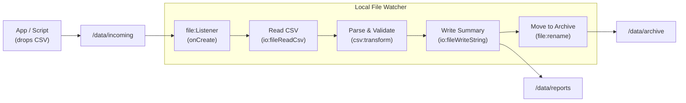

# Watch a Local Directory for CSV Files

Build a local file watcher that monitors a directory for incoming CSV files, reads and validates each row, generates a summary report, and moves processed files to an archive folder.

## What you'll build

A `file:Listener` that watches the `/data/incoming` directory. When a new CSV file appears (for example, dropped by a script or another application), the `onCreate` handler reads the file, parses it into typed records, validates each row, writes a summary to `/data/reports`, and moves the original file to `/data/archive`.

## What you'll learn

- Creating a local file listener with `ballerina/file`
- Filtering by file extension in the `onCreate` handler
- Reading and parsing CSV files with `ballerina/io` and `ballerina/data.csv`
- Writing output files (summary report)
- Moving processed files using `file:rename`

## Prerequisites

- WSO2 Integrator VS Code extension installed
- Basic familiarity with Ballerina syntax

**Time estimate:** 20–30 minutes

## Architecture



## Step 1: Create the Ballerina project

```bash
bal new local_file_watcher
cd local_file_watcher
```

Create the watch directories:

```bash
mkdir -p /data/incoming /data/archive /data/reports
```

## Step 2: Define the data types

Create `types.bal` in the project root:

```ballerina
// types.bal

type SalesRecord record {|
    string transactionId;
    string date;
    string product;
    int quantity;
    decimal unitPrice;
|};
```

## Step 3: Add configurable values

Create `config.bal`:

```ballerina
// config.bal

configurable string incomingDir = "/data/incoming";
configurable string archiveDir = "/data/archive";
configurable string reportsDir = "/data/reports";
```

## Step 4: Build the file watcher service

Replace the contents of `main.bal`:

```ballerina
// main.bal
import ballerina/data.csv;
import ballerina/file;
import ballerina/io;
import ballerina/log;
import ballerina/time;

listener file:Listener fileListener = check new ({
    path: incomingDir,
    recursive: false
});

service on fileListener {

    remote function onCreate(file:FileEvent event) returns error? {
        string filePath = event.name;

        // Only process CSV files
        if !filePath.endsWith(".csv") {
            return;
        }

        log:printInfo(string `New CSV file detected: ${filePath}`);

        do {
            // Step 1: Read the CSV file
            SalesRecord[] records = check csv:parseStream(
                check io:fileReadBlocksAsStream(filePath, 8192)
            );
            log:printInfo(string `Parsed ${records.length()} records`);

            // Step 2: Validate and compute summary
            decimal totalRevenue = 0;
            int validCount = 0;
            string[] errors = [];

            foreach int i in 0 ..< records.length() {
                SalesRecord rec = records[i];
                if rec.quantity <= 0 {
                    errors.push(string `Row ${i + 1}: invalid quantity ${rec.quantity}`);
                    continue;
                }
                totalRevenue += <decimal>rec.quantity * rec.unitPrice;
                validCount += 1;
            }

            // Step 3: Write summary report
            string fileName = check file:basename(filePath);
            string timestamp = time:utcToString(time:utcNow());
            string report = string `Report for ${fileName}
Generated: ${timestamp}
Total records: ${records.length()}
Valid records: ${validCount}
Skipped records: ${errors.length()}
Total revenue: ${totalRevenue}
${errors.length() > 0 ? "\nValidation errors:\n" + string:'join("\n", ...errors) : ""}`;

            string reportPath = string `${reportsDir}/${fileName}.report.txt`;
            check io:fileWriteString(reportPath, report);
            log:printInfo(string `Report written: ${reportPath}`);

            // Step 4: Move file to archive
            string archivePath = string `${archiveDir}/${fileName}`;
            check file:rename(filePath, archivePath);
            log:printInfo(string `Archived: ${archivePath}`);

        } on fail error err {
            log:printError(string `Failed to process ${filePath}`, 'error = err);
        }
    }
}
```

Key points:

- **Extension check** — The `file:Listener` fires `onCreate` for any new file. The handler filters by `.csv` extension explicitly.
- **`csv:parseStream`** — Parses the CSV stream into typed `SalesRecord` records. If headers match field names, no `customHeaders` configuration is needed.
- **Validation** — Checks `quantity > 0` for each row and accumulates errors.
- **`file:rename`** — Moves the file from incoming to archive. This is an atomic operation on most file systems.
- **`do/on fail`** — Catches any error during processing and logs it. The file stays in incoming for manual review.

## Step 5: Add the configuration file

Create `Config.toml`:

```toml
# Config.toml

incomingDir = "/data/incoming"
archiveDir = "/data/archive"
reportsDir = "/data/reports"
```

## Step 6: Prepare sample data

Create `sample-data/daily-sales.csv`:

```csv
transactionId,date,product,quantity,unitPrice
TX-001,2026-04-15,Widget A,5,19.99
TX-002,2026-04-15,Widget B,3,29.99
TX-003,2026-04-15,Widget C,-1,9.99
TX-004,2026-04-15,Widget D,10,14.50
TX-005,2026-04-15,Widget E,2,49.00
```

Row 3 has a negative quantity and will be flagged during validation.

## Step 7: Run and test

Start the service:

```bash
bal run
```

In a separate terminal, copy the sample file into the watched directory:

```bash
cp sample-data/daily-sales.csv /data/incoming/
```

The listener detects the new file and processes it. Expected output:

```text
time=... level=INFO message="New CSV file detected: /data/incoming/daily-sales.csv"
time=... level=INFO message="Parsed 5 records"
time=... level=INFO message="Report written: /data/reports/daily-sales.csv.report.txt"
time=... level=INFO message="Archived: /data/archive/daily-sales.csv"
```

Verify the results:

```bash
# Report was written
cat /data/reports/daily-sales.csv.report.txt

# File was moved to archive
ls /data/archive/

# Incoming directory is now empty
ls /data/incoming/
```

The report should show 4 valid records, 1 skipped, and a validation error for row 3.

## Extend it

- **Watch sub-directories** — Set `recursive: true` in the listener to monitor nested folders
- **Handle multiple formats** — Check file extension and route to different parsers for JSON, XML, or text files
- **Add onModify** — Detect re-uploads or appends to existing files
- **Send alerts** — Add an email or Slack notification when validation errors exceed a threshold
- **Scale to remote servers** — Replace `file:Listener` with `ftp:Listener` to watch FTP/SFTP directories using the same processing pattern

## What's next

- [Local Files](../../develop/integration-artifacts/file/local-files.md) — local file service configuration and event handler reference
- [FTP / SFTP](../../develop/integration-artifacts/file/ftp-sftp.md) — monitor remote servers instead of local directories
- [CSV processing](../../develop/transform/csv-flat-file.md) — fail-safe parsing, projections, and custom delimiters
