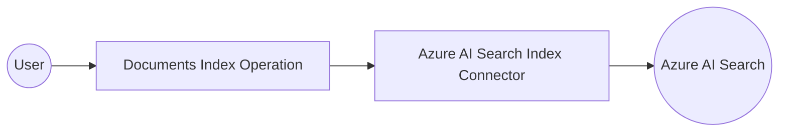

# Example

## What you'll build

Build an integration that connects to Azure AI Search and uploads documents to a search index using the WSO2 Integrator low-code canvas. The integration creates an automation flow that calls the Documents Index operation to batch-upload documents and logs the result.

**Operations used:**
- **Documents Index** : Uploads or indexes a batch of documents to an Azure AI Search index using an `IndexBatch` payload

## Architecture

## Prerequisites

- An Azure subscription with an Azure AI Search service provisioned
- Your Azure AI Search service endpoint URL and API key

## Setting up the Azure AI Search Index integration

> **New to WSO2 Integrator?** Follow the [Create a New Integration](../../../../develop/create-integrations/create-new-integration.md) guide to set up your integration first, then return here to add the connector.

## Adding the Azure AI Search Index connector

Search for and add the Azure AI Search Index connector to your integration project.

### Step 1: Open the connector palette

Select **+ Add Connection** to open the connector palette and view all available connectors before searching.

### Step 2: Search for and select the Index connector

1. Enter "Index" in the search box.
2. Select the **ballerinax/azure.ai.search.index** connector card (labeled **Index**) to open the connection configuration form.

## Configuring the Azure AI Search Index connection

### Step 3: Fill in the connection parameters

Bind each connection field to a configurable variable so credentials aren't hardcoded.

- **serviceUrl** : The Azure AI Search service endpoint URL, bound to a configurable variable
- **Config** : HTTP-level transport configuration; leave as `{}` to accept all defaults

> **Note:** The `ConnectionConfig` record for this connector is an HTTP transport-level config only and has no `auth` field. Pass the Azure AI Search API key as the `api-key` request header in individual operation calls, not in the connection config.

### Step 4: Save the connection

Select **Save Connection** to persist the connection. The canvas updates and `indexClient` appears under **Connections**.

### Step 5: Set actual values for your configurables

1. In the left panel, select **Configurations**.
2. Set a value for each configurable listed below.

- **serviceUrl** (string) : The Azure AI Search index endpoint, for example `https://<your-search-service>.search.windows.net/indexes/<index-name>`
- **apiKey** (string) : Your Azure AI Search API key

## Configuring the Azure AI Search Index Documents Index operation

### Step 6: Add an Automation entry point

1. Select **+ Add Artifact** on the design canvas.
2. Select **Automation** from the artifact picker.
3. Accept the defaults in the **Create New Automation** form and select **Create**.

The automation flow canvas opens, showing `Start → Error Handler → End`.

### Step 7: Select and configure the Documents Index operation

1. Select the **+** node between **Start** and **Error Handler** to open the node panel.
2. Under **Connections**, expand **indexClient** to view its available operations.

3. Select **Documents Index** to open the operation configuration panel.
4. Fill in the operation fields:

- **Payload** : An `index:IndexBatch` record with a `value` array of `IndexAction` items; enter `{value: []}` in expression mode
- **Api-version** : The Azure AI Search REST API version, for example `2024-07-01`
- **Result** : Variable name for the operation result

Select **Save** to add the node to the flow.

## Try it yourself

Try this sample in WSO2 Integration Platform.

[View source on GitHub](https://github.com/wso2/integration-samples/tree/main/connectors/azure.ai.search.index_connector_sample)

## More code examples

The `Azure AI Search Index` connector provides practical examples illustrating usage in various scenarios. Explore these [examples](https://github.com/ballerina-platform/module-ballerinax-azure.ai.search.index/tree/main/examples/), covering the following use cases:

1. [Document search](https://github.com/ballerina-platform/module-ballerinax-azure.ai.search.index/tree/main/examples/document-search) - Search for documents in an Azure AI Search index with various query parameters and filters.
