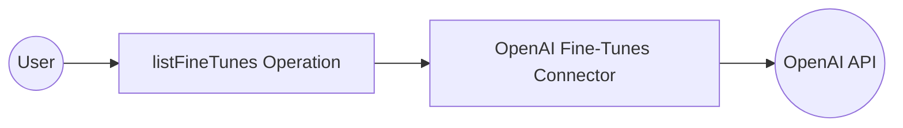

# Example

## What you'll build

Build a WSO2 Integrator automation that lists your organization's OpenAI fine-tuning jobs and logs the results. The integration connects to the OpenAI Fine-Tunes API using a secure configurable API token and retrieves all fine-tuning jobs associated with your account.

**Operations used:**
- **listFineTunes** : Lists all fine-tuning jobs in your organization's OpenAI account

## Architecture

## Prerequisites

- An [OpenAI API key](https://platform.openai.com/api-keys) with access to fine-tuning endpoints

## Setting up the OpenAI Fine-Tunes integration

> **New to WSO2 Integrator?** Follow the [Create a New Integration](../../../../develop/create-integrations/create-new-integration.md) guide to set up your integration first, then return here to add the connector.

## Adding the OpenAI Fine-Tunes connector

### Step 1: Open the Add connection panel

Select **+ Add Artifact** and then select the **Connections** node to open the **Add Connection** palette.

## Configuring the OpenAI Fine-Tunes connection

### Step 2: Fill in the connection parameters

Search for `openai` in the palette and select **Finetunes** to open the **Configure Finetunes** form. Bind the connection parameter to a configurable variable and enter a connection name.

- **config** : Bind to a configurable variable of type `string` to hold the OpenAI Bearer token (`openaiFineTunesApiToken`)
- **connectionName** : Enter `finetunesClient` as the connection name

### Step 3: Save the connection

Select **Save Connection** to persist the connection. The `finetunesClient` connection now appears under **Connections** in the project tree and on the design canvas.

### Step 4: Set actual values for your configurables

In the left panel, select **Configurations** and set a value for each configurable listed below.

- **openaiFineTunesApiToken** (string) : Your OpenAI API key with access to fine-tuning endpoints

## Configuring the OpenAI Fine-Tunes listFineTunes operation

### Step 5: Add an Automation entry point

Select **+ Add Artifact** on the design canvas. Under **Automation**, select **Automation**, leave all fields at their defaults, and select **Create**. The `main` automation appears under **Entry Points** and the automation flow canvas opens.

### Step 6: Select and configure the listFineTunes operation

In the automation flow canvas, select the **+** (Add Step) button between **Start** and **Error Handler**. Expand **finetunesClient** under **Connections** to reveal all available operations.

Select **List your organization's fine-tuning jobs** (`listFineTunes`) to open the operation form, then configure the following:

- **result** : Enter `result` as the output variable name to capture the list of fine-tuning jobs

Select **Save** to apply the configuration.

## Try it yourself

Try this sample in WSO2 Integration Platform.

[View source on GitHub](https://github.com/wso2/integration-samples/tree/main/connectors/openai.finetunes_connector_sample)

## More code examples

The `OpenAI Finetunes` connector provides practical examples illustrating usage in various scenarios. Explore these [examples](https://github.com/ballerina-platform/module-ballerinax-openai.finetunes/tree/main/examples), covering the following use cases:

1. [Sarcastic bot](https://github.com/ballerina-platform/module-ballerinax-openai.finetunes/tree/main/examples/sarcastic-bot) - Fine-tune the GPT-3.5-turbo model to generate sarcastic responses 

2. [Sports headline analyzer](https://github.com/ballerina-platform/module-ballerinax-openai.finetunes/tree/main/examples/sports-headline-analyzer) - Fine-tune the GPT-4o-mini model to extract structured information (player, team, sport, and gender) from sports headlines.
