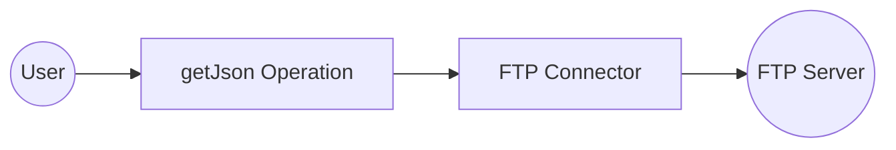
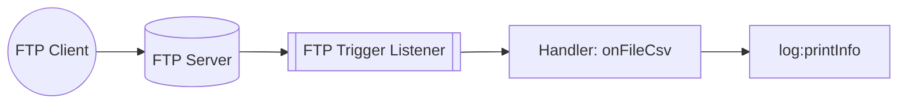

# Example

## Table of Contents

- [FTP Example](#ftp-example)
- [FTP Trigger Example](#ftp-trigger-example)

## FTP Example

### What you'll build

Build a WSO2 Integrator automation that connects to a remote FTP server, retrieves a JSON file using the `getJson` operation, and logs its contents. The workflow uses configurable variables to manage FTP credentials securely.

**Operations used:**
- **getJson** : Retrieves a JSON file from a specified path on the FTP server and returns its contents as a `json` value

### Architecture

### Prerequisites

- Access to an FTP server with a JSON file at a known path
- FTP server credentials (host, port, username, and password)

### Setting up the FTP integration

> **New to WSO2 Integrator?** Follow the [Create a New Integration](../../../../develop/create-integrations/create-new-integration.md) guide to set up your integration first, then return here to add the connector.

### Adding the FTP connector

Select **Add Connection** in the WSO2 Integrator sidebar to open the connector palette.

#### Step 1: Open the connector palette and select the FTP connector

1. In the WSO2 Integrator sidebar, expand **Connections** and select the **+** button next to it.
2. In the connector palette search box, enter `ftp`.
3. Select the **FTP** card (under `ballerina/ftp`, labeled "Standard").

### Configuring the FTP connection

#### Step 2: Bind connection parameters to configurable variables

Set the **Client Config** field using four configurable variables. Use the **Configurables** tab in the helper panel to create each variable:

- **ftpHost** (string) : Hostname or IP address of the FTP server
- **ftpPort** (int) : Port number used by the FTP server (default `21`)
- **ftpUsername** (string) : Username for FTP authentication
- **ftpPassword** (string) : Password for FTP authentication

After creating all four configurables, enter the following record literal in the **Client Config** expression field and set **Connection Name** to `ftpClient`.

#### Step 3: Save the connection

Select **Save Connection** to persist the connection. The form closes and the canvas displays the `ftpClient` connection node.

#### Step 4: Set actual values for your configurables

1. In the left panel, select **Configurations**.
2. Set a value for each configurable listed below.

- **ftpHost** (string) : The hostname or IP address of your FTP server (for example, `ftp.example.com`)
- **ftpPort** (int) : The port your FTP server listens on
- **ftpUsername** (string) : Your FTP account username
- **ftpPassword** (string) : Your FTP account password

### Configuring the FTP getJson operation

#### Step 5: Add an Automation entry point

1. Select **+ Add Artifact** on the canvas toolbar.
2. Under **Automation**, select the **Automation** tile.
3. Select **Create** — no additional configuration is needed.

The `main` automation entry point appears in the sidebar under **Entry Points**, and the canvas switches to the Automation flow editor showing a **Start** node.

#### Step 6: Select the getJson operation and configure its parameters

1. Select the **+** button on the canvas between **Start** and **Error Handler**.
2. In the right-side node panel, expand **Connections → ftpClient**.

3. Select **Get Json** and fill in the operation form:

- **Path** : Path to the JSON file on the FTP server (for example, `/data/sample.json`)
- **Result** : Name of the variable that stores the returned value
- **Target Type** : The expected return type (`json`)

4. Select **Save**.

### Try it yourself

Try this sample in WSO2 Integration Platform.

[View source on GitHub](https://github.com/wso2/integration-samples/tree/main/integrator-default-profile/connectors/ftp_connector_sample)

---
## FTP Trigger Example
### What you'll build

This integration listens for file creation events on a remote FTP/SFTP server and processes each new file through a configurable handler. When a new file arrives at the monitored path, the `onFileCsv` handler fires and logs the file metadata using `log:printInfo`. The overall flow runs from the FTP listener through the handler to the log output.

### Architecture

### Prerequisites

- Access to a running FTP or SFTP server (hostname, port, credentials, and a monitored directory path)

### Setting up the FTP integration

> **New to WSO2 Integrator?** Follow the [Create a New Integration](../../../../develop/create-integrations/create-new-integration.md) guide to set up your integration first, then return here to add the trigger.

### Adding the FTP trigger

#### Step 1: Open the Artifacts palette and select the FTP trigger

Select **Add Artifact** to open the Artifacts palette. Navigate to the **File Integration** category and locate the **FTP/SFTP** trigger card.

### Configuring the FTP listener

#### Step 2: Bind listener parameters to configurable variables

Select the FTP/SFTP trigger card to open the trigger configuration form. Bind each listener parameter to a new configurable variable using the Helper Panel:

- **Host** : Hostname or IP address of the FTP/SFTP server
- **Port Number** : Port used to connect to the FTP/SFTP server
- **Username** : Authentication username for the FTP/SFTP server
- **Password** : Authentication password for the FTP/SFTP server
- **Monitoring Path** : Directory path on the server to monitor for new files

For string fields, select **Open Helper Panel** → **Configurables** tab → **+ New Configurable**, enter the name and default value, then select **Save**. The configurable chip appears in the field. For the **Port Number** field (integer type), first switch from **Number** to **Expression** mode, then select **Open Helper Panel** to access the Configurables tab and create the `ftpPort` configurable. Leave **Authentication** set to **Basic Authentication** and **Protocol** set to **ftp**.

#### Step 3: Set actual values for your configurations

In the left panel, select **Configurations**. Set a value for each configuration listed below:

- **ftpHost** (string) : Hostname or IP address of the FTP/SFTP server
- **ftpPort** (int) : Port number used to connect to the server
- **ftpUsername** (string) : Authentication username
- **ftpPassword** (string) : Authentication password
- **ftpPath** (string) : Directory path on the server to monitor for new files

#### Step 4: Create the trigger

Select **Create** to generate the integration service and listener.

### Handling FTP events

#### Step 5: Add a file handler

Return to the FTP Integration service view. The service shows a **File Handlers** section with no handlers registered yet. Select **+ Add File Handler**. A **Select Handler to Add** side panel opens on the right, listing the available handler types:

- `onCreate` — triggered when a new file is created or detected
- `onDelete` — triggered when a file is deleted
- `onError` — triggered when a processing error occurs

#### Step 6: Configure the onCreate handler

Select **onCreate** to open the **New On Create Handler Configuration** panel. Set the handler options:

- **File Format** : Select `CSV` so the handler parses file content as rows of string arrays
- **After File Processing → Success** : Set to `Move` with destination `/tmp/success`
- **After File Processing → Error** : Set to `Move` with destination `/tmp/error`

These paths determine what happens to the source file after your handler runs—successful processing moves the file to the success directory, while any returned `error` routes it to the error directory.

Select **Save** to register the `onFileCsv` handler on the service.

#### Step 7: Add a log statement to the handler

After the handler is saved, WSO2 Integrator opens the **onFileCsv** flow canvas. To observe incoming file metadata at runtime, add a `log:printInfo` call to the handler body by selecting the **+** icon in the flow chart and choosing **Log Info** from the **Logging** section in the side panel. Enter the log statement:

`log:printInfo(fileInfo.toJsonString())`

WSO2 Integrator renders the `log:printInfo` node in the flow canvas.

#### Step 8: Verify the final service view

Navigate back to the **FTP Integration** service view. The **File Handlers** section now displays the registered `onFileCsv` handler row, showing the handler type tag (`onCreate`) alongside the function name.

### Running the integration

Select **Run Integration** in the WSO2 Integrator toolbar to start the integration. To fire a test event, use one of the following approaches:

- **WSO2 Integrator FTP client template**: Use the built-in FTP client integration template to upload a CSV file to the monitored path programmatically.
- **Native FTP CLI**: Use an FTP command-line client (for example, `ftp` or `lftp`) to connect to the server and upload a CSV file to the monitored directory.
- **FTP client application**: Use a graphical FTP client such as FileZilla to upload a CSV file to the monitored path on the server.

When a new CSV file appears at the monitored FTP path, the `onFileCsv` handler fires. The file metadata—name, size, path, and last modified time—is logged to the console via `log:printInfo`, and the source file is moved to `/tmp/success` on completion.

### Try it yourself

Try this sample in WSO2 Integration Platform.

[View source on GitHub](https://github.com/wso2/integration-samples/tree/main/integrator-default-profile/connectors/ftp_trigger_sample)
