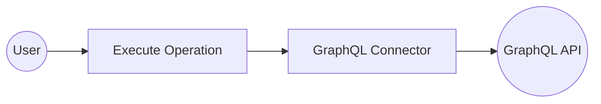
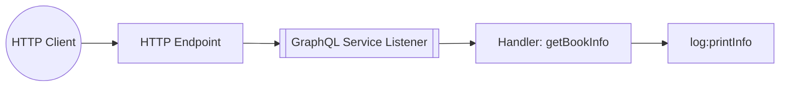

# Example


## Table of Contents

- [GraphQL Example](#graphql-example)
- [GraphQL Trigger Example](#graphql-trigger-example)

## GraphQL Example

### What you'll build

Build a WSO2 Integrator automation that connects to a GraphQL endpoint using the `ballerinax/graphql` connector. The integration sends a GraphQL query and receives a response from the configured GraphQL server.

**Operations used:**
- **Execute** : Sends a GraphQL document query to the configured endpoint and returns the response.

### Architecture



### Prerequisites

- A GraphQL endpoint URL to connect to.

### Setting up the GraphQL integration

> **New to WSO2 Integrator?** Follow the [Create a New Integration](../../../../develop/create-integrations/create-new-integration.md) guide to set up your integration first, then return here to add the connector.

### Adding the GraphQL connector

#### Step 1: Open the Add Connection palette

Select **+ Add Connection** on the WSO2 Integrator canvas to open the connection palette.


#### Step 2: Find and select the GraphQL connector

1. Enter `graphql` in the search field.
2. Select **ballerina/graphql** from the results to open the **Configure GraphQL** form.

### Configuring the GraphQL connection

#### Step 3: Bind connection parameters to configurable variables

Bind each field to a configurable variable using the helper panel.

- **serviceUrl** : The GraphQL server endpoint URL
- **forwarded** : Controls forwarded header behavior (default: `"disable"`)


#### Step 4: Save the connection

Select **Save Connection** to persist the connection. The `graphqlClient` node appears on the canvas.


#### Step 5: Set actual values for your configurables

In the left panel, select **Configurations** and set a value for each configurable listed below.

- **graphqlServiceUrl** (string) : The full URL of the GraphQL endpoint (for example, `https://countries.trevorblades.com/`)
- **graphqlForwarded** (string) : The forwarded header value (for example, `"disable"`)

### Configuring the GraphQL Execute operation

#### Step 6: Add an Automation entry point

1. Select **+ Add Artifact** on the canvas.
2. Under **Automation**, select **Automation**.
3. Select **Create** to scaffold the `main` entry point.

#### Step 7: Select and configure the Execute operation

1. Select the **+** button between **Start** and **Error Handler** on the canvas to open the step-addition panel.
2. Under **Connections**, expand **graphqlClient** to view available operations.


3. Select **Execute** to open the operation configuration form and fill in the following fields:

- **document** : The GraphQL query string to send (for example, `"{ __typename }"`)
- **result** : The variable name that stores the response
- **targetType** : The expected response type (for example, `graphql:GenericResponseWithErrors`)


Select **Save** to add the `execute` step to the flow.


### Try it yourself

Try this sample in WSO2 Integration Platform.

[](https://console.devant.dev/new?gh=wso2/integration-samples/tree/main/integrator-default-profile/connectors/graphql_connector_sample)

[View source on GitHub](https://github.com/wso2/integration-samples/tree/main/integrator-default-profile/connectors/graphql_connector_sample)


---
## GraphQL Trigger Example
### What you'll build

This integration exposes a typed GraphQL endpoint that listens for incoming Query requests from HTTP clients. When a query arrives, the `getBookInfo` resource handler processes it and logs the GraphQL context for observability. The overall flow runs from the HTTP client through the GraphQL listener to the handler, which calls `log:printInfo` on every request.

### Architecture



### Prerequisites

No external service accounts or API keys are required for this trigger type.

### Setting up the GraphQL Service integration

> **New to WSO2 Integrator?** Follow the [Create a New Integration](../../../../develop/create-integrations/create-new-integration.md) guide to set up your integration first, then return here to add the trigger.

### Adding the GraphQL Service trigger

#### Step 1: Open the Artifacts palette

Select **Add Artifact** (the **+** icon next to the project name) in the WSO2 Integrator panel. The **Artifacts** palette opens — locate the **Integration as API** category and find the **GraphQL Service (Beta)** card.


### Configuring the GraphQL Service listener

#### Step 2: Bind listener parameters to configuration variables

Fill in the **Create GraphQL Service** form by binding the port to a configurable variable:

1. Enter `/graphql` in the **Base Path** field.
2. Select the **Expression** tab in the **Port** field to reveal the expression editor.
3. Select **Open Helper Panel** (the **fx** icon).
4. In the **Helper Panel**, go to the **Configurables** tab and select **+ New Configurable**.
5. Enter `graphqlPort` as the variable name and select `int` as the type.
6. Select **Save**. The variable `graphqlPort` is automatically injected into the **Port** field.
7. Close the **Helper Panel**.

- **basePath** : the URL base path at which the GraphQL service is exposed
- **port** : the port the GraphQL listener binds to, driven by a `configurable int` variable


#### Step 3: Set actual values for your configurations

1. In the left panel, select **Configurations**.
2. Set a value for each configuration listed below:

- **graphqlPort** (int) : the port number the GraphQL service listens on (for example, `9090`)


#### Step 4: Create the service

Select **Create** to generate the GraphQL service.

### Handling GraphQL Service events

#### Step 5: Open the GraphQL Operations panel

Select **+ Create Operations** on the `/graphql` service node in the GraphQL diagram canvas. The **GraphQL Operations** side panel opens, listing three empty sections: **Query**, **Mutation**, and **Subscription**.


#### Step 6: Define the return type for the getBookInfo handler

1. Select **+** next to **Query** to add a new Query field. The **Add Field** form opens.
2. Enter `getBookInfo` in the **Field Name** field.
3. Select the **Field Type** input box and select **Create New Type** at the bottom of the dropdown.
4. In the **Create Type Schema** tab, enter `BookInfo` as the **Name**.
5. Select the **+** icon next to **Fields** to add the first field: enter `title` with type `string`.
6. Select **+** again to add a second field: enter `author` with type `string`.
7. Select **Save** to create the `BookInfo` type. The modal closes and `BookInfo` is auto-injected as the **Field Type**.
8. Select **Save** in the **Add Field** form to register the `getBookInfo → BookInfo` Query field.


#### Step 7: Add the log:printInfo step to the handler

Open the `getBookInfo` resource in the flow canvas. Add `graphql:Context ctx` as a parameter and insert the `log:printInfo(ctx.toJsonString())` call in the handler body. WSO2 Integrator detects the change and updates the flow diagram automatically.


#### Step 8: Confirm the registered handler in the Service view

Navigate back to **GraphQL Service - /graphql** in the left tree. The GraphQL diagram shows the complete service with the `Query: getBookInfo → BookInfo` resource registered and the `BookInfo` type node with fields `title: string` and `author: string`.


### Running the integration

#### Step 9: Run the integration and send a test query

1. Select **Run Integration** (▶) in the editor toolbar. The integration starts and logs appear in the output panel.
2. Send a GraphQL query to the running service using one of the following methods:

   **Option 1 — WSO2 Integrator built-in HTTP client:** Use the built-in HTTP client or **Try It** panel in WSO2 Integrator to POST a GraphQL query to `/graphql`.

   **Option 2 — curl:** Run the following command in a terminal, replacing the port with the value you set for `graphqlPort`:

   ```
   curl -X POST http://<host>:<graphqlPort>/graphql \
     -H "Content-Type: application/json" \
     -d '{"query": "{ getBookInfo { title author } }"}'
   ```

   **Option 3 — GraphQL client (for example, Postman or Insomnia):** Send a POST request to `http://<host>:<graphqlPort>/graphql` with the body `{ "query": "{ getBookInfo { title author } }" }`.

3. Observe the log output — the serialised GraphQL context (`ctx.toJsonString()`) is printed for each request.

### Try it yourself

Try this sample in WSO2 Integration Platform.

[](https://console.devant.dev/new?gh=wso2/integration-samples/tree/main/integrator-default-profile/connectors/graphql_trigger_sample)

[View source on GitHub](https://github.com/wso2/integration-samples/tree/main/integrator-default-profile/connectors/graphql_trigger_sample)
