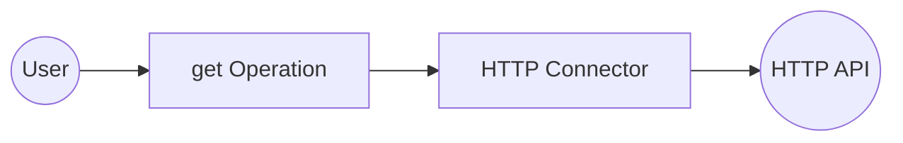
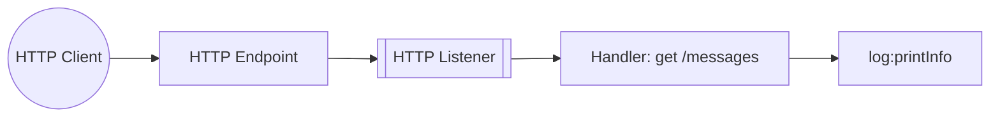

# Example

## Table of Contents

- [HTTP Example](#http-example)
- [HTTP Trigger Example](#http-trigger-example)

## HTTP Example

### What you'll build

Build an HTTP GET integration using the `ballerinax/http` HTTP Client connector in WSO2 Integrator's low-code canvas. The integration sends an outbound GET request to a configurable URL and captures the HTTP response. The flow runs as an Automation entry point named `main`.

**Operations used:**
- **get** : Sends an HTTP GET request to a specified path and returns the HTTP response.

### Architecture

### Setting up the HTTP integration

> **New to WSO2 Integrator?** Follow the [Create a New Integration](../../../../develop/create-integrations/create-new-integration.md) guide to set up your integration first, then return here to add the connector.

### Adding the HTTP connector

Select **+ Add Connection** in the **Connections** section of the WSO2 Integrator sidebar to open the connector palette.

### Configuring the HTTP connection

#### Step 1: Fill in connection parameters

In the **New Connection** form, bind the connection parameters to configurable variables:

- **connectionName** : Set to `httpClient` as the name for this connection
- **url** : Bind to a new configurable variable named `httpServiceUrl` (type: `string`) using the variable binding icon

#### Step 2: Save the connection

Select **Save** to create the connection. The connection `httpClient` now appears under **Connections** in the WSO2 Integrator sidebar.

#### Step 3: Set actual values for your configurables

1. In the left panel, select **Configurations**.
2. Set a value for each configurable listed below.

- **httpServiceUrl** (string) : The base URL of the HTTP service to send GET requests to (for example, `https://your-target-api.com`)

### Configuring the HTTP get operation

#### Step 4: Add an Automation entry point

1. In the WSO2 Integrator sidebar, hover over **Entry Points** and select **+**.
2. Select **Automation** from the entry point types.

An Automation entry point named `main` is created and the low-code canvas opens, showing **Start → (empty node placeholder) → Error Handler**.

#### Step 5: Select the get operation and configure its parameters

1. Select the empty placeholder node on the canvas to open the node panel.
2. Expand the **httpClient** connection and select **get** from the list of available operations.
3. Fill in the operation parameters:

- **path** : Enter `/` as the request path
- **result** : Set the result variable name to `result`
- **targetType** : Enter `http:Response` as the expected response type

### Try it yourself

Try this sample in WSO2 Integration Platform.

[View source on GitHub](https://github.com/wso2/integration-samples/tree/main/integrator-default-profile/connectors/http_connector_sample)

---
## HTTP Trigger Example
### What you'll build

An HTTP Service integration listens for incoming HTTP requests on a configurable port using the `ballerina/http` trigger from the **Integration as API** category. When an HTTP client sends a `GET /messages` request to the listener, the trigger routes it to the resource handler, which builds a JSON payload and logs it as a JSON string using `log:printInfo`. The complete flow—HTTP listener → resource handler → log:printInfo → response—is assembled visually on the WSO2 Integrator low-code canvas.

### Architecture

### Prerequisites

- An HTTP client tool for sending test requests (for example, `curl`, Postman, or a browser) capable of sending GET requests to the configured HTTP Service endpoint.

### Setting up the HTTP Service integration

> **New to WSO2 Integrator?** Follow the [Create a New Integration](../../../../develop/create-integrations/create-new-integration.md) guide to set up your integration first, then return here to add the trigger.

### Adding the HTTP Service trigger

#### Step 1: Open the Artifacts palette and select the HTTP Service trigger

1. Select **+ Add Artifact** on the canvas to open the Artifacts palette.
2. In the **Integration as API** category, locate and select the **HTTP Service** card.

### Configuring the HTTP Service listener

#### Step 2: Bind HTTP listener parameters to configuration variables

In the **Create HTTP Service** form, expand **Advanced Configurations** and select **Custom Listener** to expose the listener parameters. For the listener port, switch the field to **Expression** mode, open the Helper Panel, select the **Configurables** tab, select **+ New Configurable**, enter a camelCase variable name and `int` as the type, leave the default value blank, and select **Save**—the variable is automatically injected into the port field. Enum/dropdown options such as the **Service Contract** radio group and boolean-style toggles are set directly from the UI and don't need configurable bindings.

- **Port** : The TCP port the HTTP listener binds to; bound to a `configurable int` variable so the port can be set at runtime without modifying the integration source.
- **Listener Name** : The identifier used for the `http:Listener` variable in the generated source; kept as `httpListener`.

#### Step 3: Set actual values for your configurations

1. In the left panel of WSO2 Integrator, select **Configurations** (at the bottom of the project tree, under Data Mappers).
2. Set a value for each configuration listed below.

- **httpListenerPort** (int) : The actual TCP port number the HTTP listener should bind to at runtime (for example, `8090`).

#### Step 4: Select Create to register the listener and open the Service view

Select **Create** at the bottom of the trigger configuration form. WSO2 Integrator registers the HTTP listener (`httpListener`) under **Listeners** and opens the HTTP Service view, where you can add resource function handlers.

### Handling HTTP Service events

#### Step 5: Open the Add Handler side panel

1. In the HTTP Service view, locate the **Resources** section.
2. Select **+ Add Resource** on the right of the section header—the **Select HTTP Method to Add** side panel opens, listing the available HTTP methods (GET, POST, PUT, DELETE, PATCH, DEFAULT).

#### Step 6: Select the primary resource handler and define the message payload type

1. In the **Select HTTP Method to Add** side panel, select **GET**—the **New Resource Configuration** panel replaces the method list.
2. In the **Resource Path** field, enter `messages` to expose the handler at `GET /messages`.
3. Review the default **Responses** rows—`200` returns a `json` body and `500` returns an `error`—and leave both as-is for this sample.
4. Optionally add path params, query parameters, or headers using the **+ Path Param**, **+ Query Parameter**, and **+ Header** links if your handler needs them.
5. Select **Save** to register the resource.

#### Step 7: Save the handler and add a log statement to the flow

1. After selecting **Save** on the **New Resource Configuration** panel, the flow canvas for the resource handler opens.
2. Locate the primary resource function body (`resource function get messages()`) in the flow.
3. Add a JSON payload declaration followed by `log:printInfo(payload.toJsonString());` inside the handler body.
4. Confirm the canvas renders **Start → Declare Variable (payload) → log:printInfo → Return → Error Handler → End**, confirming the log step is wired into the flow.

#### Step 8: Confirm the handler is registered in the Service view

Select the back arrow in the canvas header (or re-select the **HTTP Service** entry in the left project tree) to return to the HTTP Service view. The **Resources** list now shows the registered `GET /messages` resource handler row.

### Running the integration

#### Step 9: Run the integration and send a test HTTP request

1. In the WSO2 Integrator panel, select **Run** to start the integration. Wait for the listener to bind to the configured port (watch the output for a "started HTTP/WS listener" message).
2. Send a test HTTP request using one of the following options:
   - A separate WSO2 Integrator **HTTP Client** integration assembled from the same low-code canvas (recommended—no external tooling required).
   - The `curl` command-line tool: send a GET request to the configured endpoint using `curl -X GET http://<host>:<httpListenerPort>/messages`, replacing `<host>` and `<httpListenerPort>` with the values you set in the **Configurations** panel.
   - A GUI HTTP client such as **Postman** or **Insomnia**—send a GET request to the configured endpoint.
3. Observe the integration's log output—the payload JSON string (for example, `{"message":"Hello from HTTP listener","path":"/messages"}`) should appear printed by `log:printInfo`, confirming the handler received and processed the incoming HTTP request.
