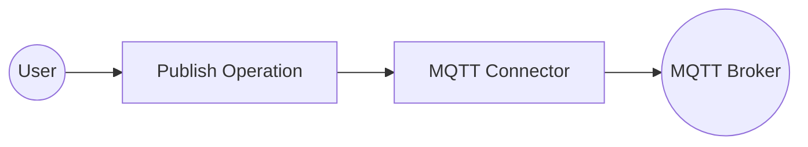
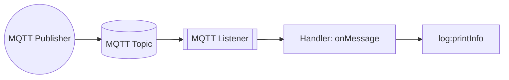

# Example

## Table of Contents

- [MQTT Example](#mqtt-example)
- [MQTT Trigger Example](#mqtt-trigger-example)

## MQTT Example

### What you'll build

Build a WSO2 Integrator automation that connects to an MQTT broker and publishes a message to a configured topic. The integration uses configurable variables for the broker URI, client ID, and topic, making it easy to adapt to different environments.

**Operations used:**
- **Publish** : Sends a message with a byte-encoded payload to a specified MQTT broker topic

### Architecture

### Prerequisites

- A running MQTT broker accessible at a known URI

### Setting up the MQTT integration

> **New to WSO2 Integrator?** Follow the [Create a New Integration](../../../../develop/create-integrations/create-new-integration.md) guide to set up your integration first, then return here to add the connector.

### Adding the MQTT connector

Add the MQTT connector connection to provide broker connectivity.

#### Step 1: Open the Add connection panel

Select **Add Connection** (the **+** button in the **Connections** section) on the integration canvas to open the connector palette.

#### Step 2: Select the MQTT connector

1. In the **Search connectors...** box, enter `mqtt`.
2. Select **MQTT Client** (the `ballerinax/mqtt` connector — choose **Client**, not **Caller**) to open the connection form.

### Configuring the MQTT connection

#### Step 3: Fill in connection parameters

Enter the following connection parameters, binding each to a configurable variable:

- **Server Uri** : The MQTT broker URI (bound to a configurable variable)
- **Client Id** : A unique identifier for this MQTT client (bound to a configurable variable)
- **Connection Name** : The name used to reference this connection on the canvas

#### Step 4: Save the connection

Select **Save Connection** to persist the connection. The `mqttClient` connection node appears on the design canvas.

#### Step 5: Set actual values for your configurables

In the left panel, select **Configurations** and set a value for each configurable listed below:

- **mqttServerUri** (string) : The full URI of your MQTT broker (for example, `tcp://your-broker-host:1883`)
- **mqttClientId** (string) : A unique client identifier for this connection (for example, `"mqtt-client-01"`)
- **mqttTopic** (string) : The topic to publish messages to (for example, `"test/topic"`)

### Configuring the MQTT Publish operation

#### Step 6: Add an Automation entry point

In the left sidebar under **Entry Points**, select **Add Entry Point** (**+**), then select **Automation**. Select **Create** to create the automation with default configuration. The automation canvas opens showing a **Start** node and an **Error Handler** node.

#### Step 7: Select and configure the Publish operation

1. Select the **+** button between the **Start** node and the **Error Handler** node to open the node panel.
2. In the **Connections** section of the node panel, select **mqttClient** to expand it.

3. Select **Publish** from the operations list to open the publish operation form.
4. Configure the following fields:
   - **Topic** : Set to expression mode and bind to the `mqttTopic` configurable variable
   - **Message** : Set to expression mode and enter `{payload: "Hello World".toBytes()}` to create an `mqtt:Message` record with a byte-encoded payload
   - **Result** : Leave the default value `mqttDeliverytoken` (type `mqtt:DeliveryToken`)

Select **Save** to add the publish step to the automation flow.

### Try it yourself

Try this sample in WSO2 Integration Platform.

[View source on GitHub](https://github.com/wso2/integration-samples/tree/main/integrator-default-profile/connectors/mqtt_connector_sample)

---
## MQTT Trigger Example
### What you'll build

This integration connects to an MQTT broker, subscribes to a topic, and handles incoming messages using the `onMessage` event handler. When a message arrives, the MQTT listener receives the `mqtt:Message` payload and logs it using `log:printInfo`. The overall flow follows a listener → handler → log pattern.

### Architecture

### Prerequisites

- Access to an MQTT broker (for example, Eclipse Mosquitto).
- A topic to subscribe to (for example, `sensors/temperature`).

### Setting up the MQTT integration

> **New to WSO2 Integrator?** Follow the [Create a New Integration](../../../../develop/create-integrations/create-new-integration.md) guide to set up your integration first, then return here to add the trigger.

### Adding the MQTT trigger

#### Step 1: Open the artifacts palette and select the MQTT trigger

Select **Add Artifact** in the WSO2 Integrator panel. In the artifacts palette, expand the **Event Integration** category and locate the **MQTT** trigger card.

### Configuring the MQTT listener

#### Step 2: Bind listener parameters to configurable variables

Select the MQTT card to open the **Create MQTT Event Integration** form. Bind each required field to a configurable variable using the **Configurables** tab in the helper panel:

- **Service URI** : Full URI of the MQTT broker
- **Client ID** : Unique identifier for this client
- **Subscriptions** : Topic(s) to subscribe to

For each field, select the helper panel icon, go to the **Configurables** tab, select **+ New Configurable**, enter the variable name and type `string`, then select **Save**. The configurable badge (`{x}`) appears in the field once bound. The listener name under **Advanced Configurations** is automatically set to `mqttListener`.

#### Step 3: Set actual values for your configurations

In the left panel, select **Configurations** to open the Configurations panel. You'll see the three newly created configurations—`mqttBrokerUrl`, `mqttClientId`, and `mqttTopic`—all marked **Required** with empty value fields. Supply the actual runtime values for each configuration before running the integration:

- **mqttBrokerUrl** (string) : The full URI of your MQTT broker
- **mqttClientId** (string) : A unique client identifier for this integration
- **mqttTopic** (string) : The topic to subscribe to

#### Step 4: Create the listener

Select **Create** to register the listener and generate the service scaffold.

### Handling MQTT events

#### Step 5: Add the onMessage event handler

Navigate back to the **MQTT Event Integration** service view by selecting the entry in the left panel. Under **Event Handlers**, select **+ Add Handler**.

> **Note:** The `onMessage` handler uses the library-defined `mqtt:Message` type as its payload parameter. The MQTT trigger provides the message structure directly through the `ballerina/mqtt` module—no custom type schema is required.

#### Step 6: Add a log statement to the handler

Select the **+** icon in the flow chart, and in the side panel that opens, choose **Log Info** from the **Logging** section, then enter `message.toJsonString()` as the message.

#### Step 7: Confirm the handler registration

Return to the **MQTT Event Integration** service view. The **Event Handlers** list now shows the registered `onMessage` handler row, confirming the integration is fully configured.

### Running the integration

Select **Run Integration** in the toolbar to start the integration.

To fire a test event, use one of the following approaches:

- **WSO2 Integrator MQTT producer template** — Use a built-in MQTT producer integration in WSO2 Integrator to publish a test message to the same topic and broker.
- **Mosquitto CLI** — Run `mosquitto_pub -h <broker-host> -t sensors/temperature -m '{"temp":22.5}'` from a terminal with the Mosquitto client installed.
- **Broker web console** — If your broker provides a management UI (for example, HiveMQ's web client), use it to publish a message directly to the subscribed topic.

Once a message is published, the console prints a JSON representation of the `mqtt:Message` record, for example:

`{"topic":"sensors/temperature","payload":"eyJ0ZW1wIjoyMi41fQ==","qos":"AT_MOST_ONCE","retain":false}`

> **Tip:** The `payload` field is Base64-encoded. Decode it to read the original message content.

### Try it yourself

Try this sample in WSO2 Integration Platform.

[View source on GitHub](https://github.com/wso2/integration-samples/tree/main/integrator-default-profile/connectors/mqtt_trigger_sample)
