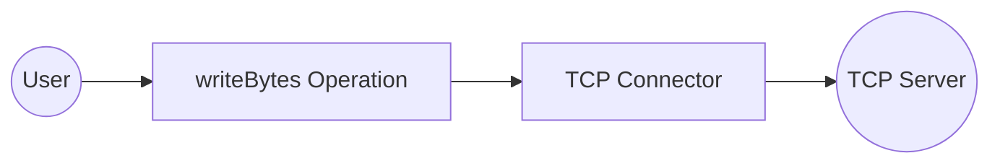
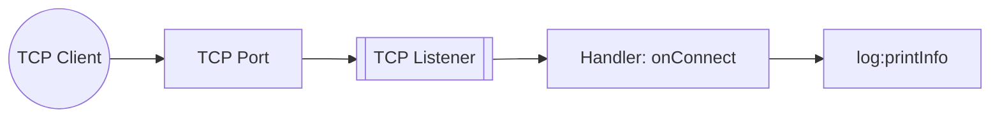

# Example

## Table of Contents

- [TCP Example](#tcp-example)
- [TCP Trigger Example](#tcp-trigger-example)

## TCP Example

### What you'll build

Build a TCP connector integration that connects to a remote TCP server and sends a byte message. The integration uses an Automation entry point to invoke the `writeBytes` operation and transmit data to the configured TCP host.

**Operations used:**
- **writeBytes** : Sends a `byte[]` payload to the connected remote TCP host

### Architecture

### Prerequisites

- A running TCP server with a reachable host and port

### Setting up the TCP integration

> **New to WSO2 Integrator?** Follow the [Create a New Integration](../../../../develop/create-integrations/create-new-integration.md) guide to set up your integration first, then return here to add the connector.

### Adding the TCP connector

Select **+ Add Connection** from the Artifacts panel and search for **TCP** in the connector palette. Select the **TCP** connector — not "TCP Caller".

### Configuring the TCP connection

#### Step 1: Fill in the TCP connection parameters

Bind each connection parameter to a configurable variable in the **Configure TCP** form:

- **Remote Host** : Binds to the `tcpHost` configurable variable (string) representing the remote server hostname
- **Remote Port** : Binds to the `tcpPort` configurable variable (int) representing the remote server port
- **Connection Name** : Keep the default value `tcpClient`

#### Step 2: Save the TCP connection

Select **Save Connection**. The `tcpClient` connection appears on the integration canvas and in the sidebar under **Connections**.

#### Step 3: Set actual values for your configurables

1. In the left panel, select **Configurations**.
2. Set a value for each configurable listed below.

- **tcpHost** (string) : The hostname or IP address of the remote TCP server
- **tcpPort** (int) : The port number of the remote TCP server

### Configuring the TCP writeBytes operation

#### Step 4: Add an Automation entry point

Select **+ Add Artifact** on the canvas, then select **Automation** from the Artifacts panel and select **Create**. This creates a `main` automation entry point and opens the flow canvas.

#### Step 5: Select the writeBytes operation and configure its parameters

1. Inside the automation flow, select the **+** button between Start and Error Handler to open the node panel.
2. Under **Connections → tcpClient**, expand to reveal the available operations.

3. Select **Write Bytes** and fill in the operation fields.

- **Data** : Enter `"Hello World".toBytes()` as the byte payload to send to the remote TCP host

### Try it yourself

Try this sample in WSO2 Integration Platform.

[View source on GitHub](https://github.com/wso2/integration-samples/tree/main/integrator-default-profile/connectors/tcp_connector_sample)

---
## TCP Trigger Example
### What you'll build

This integration listens on a configurable TCP port and handles raw TCP client connections using the `ballerina/tcp` library. When a TCP client connects, the `onConnect` handler fires and logs the caller information using `log:printInfo`. The overall flow follows a listener → handler → log pattern, where the TCP listener accepts connections and routes them to the auto-registered `onConnect` handler.

### Architecture

### Prerequisites

- A TCP client tool (for example, `nc` or `telnet`) for testing

### Setting up the TCP integration

> **New to WSO2 Integrator?** Follow the [Create a New Integration](../../../../develop/create-integrations/create-new-integration.md) guide to set up your integration first, then return here to add the trigger.

### Adding the TCP trigger

#### Step 1: Open the artifacts palette and select the TCP service

Select **Add Artifact** (the **+** icon) in the WSO2 Integrator panel toolbar to open the **Artifacts** palette. Locate the **Integration as API** category and select **TCP Service**.

### Configuring the TCP listener

#### Step 2: Bind the listener port to a configuration variable

In the **Create TCP Service** form, bind the **TCP Port** field to a `configurable int` variable so the port can be set at runtime without redeploying.

1. Select the **Expression** toggle next to the **TCP Port** field to switch to Expression mode.
2. Select the **Open Helper Panel** icon to open the Helper Panel on the right.
3. In the Helper Panel, select the **Configurables** tab, then select **New Configurable**.
4. In the **New Configurable** dialog, enter `listenerPort` as the name and select `int` as the type, then select **Save**.
5. In the **TCP Port** expression field, enter `listenerPort` and select **listenerPort int** from the autocomplete dropdown.

- **listenerPort** : The port on which the TCP listener accepts client connections

#### Step 3: Set actual values for your configurations

Select **Configurations** in the left panel of WSO2 Integrator to open the Configurations panel and provide values for each configuration.

- **listenerPort** (int) : The port number on which the TCP listener accepts incoming client connections

#### Step 4: Create the TCP service

Select **Create** to register the TCP service. WSO2 Integrator creates a `tcp:Listener` named `tcpListener` under **Listeners** and a `tcp:Service` entry point under **Entry Points** with the `onConnect` handler auto-registered.

### Handling TCP events

#### Step 5: View the auto-registered handlers in the service view

Select **TCP Service** under **Entry Points** in the left panel to open the TCP Service view. The `onConnect` handler is auto-registered by the framework—there's no **Add Handler** side panel for the TCP trigger.

#### Step 6: Examine the onConnect handler flow

Select the **onConnect** row to open the handler's flow canvas. The initial flow shows the `TcpEchoService` instantiation and return steps generated by the framework. The `TcpEchoService` type implements `tcp:ConnectionService` and is returned to the TCP listener to route subsequent `onBytes`, `onError`, and `onClose` calls.

#### Step 7: Log the caller information in the onConnect flow

In the `onConnect` flow canvas, open the auto-generated `TcpEchoService` and add a **Log** step before the existing `Declare Variable` and `Return` steps. Use `log:printInfo` to output the caller details (for example, the `caller` remote address or connection metadata) so each incoming connection is logged before the handler returns the `TcpEchoService` to the listener.

### Running the integration

Run the integration from the WSO2 Integrator panel by selecting **Run Integration** (▶) in the editor toolbar.

Once the service starts and listens on the configured port, use one of the following methods to fire a test event:

- **Use `nc` (netcat):** Connect a TCP client to the listener port—for example, `nc <host> <port>`—to trigger the `onConnect` handler immediately on connection.
- **`telnet`:** Open a telnet session to the listener address and port to establish a TCP connection and trigger the `onConnect` handler.
- **WSO2 Integrator built-in Try It tool:** If available, select the WSO2 Integrator built-in Try It TCP client template to send a test connection without an external tool.

When the connection is established, the `onConnect` handler fires and logs the caller information to the console output in WSO2 Integrator.

### Try it yourself

Try this sample in WSO2 Integration Platform.

[View source on GitHub](https://github.com/wso2/integration-samples/tree/main/integrator-default-profile/connectors/tcp_trigger_sample)
