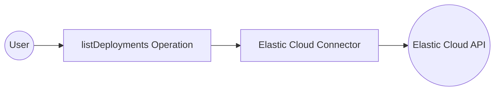

# Example

## What you'll build

Build a WSO2 Integrator automation that connects to **Elastic Cloud** and retrieves a list of all deployments using the `listDeployments` operation. The integration authenticates with an API key stored as a configurable variable and returns the deployment list response.

**Operations used:**
- **listDeployments** : Retrieves all Elastic Cloud deployments associated with the configured API key

## Architecture

## Prerequisites

- An Elastic Cloud API key (obtainable from the [Elastic Cloud console](https://cloud.elastic.co/))

## Setting up the Elastic cloud integration

> **New to WSO2 Integrator?** Follow the [Create a New Integration](../../../../develop/create-integrations/create-new-integration.md) guide to set up your integration first, then return here to add the connector.

## Adding the Elastic cloud connector

### Step 1: Open the add connection palette

Select **+ Add Artifact** on the canvas toolbar, then select **Connection** to open the Add Connection search palette.

## Configuring the Elastic cloud connection

### Step 2: Fill in the connection parameters

Enter `elastic` in the search box and select the **Elasticcloud** connector card to open the configuration form. Bind each field to a configurable variable as described below:

- **apiKeyConfig** : The `ApiKeysConfig` record holding the Elastic Cloud API key used for authentication — bind to a new configurable variable of type `string`
- **serviceUrl** : The base URL for the Elastic Cloud API — bind to a new configurable variable of type `string`

### Step 3: Save the connection

Select **Save Connection** to persist the connection. The **`elasticcloudClient`** connection node appears on the canvas and under **Connections** in the sidebar.

### Step 4: Set actual values for your configurables

In the left panel, select **Configurations**. Set a value for each configurable listed below:

- **elasticApiKey** (string) : Your Elastic Cloud API key, obtainable from the Elastic Cloud console
- **elasticServiceUrl** (string) : The base service URL for the Elastic Cloud API, for example `https://api.elastic-cloud.com/api/v1`

## Configuring the Elastic cloud listDeployments operation

### Step 5: Add an automation entry point

Select **+ Add Artifact** on the canvas toolbar, select **Automation**, then select **Create** in the form that appears. A new `main` Automation entry point is added under **Entry Points** and the Automation flow canvas opens.

### Step 6: Select and configure the listDeployments operation

In the Automation flow canvas, select the **+** (Add Step) button below the **Start** node to open the step panel. Expand **`elasticcloudClient`** under **Connections**, enter `deployment` in the search box to filter the list, then select **List Deployments**.

The **List Deployments** operation form opens. This operation requires no mandatory parameters. The result is stored in the auto-generated variable `elasticcloudDeploymentslistresponse`. Select **Save** to add the step to the flow.

## Try it yourself

Try this sample in WSO2 Integration Platform.

[View source on GitHub](https://github.com/wso2/integration-samples/tree/main/connectors/elastic.elasticcloud_connector_sample)

## More code examples

The `Elasticcloud` connector provides practical examples illustrating usage in various scenarios. Explore these [examples](https://github.com/ballerina-platform/module-ballerinax-elastic.elasticcloud/tree/main/examples/), covering the following use cases:

1. [**Manage Deployment**](https://github.com/ballerina-platform/module-ballerinax-elastic.elasticcloud/tree/main/examples/deployment-management) - Create, list, and manage Elasticsearch deployments in your organization.

2. [**API key Management**](https://github.com/ballerina-platform/module-ballerinax-elastic.elasticcloud/tree/main/examples/api-key-management/) - Create, list, and delete API keys for secure access to Elastic Cloud resources.
