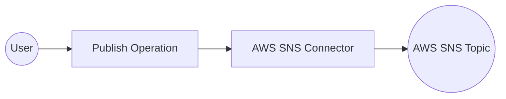

# Example

## What you'll build

Build a WSO2 Integrator automation that publishes a message to an AWS Simple Notification Service (SNS) topic using the `ballerinax/aws.sns` connector. The integration connects to SNS using AWS credentials stored as configurable variables, then publishes a message to a specified topic ARN.

**Operations used:**
- **Publish** : Publishes a message to an SNS topic ARN, phone number, or mobile endpoint

## Architecture

## Prerequisites

- An AWS account with SNS access and an existing SNS topic
- AWS credentials: Access Key ID, Secret Access Key, optional Security Token, and Region

## Setting up the AWS SNS integration

> **New to WSO2 Integrator?** Follow the [Create a New Integration](../../../../develop/create-integrations/create-new-integration.md) guide to set up your integration first, then return here to add the connector.

## Adding the AWS SNS connector

### Step 1: Open the connector palette

In the left sidebar under your project, expand **Connections** and select the **+** icon to open the connector palette.

## Configuring the AWS SNS connection

### Step 2: Search for and select the AWS SNS connector

1. In the connector palette search box, enter `aws.sns` to filter the list.
2. Select **ballerinax/aws.sns** from the results to open the **New Connection** form.

### Step 3: Fill in the connection parameters

Fill in the following fields, binding each to a configurable variable:

- **connectionName** : Name for this connection instance (`snsClient`)
- **accessKeyId** : Your AWS access key ID, bound to a configurable variable
- **secretAccessKey** : Your AWS secret access key, bound to a configurable variable
- **securityToken** : Optional AWS security token, bound to a configurable variable
- **region** : AWS region where your SNS topic resides, bound to a configurable variable

### Step 4: Save the connection

Select **Save Connection**. The `snsClient` connection node appears on the design canvas and is listed under **Connections** in the left sidebar.

### Step 5: Set actual values for your configurables

1. In the left panel, select **Configurations**.
2. Set a value for each configurable listed below.

- **snsAccessKeyId** (string) : Your AWS access key ID
- **snsSecretAccessKey** (string) : Your AWS secret access key
- **snsSecurityToken** (string) : Your AWS security token (required for temporary credentials)
- **snsRegion** (string) : The AWS region where your SNS topic is located (for example, `us-east-1`)

## Configuring the AWS SNS publish operation

### Step 6: Add an automation entry point

1. In the WSO2 Integrator panel toolbar, select **Add Artifact**.
2. Select **Automation** from the artifact type list.
3. In the **Create New Automation** dialog, select **Create**.

The automation flow canvas opens with a **Start** node and an **Error Handler** node pre-placed.

### Step 7: Select and configure the publish operation

Select the **+** button between the **Start** node and the **Error Handler** node to open the node selection panel. Under **Connections**, expand **snsClient** to view all available operations.

Select **Publish** to open the configuration form, then fill in the following fields:

- **Target** : The SNS topic ARN to publish to (for example, `"arn:aws:sns:us-east-1:123456789012:MyTopic"`)
- **Message** : The message body to publish (for example, `"Hello from WSO2 Integrator!"`)
- **Target Type** : Leave as `TOPIC` (default) for publishing to a topic
- **Result variable** : Auto-generated variable that stores the `sns:PublishMessageResponse`

Select **Save**. The publish node is added to the flow canvas, connected to `snsClient`.

## Try it yourself

Try this sample in WSO2 Integration Platform.

[View source on GitHub](https://github.com/wso2/integration-samples/tree/main/connectors/aws.sns_connector_sample)
