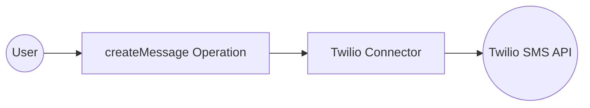
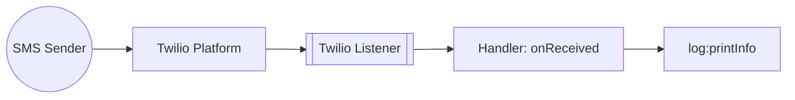

# Example

## Table of Contents

- [Twilio Example](#twilio-example)
- [Twilio Trigger Example](#twilio-trigger-example)

## Twilio Example

### What you'll build

Build a Twilio SMS integration using the WSO2 Integrator low-code UI. The integration configures the Twilio connector with secure configurable credentials and calls the `createMessage` operation to send an SMS message.

**Operations used:**
- **createMessage** : Sends an SMS message by specifying a recipient number, sender number, and message body.

### Architecture

### Prerequisites

- Twilio account with an Account SID and Auth Token

### Setting up the Twilio integration

> **New to WSO2 Integrator?** Follow the [Create a New Integration](../../../../develop/create-integrations/create-new-integration.md) guide to set up your integration first, then return here to add the connector.

### Adding the Twilio connector

#### Step 1: Open the Add connection panel

Select **Add Connection** (the `+` icon next to **Connections**) in the WSO2 Integrator panel to open the connector palette.

#### Step 2: Select the Twilio connector

Search for "twilio" in the palette, then select **Twilio** from the search results to open the **Configure Twilio** form.

### Configuring the Twilio connection

#### Step 3: Fill in connection parameters

Enter the connection parameters, binding each to a configurable variable to keep credentials out of source code:

- **accountSid** : Twilio Account SID, bound to a `string` configurable variable
- **authToken** : Twilio Auth Token, bound to a `string` configurable variable
- **connectionName** : Name for this connection instance (for example, `twilioClient`)

#### Step 4: Save the connection

Select **Save Connection** to persist the connection. The `twilioClient` connection appears in the **Connections** panel and on the design canvas.

#### Step 5: Set actual values for your configurables

In the left panel, select **Configurations** to open the Configurations panel. Set a value for each configurable listed below:

- **accountSid** (string) : Your Twilio Account SID (for example, `ACxxxxxxxxxxxxxxxxxxxxxxxxxxxxxxxx`)
- **authToken** (string) : Your Twilio Auth Token

### Configuring the Twilio createMessage operation

#### Step 6: Add an Automation entry point

In the integration overview, select **+ Add Artifact**, then select **Automation** from the artifact type list, and select **Create**. A new automation named `main` is added under **Entry Points** and the flow editor opens.

#### Step 7: Select and configure the createMessage operation

In the Automation flow editor, select the **+** button between **Start** and **Error Handler** to open the node panel. Expand **twilioClient** under **Connections** to reveal available operations.

Select **Create Message** from the **Message** group to open the **twilioClient → createMessage** configuration form. Enter the following values in the **Payload** field:

- **To** : Recipient phone number in E.164 format
- **From** : Your Twilio-provisioned sender number
- **Body** : The SMS message text
- **Result** : Auto-named result variable (`twilioMessage`) of type `twilio:Message`

Select **Save**. The `twilio : createMessage` node appears in the automation flow.

### Try it yourself

Try this sample in WSO2 Integration Platform.

[View source on GitHub](https://github.com/wso2/integration-samples/tree/main/integrator-default-profile/connectors/twilio_connector_sample)

### More code examples

The Twilio connector comes equipped with examples that demonstrate its usage across various scenarios. These examples are conveniently organized into three distinct groups based on the functionalities they showcase. For a more hands-on experience and a deeper understanding of these capabilities, we encourage you to experiment with the provided examples in your development environment.

1. Account management
    - [Create a sub-account](https://github.com/ballerina-platform/module-ballerinax-twilio/tree/master/examples/accounts/create-sub-account) - Create a subaccount under a Twilio account
    - [Fetch an account](https://github.com/ballerina-platform/module-ballerinax-twilio/tree/master/examples/accounts/fetch-account) - Get details of a Twilio account
    - [Fetch balance](https://github.com/ballerina-platform/module-ballerinax-twilio/tree/master/examples/accounts/fetch-balance) - Get the balance of a Twilio account
    - [List accounts](https://github.com/ballerina-platform/module-ballerinax-twilio/tree/master/examples/accounts/list-accounts) - List all subaccounts under a Twilio account
    - [Update an account](https://github.com/ballerina-platform/module-ballerinax-twilio/tree/master/examples/accounts/update-account) - Update the name of a Twilio account
2. Call management
    - [Make a call](https://github.com/ballerina-platform/module-ballerinax-twilio/tree/master/examples/calls/create-call) - Make a call to a phone number via a Twilio
    - [Fetch call log](https://github.com/ballerina-platform/module-ballerinax-twilio/tree/master/examples/calls/fetch-call-log) - Get details of a call made via a Twilio
    - [List call logs](https://github.com/ballerina-platform/module-ballerinax-twilio/tree/master/examples/calls/list-call-logs) - Get details of all calls made via a Twilio
    - [Delete a call log](https://github.com/ballerina-platform/module-ballerinax-twilio/tree/master/examples/calls/delete-call-log) - Delete the log of a call made via Twilio
3. Message management
    - [Send an SMS message](https://github.com/ballerina-platform/module-ballerinax-twilio/tree/master/examples/messages/create-sms-message) - Send an SMS to a phone number via a Twilio 
    - [Send a Whatsapp message](https://github.com/ballerina-platform/module-ballerinax-twilio/tree/master/examples/messages/create-whatsapp-message) - Send a Whatsapp message to a phone number via a Twilio
    - [List message logs](https://github.com/ballerina-platform/module-ballerinax-twilio/tree/master/examples/messages/list-message-logs) - Get details of all messages sent via a Twilio
    - [Fetch a message log](https://github.com/ballerina-platform/module-ballerinax-twilio/tree/master/examples/messages/fetch-message-log) - Get details of a message sent via a Twilio
    - [Delete a message log](https://github.com/ballerina-platform/module-ballerinax-twilio/tree/master/examples/messages/delete-message-log) - Delete a message log via a Twilio

---
## Twilio Trigger Example
### What you'll build

This integration reacts to SMS delivery status changes reported by Twilio. When Twilio posts a webhook for an outgoing or incoming SMS status update, the `twilio:Listener` receives the webhook and routes it to the `onReceived` handler in your `twilio:SmsStatusService`. The handler logs the full event payload as a JSON string for debugging and observability.

### Architecture

### Prerequisites

- A Twilio account with an active phone number
- Your Twilio webhook URL configured to point to your listener endpoint as the status callback URL on your Twilio number or messaging service

### Setting up the Twilio integration

> **New to WSO2 Integrator?** Follow the [Create a New Integration](../../../../develop/create-integrations/create-new-integration.md) guide to set up your integration first, then return here to add the trigger.

### Adding the Twilio trigger

#### Step 1: Open the Artifacts palette

Select **Add Artifact** in the WSO2 Integrator panel to open the Artifacts palette. Scroll to the **Event Integration** category and locate the **Twilio** card.

### Configuring the Twilio listener

#### Step 2: Fill in the trigger configuration form

Select the **Twilio** card to open the trigger configuration form, then configure the listener parameters:

- **Service Type** : The service type for this trigger — `SmsStatusService` is pre-selected
- **Webhook Listener Port** : The port on which the Twilio webhook listener accepts incoming HTTP status callbacks from Twilio — bind this field to a `configurable int` variable named `listenerPort`

#### Step 3: Set actual values for your configurations

Select **Configurations** in the left panel of WSO2 Integrator. Set a value for each configuration listed below:

- **listenerPort** (int) : The port on which the Twilio webhook listener will accept incoming HTTP status callbacks from Twilio

#### Step 4: Create the trigger

Select **Create** to generate the integration.

### Handling Twilio events

#### Step 5: Inspect the pre-registered event handlers

Select **twilio:SmsStatusService** in the left project tree to open the Twilio Event Integration service view.

> **Note:** Unlike Kafka or RabbitMQ, the Twilio `SmsStatusService` pre-registers all nine SMS status handlers at service creation time. There's no **+ Add Handler** side panel for this trigger—all handlers are automatically wired.

The service view shows the full set of pre-registered handlers bound to the `twilioListener`:

- **onAccepted** : Twilio accepted the message for delivery
- **onQueued** : Message is queued
- **onSending** : Message is being sent
- **onSent** : Message was sent to the carrier
- **onFailed** : Message failed to send
- **onDelivered** : Message confirmed delivered
- **onUndelivered** : Message could not be delivered
- **onReceiving** : Inbound message being received
- **onReceived** : Inbound message fully received

#### Step 6: Open the onReceived handler flow

Select the **onReceived** row to navigate to its flow canvas.

> **Note:** The `onReceived` handler uses the library-defined `twilio:SmsStatusChangeEventWrapper` payload type. There's no **Define Value** modal for this trigger—the payload type is provided by the `ballerinax/trigger.twilio` package and can't be customised via the UI.

The initial flow canvas shows a minimal handler skeleton: **Start → + → Error Handler → End**.

#### Step 7: Add a log step

Select the **+** icon in the flow chart, and in the side panel that opens, choose **Log Info** from the **Logging** section, then enter `event.toJsonString()` as the message.

### Running the integration

Run the integration from WSO2 Integrator and then fire a test SMS status event to confirm the log output. Use any of the following methods:

- **Twilio web console** — Navigate to your Twilio phone number settings, set the status callback URL to your listener endpoint, and send a test SMS from the Twilio console. Twilio posts a status webhook for each delivery stage (`queued`, `sent`, `delivered`, and so on).
- **Twilio CLI** — Use the Twilio CLI (`twilio api:core:messages:create`) to send an SMS from your active Twilio number with `--status-callback` pointing to your listener endpoint. Each status transition triggers a separate webhook POST.
- **Direct HTTP POST** — Use a tool such as `curl` or Postman to send a POST request that mimics a Twilio status callback to your listener endpoint, with form-encoded fields such as `MessageSid`, `MessageStatus`, `From`, and `To`.

When the integration receives a webhook, the `onReceived` handler logs the full `twilio:SmsStatusChangeEventWrapper` payload as JSON. Verify that the log entry appears in the WSO2 Integrator console output.

### Try it yourself

Try this sample in WSO2 Integration Platform.

[View source on GitHub](https://github.com/wso2/integration-samples/tree/main/integrator-default-profile/connectors/twilio_trigger_sample)
