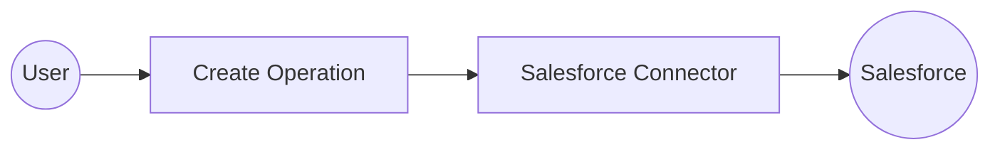
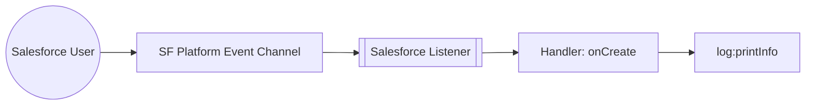

# Example

## Table of Contents

- [Salesforce Example](#salesforce-example)
- [Salesforce Trigger Example](#salesforce-trigger-example)

## Salesforce Example

### What you'll build

Build a WSO2 Integrator automation that creates an Account record in Salesforce using the Salesforce connector. The integration connects to your Salesforce instance and submits a new Account sObject with name and industry fields. On success, it logs the creation response containing the new record's ID.

**Operations used:**
- **create** : Creates a new sObject record (Account) in Salesforce and returns a creation response with the record ID and success status.

### Architecture

### Prerequisites

- A Salesforce account with API access enabled
- Your Salesforce instance URL (e.g., `https://yourorg.my.salesforce.com`)
- A Salesforce connected app access token

### Setting up the Salesforce integration

> **New to WSO2 Integrator?** Follow the [Create a New Integration](../../../../develop/create-integrations/create-a-new-integration.md) guide to set up your integration first, then return here to add the connector.

### Adding the Salesforce connector

#### Step 1: Add the Salesforce connector

1. In the left sidebar under your project, locate the **Connections** section.
2. Select the **+** icon next to **Connections** (or select **Add Connection**).
3. In the search field, enter `salesforce`.
4. Select **Salesforce** from the results.

### Configuring the Salesforce connection

#### Step 2: Fill in the Salesforce connection parameters

In the **Configure Salesforce** form, bind each field to a configurable variable so credentials aren't hardcoded.

1. In the **Config** field, select the **Expression** tab to switch to expression mode.
2. Enter the following expression, referencing the configurable variables you'll define:
   `{baseUrl: salesforceServiceUrl, auth: {token: salesforceToken}}`
3. Confirm the **Connection Name** field shows `salesforceClient`.

- **Config** : Full `salesforce:ConnectionConfig` record expression referencing `salesforceServiceUrl` and `salesforceToken`
- **Connection Name** : Logical name used to reference this connection on the canvas

#### Step 3: Save the connection

Select **Save Connection** to persist the connection. The dialog closes and `salesforceClient` appears as a connection node on the canvas.

#### Step 4: Set actual values for your configurables

1. In the left panel, select **Configurations**.
2. Set a value for each configurable listed below.

- **salesforceServiceUrl** (string) : Your Salesforce instance URL (e.g., `https://yourorg.my.salesforce.com`)
- **salesforceToken** (string) : Your Salesforce connected app access token

### Configuring the Salesforce create operation

#### Step 5: Add an Automation entry point

1. Select **+ Add Artifact** on the canvas toolbar.
2. In the **Artifacts** panel, select **Automation**.
3. In the **Create New Automation** form, select **Create**.

The Automation flow view opens showing a **Start** node and an **Error Handler** node.

#### Step 6: Select and configure the create operation

1. Select the **+** button between the **Start** and **Error Handler** nodes to add a step.
2. In the node panel, under **Connections**, expand **salesforceClient** to see its operations.

3. Select **Create** from the list of operations.
4. In the **salesforceClient → create** form, fill in the fields:

- **S Object Name** : Set to `"Account"` (use expression mode)
- **S Object** : Set to `{"Name": "Test Account", "Industry": "Technology"}`
- **Result** : Enter `result` as the variable name
- **Result Type** : Auto-filled as `salesforce:CreationResponse`

Select **Save**. The `salesforce : create` node now appears in the flow between **Start** and **Error Handler**.

### Try it yourself

Try this sample in WSO2 Integration Platform.

[View source on GitHub](https://github.com/wso2/integration-samples/tree/main/integrator-default-profile/connectors/salesforce_connector_sample)

### More code examples

The `salesforce` connector provides practical examples illustrating usage in various scenarios. Explore these examples below, covering use cases like creating sObjects, retrieving records, and executing bulk operations.

1. [Salesforce REST API use cases](https://github.com/ballerina-platform/module-ballerinax-salesforce/tree/master/examples/rest_api_usecases) - How to employ the REST API of Salesforce to carry out various tasks.

2. [Salesforce Bulk API use cases](https://github.com/ballerina-platform/module-ballerinax-salesforce/tree/master/examples/bulk_api_usecases) - How to employ Bulk API of Salesforce to execute Bulk jobs.

3. [Salesforce Bulk v2 API use cases](https://github.com/ballerina-platform/module-ballerinax-salesforce/tree/master/examples/bulkv2_api_usecases) - How to employ Bulk v2 API to execute an ingest job.

4. [Salesforce APEX REST API use cases](https://github.com/ballerina-platform/module-ballerinax-salesforce/tree/master/examples/apex_rest_api_usecases) - How to employ APEX REST API to create a case in Salesforce.

---
## Salesforce Trigger Example
### What you'll build

This integration listens for Salesforce platform events—record creates, updates, deletes, and restores—using the Salesforce event listener in WSO2 Integrator. When a Salesforce user triggers a change, the listener receives the `salesforce:EventData` payload and passes it to the appropriate handler. Each handler logs the event payload as a JSON string using `log:printInfo`.

### Architecture

### Prerequisites

- A Salesforce developer account with a connected app that has the required OAuth scopes (`api`, `refresh_token`).
- Your Salesforce **username** and **password** (with security token appended if required by your org).

### Setting up the Salesforce Event Integration

> **New to WSO2 Integrator?** Follow the [Create a New Integration](../../../../develop/create-integrations/create-new-integration.md) guide to set up your integration first, then return here to add the trigger.

### Adding the Salesforce Event Integration trigger

#### Step 1: Open the artifacts palette

Select **+ Add Artifact** in the low-code canvas to open the **Artifacts** palette.

### Configuring the Salesforce Event Integration listener

#### Step 2: Bind listener parameters to configuration variables

In the **Create Salesforce Event Integration** form, bind the **Auth** field to configurable variables so credentials aren't hard-coded:

1. Select the **Open Helper Panel** icon next to the **Auth** field.
2. In the **Helper Panel**, open the **Configurables** tab and select **+ Add**.
3. Add `sfUsername` with type `string`, then select **Save**.
4. Add `sfPassword` with type `string`, then select **Save**.
5. Ensure the **Auth** field is in **Expression** mode and enter the following expression referencing the configurable variables:

   `{ username: sfUsername, password: sfPassword }`

6. Leave the **Listener Name** field as the default `salesforceListener`.

- **Auth** : the `salesforce:CredentialsConfig` record containing the Salesforce username and password used to authenticate the listener

#### Step 3: Set actual values for your configurations

Select **Configurations** in the left panel to open the Configurations panel and enter a value for each configuration listed below:

- **sfUsername** (string) : Salesforce account username (for example, `user@example.com`)
- **sfPassword** (string) : Salesforce account password with security token appended if required

#### Step 4: Create the listener

Select **Create** to submit the trigger configuration. WSO2 Integrator generates the service with all four auto-registered Salesforce event handlers.

### Handling Salesforce Event Integration events

#### Step 5: Review auto-registered event handlers

Navigate to the **Salesforce Event Integration** service view in the left panel. Salesforce registers four event handlers automatically—no manual **+ Add Handler** step is needed for this trigger:

- **onCreate** : Salesforce record created
- **onUpdate** : Salesforce record updated
- **onDelete** : Salesforce record deleted
- **onRestore** : Salesforce record restored

#### Step 6: Open the onCreate handler canvas

Select the **onCreate** row to open its flow canvas. The canvas shows the initial handler flow: a **Start** node connected to an **Error Handler** block. There's no Define Value modal for this trigger; the handler receives a pre-typed `salesforce:EventData` payload directly.

#### Step 7: Add a log step to the handler body

Select the **+** icon in the flow chart, and in the side panel that opens, choose **Log Info** from the **Logging** section, then enter `payload.toJsonString()` as the message.

#### Step 8: Confirm the registered handlers in the service view

Navigate back to **Salesforce Event Integration** in the left panel to confirm the complete service with all four registered handlers.

### Running the integration

Run the integration from WSO2 Integrator and then trigger a Salesforce event to see the log output. Use one of the following approaches:

- **Salesforce web console**: Log in to your Salesforce org and create, update, delete, or restore a record. The platform event is published automatically, and the listener receives it.
- **Salesforce REST API**: Use the Salesforce REST API (for example, with `curl` or Postman) to create or update a record via the `/sobjects/` endpoint, which fires the corresponding platform event.
- **Salesforce Data Loader**: Use the Salesforce Data Loader tool to perform a bulk insert or update operation, which generates create or update events.

Once the event fires, the `onCreate` (or the appropriate event) handler logs the `salesforce:EventData` payload as a JSON string. Check the WSO2 Integrator console output to verify the log entry appears.

### Try it yourself

Try this sample in WSO2 Integration Platform.

[View source on GitHub](https://github.com/wso2/integration-samples/tree/main/integrator-default-profile/connectors/salesforce_trigger_sample)
