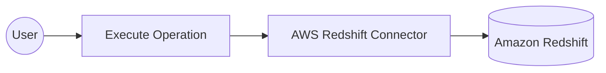

# Example

## What you'll build

Build a low-code integration using the AWS Redshift connector in WSO2 Integrator that connects to an Amazon Redshift cluster and executes a DDL SQL statement. The workflow creates a Redshift client connection using configurable variables and runs a `CREATE TABLE IF NOT EXISTS Employees` statement via an automation entry point.

**Operations used:**
- **Execute** : Runs a DDL SQL statement against the connected Redshift database

## Architecture

## Prerequisites

- An Amazon Redshift cluster with a valid JDBC URL, database username, and password

## Setting up the AWS Redshift integration

> **Note:** New to WSO2 Integrator? Follow the [Create a new integration](../../../../develop/create-integrations/create-new-integration.md) guide to set up your integration first.

## Adding the AWS Redshift connector

### Step 1: Open the add connection panel

In the left sidebar, hover over **Connections** to reveal the toolbar and select the **Add Connection** (**+**) button to open the connector palette.

### Step 2: Select the AWS Redshift connector

1. Enter `Redshift` in the search field to filter the connectors.
2. Select the **AWS Redshift** connector card to open the connection configuration form.

## Configuring the AWS Redshift connection

### Step 3: Configure the connection parameters

Set the **Connection Name** to `redshiftClient`. Bind each field to a configurable variable using the helper panel next to each field, and configure the following parameters:

- **Url** : JDBC connection URL for the Redshift cluster
- **User** : Database username
- **Password** : Database password

### Step 4: Save the connection

Select **Save Connection** to persist the connection. The `redshiftClient` connection node appears on the canvas and is listed under **Connections** in the left sidebar.

### Step 5: Set values for your configurables

1. In the left panel, select **Configurations** (at the bottom of the project tree, under Data Mappers).
2. Set a value for each configurable listed below:
   - **jdbcUrl** : string : the JDBC connection URL for your Redshift cluster (for example, `jdbc:redshift://<cluster-endpoint>:5439/<database>`)
   - **dbUser** : string : the database username
   - **dbPassword** : string : the database password

## Configuring the AWS Redshift execute operation

### Step 6: Add an automation entry point

1. In the left sidebar, hover over **Entry Points** and select the **Add Entry Point** button.
2. Select **Automation** in the artifact selection panel.
3. Select **Create** in the dialog to accept the default settings.

### Step 7: Expand the connection and select the execute operation

1. Select the **+** (Add Step) button in the automation flow between the Start and Error Handler nodes.
2. Under **Connections** in the node panel, select **redshiftClient** to expand it and reveal all available operations.

### Step 8: Configure the execute operation

Select **Execute** from the list of operations under `redshiftClient`, then fill in the operation fields:

- **SQL Query** : The DDL statement to run against the Redshift database: `CREATE TABLE IF NOT EXISTS Employees (id INT PRIMARY KEY, name VARCHAR(100), department VARCHAR(50))`
- **Result** : Variable that stores the execution result (`sqlExecutionresult`, auto-populated)
- **Result Type** : `sql:ExecutionResult` (auto-populated, read-only)

Select **Save** to add the step to the automation flow.

## Try it yourself

Try this sample in WSO2 Integration Platform.

[View source on GitHub](https://github.com/wso2/integration-samples/tree/main/connectors/aws.redshift_connector_sample)

## More code examples

The `aws.redshift` connector provides practical examples illustrating usage in various scenarios. Explore these [examples](https://github.com/ballerina-platform/module-ballerinax-aws.redshift/tree/master/examples).

1. [Read data from the database](https://github.com/ballerina-platform/module-ballerinax-aws.redshift/blob/main/examples/query) - Connects to AWS Redshift using the Redshift connector and performs a simple SQL query to select all records from a specified table with a limit of 10.

2. [Insert data into the database](https://github.com/ballerina-platform/module-ballerinax-aws.redshift/blob/main/examples/execute) - Connects to AWS Redshift using the Redshift connector and performs an INSERT operation into a specified table.

3. [Music store](https://github.com/ballerina-platform/module-ballerinax-aws.redshift/blob/main/examples/music-store) - Illustrates how to create an HTTP RESTful API with Ballerina to perform basic operations on an AWS Redshift database, including setup, configuration, and running examples.
