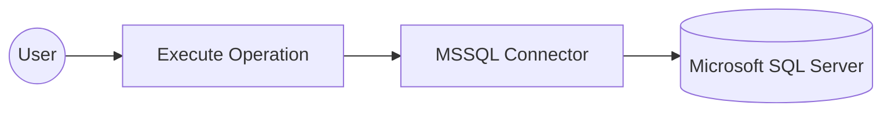
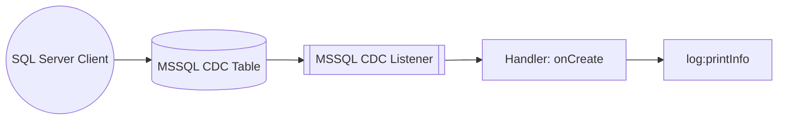

# Example

## Table of Contents

- [MSSQL Example](#mssql-example)
- [MSSQL Trigger Example](#mssql-trigger-example)

## MSSQL Example

### What you'll build

Build a WSO2 Integrator integration that connects to a Microsoft SQL Server database using the MSSQL connector and inserts a record into a `customers` table via an Automation entry point. All credentials are secured through configurable variables.

**Operations used:**
- **execute** — Runs a SQL INSERT statement against the MSSQL database and returns an execution result

### Architecture

### Prerequisites

- A running Microsoft SQL Server instance

### Setting up the MSSQL integration

> **New to WSO2 Integrator?** Follow the [Create a New Integration](../develop/create-integrations/create-new-integration.md) guide to set up your integration first, then return here to add the connector.

### Adding the MSSQL connector

#### Step 1: Open the connector palette and search for MSSQL

1. From the integration canvas, click **+ Add Artifact** (or the connection **+** icon).
2. In the artifact picker, scroll to **Other Artifacts** and select **Connection**.
3. In the connector search palette, type `mssql`.
4. Select **MS SQL** from the search results.

### Configuring the MSSQL connection

#### Step 2: Bind all connection parameters to configurable variables

The **Configure MS SQL** form opens. All connection parameters are under **Advanced Configurations** — click **Expand** if collapsed. For each field, use the **Open Helper Panel** → **Configurables** tab → **+ New Configurable** workflow to create a Configurable variable and bind it to the field:

- **host**: The MSSQL server hostname
- **user**: The database username
- **password**: The database password
- **database**: The name of the target database
- **port**: The TCP port for the MSSQL server

After all fields are bound, set the **Connection Name** to `mssqlClient`.

#### Step 3: Save the connection

Click **Save Connection** at the bottom of the form to persist the connection.

The canvas returns to the main integration view and displays the `mssqlClient` connection node. The left-hand sidebar lists it under **Connections → mssqlClient**.

#### Step 4: Set actual values for your configurables

1. In the left panel, click **Configurations**.
2. Set a value for each configurable listed below:
   - **mssqlHost** : string : hostname of your MSSQL server
   - **mssqlUser** : string : database username
   - **mssqlPassword** : string : database password
   - **mssqlDatabase** : string : name of the target database
   - **mssqlPort** : int : TCP port for the MSSQL server

### Configuring the MSSQL execute operation

#### Step 5: Add an automation entry point

1. Click **+ Add Artifact** on the canvas.
2. In the Artifacts panel, click **Automation** under the "Automation" section.
3. In the **Create New Automation** form, leave the defaults and click **Create**.

The automation flow editor opens showing a **Start** node and an **Error Handler**.

#### Step 6: Select and configure the execute operation

1. In the automation flow, click the **+** button between **Start** and **Error Handler**.
2. In the node panel, under **Connections**, click **mssqlClient** to expand its available operations.

3. Click **Execute** to add it to the flow and configure the following parameters:

- **sqlQuery** — The SQL INSERT statement to run against the database
- **result** — The variable that stores the execution result (auto-generated as `sqlExecutionresult`)

4. Click **Save**.

### Try it yourself

Try this sample in WSO2 Integration Platform.

[View source on GitHub](https://github.com/wso2/integration-samples/tree/main/integrator-default-profile/connectors/mssql_connector_sample)

---
## MSSQL Trigger Example
### What you'll build

A WSO2 Integrator integration that listens for row-level change events on a Microsoft SQL Server table using the CDC (Change Data Capture) trigger from the `ballerinax/mssql` package. When a new row is inserted into the configured CDC-enabled table, the trigger fires the `onCreate` handler, which receives the inserted row as a generic record payload. You define a custom `MssqlInsertRecord` type schema (see Step 6) to structure the payload, then print its JSON representation to the integration log using `log:printInfo`.

### Architecture

### Prerequisites

- A running Microsoft SQL Server instance with Change Data Capture (CDC) enabled on the target database.
- A database user with sufficient privileges to read CDC change tables.
- The target table must have CDC enabled (via `sys.sp_cdc_enable_table`).
- Network connectivity from the WSO2 Integrator runtime to the SQL Server instance on the configured port.

### Setting up the MSSQL CDC integration

> **New to WSO2 Integrator?** Follow the [Create a New Integration](../../../../develop/create-integrations/create-new-integration.md) guide to set up your integration first, then return here to add the trigger.

### Adding the CDC for Microsoft SQL Server trigger

#### Step 1: Open the Artifacts palette and select the CDC for Microsoft SQL Server trigger

1. On the integration canvas, select **+ Add Artifact** to open the Artifacts palette.
2. In the **Event Integration** category, locate and select the **CDC for Microsoft SQL Server** card.

### Configuring the CDC for Microsoft SQL Server listener

#### Step 2: Bind CDC listener parameters to configuration variables

For each connection parameter in the trigger configuration form, open the **Helper Panel**, select the **Configurables** tab, select **+ New Configurable**, enter the variable name and type, and select **Save**—the value is automatically injected into the field. Repeat for every non-enum, non-boolean parameter. Each bound field will display the configurable variable name instead of a literal value.

- **Host** : The hostname of the Microsoft SQL Server, bound to a `configurable string` variable.
- **Port** : The TCP port number the SQL Server listens on, bound to a `configurable int` variable.
- **Username** : The SQL Server login username with CDC read access, bound to a `configurable string` variable.
- **Password** : The SQL Server login password, bound to a `configurable string` variable.
- **Databases** : The database to capture changes from (add one entry and bind it), bound to a `configurable string` variable.
- **Table** : The fully-qualified table name to capture events from (format `<database>.<schema>.<table>`), bound to a `configurable string` variable.

#### Step 3: Set actual values for your configurations

In the left panel of WSO2 Integrator, select **Configurations** (at the bottom of the project tree, under Data Mappers) to open the Configurations panel. Set a value for each configuration:

- **mssqlHost** (string) : The hostname or IP address of your SQL Server instance.
- **mssqlPort** (int) : The port SQL Server listens on.
- **mssqlUsername** (string) : The SQL Server username with permission to read CDC change tables.
- **mssqlPassword** (string) : The password for the SQL Server user.
- **mssqlDatabase** (string) : The name of the CDC-enabled database (e.g., `SalesDB`).
- **mssqlTableName** (string) : The fully-qualified table to watch for changes (e.g., `SalesDB.dbo.Orders`).

#### Step 4: Select Create to register the listener and open the Service view

Select **Create** at the bottom of the trigger configuration form—WSO2 Integrator automatically creates the CDC listener and opens the Service view showing the listener chip.

### Handling CDC for Microsoft SQL Server events

#### Step 5: Open the Add Handler side panel

1. In the Service view, locate the **Event Handlers** section and select **+ Add Handler**.
2. The **Select Handler to Add** side panel opens, listing the available CDC handler options: `onRead`, `onCreate`, `onUpdate`, `onDelete`, and `onError`.

#### Step 6: Select the onCreate handler and define the message payload type

1. In the side panel, select **onCreate** to open the **Message Handler Configuration** panel.
2. In the **Message Configuration** field, select **Define Value** to open the type definition modal.
3. Select the **Create Type Schema** tab and enter `MssqlInsertRecord` in the **Name** field.
4. Select the **+** icon next to **Fields** to add each payload field, entering a field name and a Ballerina type for every field—for example: `id` (`int`), `tableName` (`string`).
5. Select **Save** to create the record type and bind it to the handler.

#### Step 7: Save the handler and add a log statement to the flow

1. Select **Save** on the **Message Handler Configuration** panel—the flow canvas for the `onCreate` handler opens.
2. In the handler flow canvas, add a **log:printInfo** step with `after.toJsonString()` as the message.
3. Verify the `log:printInfo` node appears between Start and Error Handler on the canvas.

#### Step 8: Confirm the handler is registered in the Service view

Select the back arrow in the canvas header to return to the Service view—the Event Handlers list now shows the registered **Event onCreate** handler row.

### Running the integration

#### Step 9: Run the integration and trigger a test INSERT event

1. In the WSO2 Integrator panel, select **Run** to start the integration—the CDC listener connects to your SQL Server instance and begins polling the CDC change tables for the configured database and table.
2. Trigger a test INSERT event using one of the following approaches:
   - A separate WSO2 Integrator **MSSQL Producer** integration template—recommended, as it stays within the WSO2 Integrator environment.
   - A native SQL client such as **sqlcmd**, **Azure Data Studio**, or **SQL Server Management Studio** to run an `INSERT INTO <tableName> (<columns>) VALUES (<values>);` statement against the CDC-enabled table.
   - The **Azure Portal Query Editor** or any SQL web client connected to your SQL Server instance, if the server is hosted in Azure SQL Database.
3. Observe the integration log output—the inserted row's data should appear as a JSON string printed by `log:printInfo`, confirming the `onCreate` handler received and processed the CDC event.
