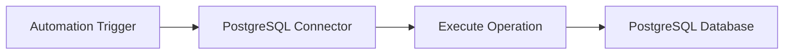
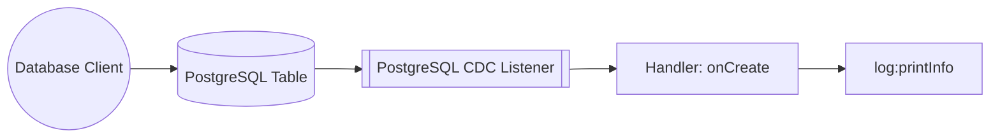

# Example

## Table of Contents

- [PostgreSQL Example](#postgresql-example)
- [PostgreSQL Trigger Example](#postgresql-trigger-example)

## PostgreSQL Example

### What you'll build

Build a PostgreSQL database integration using the WSO2 Integrator low-code canvas. The integration connects to a running PostgreSQL instance and executes a SQL INSERT operation to add records into a database table.

**Operations used:**
- **Execute** — runs a SQL INSERT statement and returns an execution result containing affected row count and last insert ID

### Architecture

### Prerequisites

- A running PostgreSQL instance with host, database name, username, and password available

### Setting up the PostgreSQL integration

> **New to WSO2 Integrator?** Follow the [Create a New Integration](../../../../develop/create-integrations/create-a-new-integration.md) guide to set up your integration first, then return here to add the connector.

### Adding the PostgreSQL connector

#### Step 1: Open the add connection palette

From the low-code canvas or the sidebar, click **Add Connection** to open the connector palette.

#### Step 2: Search for and select the PostgreSQL connector

Search for "postgresql" and select the `ballerinax/postgresql` connector card to open the connection form.

### Configuring the PostgreSQL connection

#### Step 3: Bind connection parameters to configurable variables

Bind each field in the connection form to a Configurable variable so that deployment environments can supply values without changing code:

- **host**: hostname of the PostgreSQL server
- **port**: port number the PostgreSQL server listens on
- **database**: name of the PostgreSQL database to connect to
- **username**: PostgreSQL username for authentication
- **password**: PostgreSQL password for authentication

#### Step 4: Save the connection

Click **Save** to persist the connection. The connection card `postgresqlClient` appears on the canvas and in the sidebar under **Connections**.

#### Step 5: Set actual values for your configurables

1. In the left panel, click **Configurations** (at the bottom of the project tree, under Data Mappers).
2. Set a value for each configurable listed below:

- **postgresHost**: string : hostname of your PostgreSQL server
- **postgresPort**: int : port your PostgreSQL server listens on
- **postgresDatabase**: string : name of the target database
- **postgresUser**: string : PostgreSQL username
- **postgresPassword**: string : PostgreSQL password

### Configuring the PostgreSQL execute operation

#### Step 6: Add an automation entry point

1. In the sidebar, click **+** next to **Entry Points**.
2. Select **Automation**.
3. Accept the default name `main`.
4. Click **Create**.

#### Step 7: Open the operations panel

On the Automation canvas, click the **+** drop zone between **Start** and **Error Handler** to open the node selection panel.

### Step 8: Select and configure the execute operation

Select **Execute** to open the configuration form, then fill in the operation fields:

- **SQL Query**: the parameterized SQL statement to execute (for example, an INSERT into your target table)
- **Result**: variable name to store the execution result (for example, `sqlExecutionresult`)
- **Result Type**: set to `sql:ExecutionResult`

Click **Save**. The execute node is placed on the canvas.

### Try it yourself

[View source on GitHub](https://github.com/wso2/integration-samples/tree/main/integrator-default-profile/connectors/postgresql_connector_sample)

---
## PostgreSQL Trigger Example
### What you'll build

This integration uses the PostgreSQL CDC trigger to listen for row-level insert events on a PostgreSQL table in real time. When a new row is inserted, the `onCreate` handler receives a typed `PostgreSQLInsertEntry` record containing the new row's data and logs it to the console. The overall flow runs from listener to handler to `log:printInfo`, giving you a foundation for event-driven pipelines such as data sync, audit logging, or downstream notifications.

### Architecture

### Prerequisites

- A running PostgreSQL instance with logical replication enabled (`wal_level = logical`).
- A PostgreSQL user with `REPLICATION` privilege on the target database.
- The target table already created in the database.

### Setting up the PostgreSQL CDC integration

> **New to WSO2 Integrator?** Follow the [Create a New Integration](../../../../develop/create-integrations/create-new-integration.md) guide to set up your integration first, then return here to add the trigger.

### Adding the PostgreSQL CDC trigger

#### Step 1: Open the artifacts palette

Select **+ Add Artifact** in the WSO2 Integrator side panel to open the Artifacts palette. Locate the **Event Integration** category and select the **CDC for PostgreSQL** trigger card.

### Configuring the PostgreSQL CDC listener

#### Step 2: Bind listener parameters to configurable variables

Fill in the trigger configuration form, binding every connection field to a `configurable` variable so that credentials are never hard-coded:

- **Hostname** : Hostname or IP address of the PostgreSQL server
- **Port** : Port on which PostgreSQL is listening
- **Username** : PostgreSQL user with replication privileges
- **Password** : Password for the PostgreSQL user
- **Database Name** : Name of the database that contains the monitored table
- **Table Name** : Fully-qualified table name to watch for CDC events

#### Step 3: Set actual values for your configurations

Select **Configurations** in the left panel of WSO2 Integrator to verify that all six configurable variables were registered. Enter a value for each configuration:

- **postgresHost** (string) : Hostname or IP address of the PostgreSQL server
- **postgresPort** (int) : Port on which PostgreSQL is listening (default `5432`)
- **postgresUser** (string) : PostgreSQL user with replication privileges
- **postgresPassword** (string) : Password for the PostgreSQL user
- **postgresDatabase** (string) : Name of the database that contains the monitored table
- **postgresTable** (string) : Fully-qualified table name to watch for CDC events (e.g. `public.orders`)

#### Step 4: Create the trigger

Select **Create** to submit the trigger configuration and generate the listener.

### Handling PostgreSQL CDC events

#### Step 5: Add the onCreate handler

In the Service view, select **+ Add Handler** to open the handler selection panel. Select **onCreate** to handle row-insert CDC events.

#### Step 6: Define the entry type schema

Select the **onCreate** handler, then open **Message Configuration → Define Value** on the `afterEntry` parameter. On the **Create Type Schema** tab, enter `PostgreSQLInsertEntry` as the **Name**. Select the **+** icon next to **Fields** to add each field—for example, `id` of type `string` and `name` of type `string`—that mirrors the columns in your target table. Select **Save** when done.

#### Step 7: Add a log step to the handler body

After saving, the `onCreate` handler body is generated with an **Error Handler** node. Select the **+** icon in the flow chart and choose **Log Info** from the **Logging** section in the side panel, then enter `afterEntry.toJsonString()` as the message to log every received CDC entry as JSON.

#### Step 8: Confirm the registered handler

Navigate back to the **CDC for PostgreSQL** Service view. The **Event Handlers** section now lists the `onCreate` handler row, confirming the integration is fully wired and ready to receive insert events from the configured PostgreSQL table.

### Running the integration

Select **Run** in WSO2 Integrator to start the integration. The PostgreSQL CDC listener connects to your database and begins monitoring the configured table for insert events.

To fire a test event, use one of the following approaches:

- **WSO2 Integrator database client** — if your project includes a database connection, use the built-in query runner to execute an `INSERT` statement against the monitored table directly from the IDE.
- **psql CLI** — connect to your PostgreSQL instance with `psql` and run an `INSERT` statement against the target table (for example, `INSERT INTO public.orders (id, name) VALUES (1, 'test')`).
- **PostgreSQL web console** — use pgAdmin or another GUI client to insert a row into the monitored table through the table data editor.

When an insert is detected, the `onCreate` handler fires and the serialized `PostgreSQLInsertEntry` record appears in the WSO2 Integrator console log, confirming end-to-end event capture.

### Try it yourself

Try this sample in WSO2 Integration Platform.

[View source on GitHub](https://github.com/wso2/integration-samples/tree/main/integrator-default-profile/connectors/postgresql_trigger_sample)
