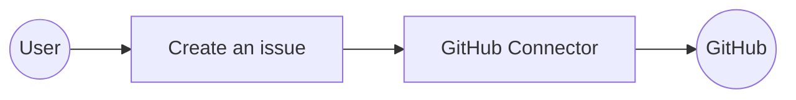
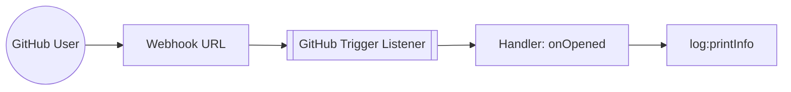

# Example

## Table of Contents

- [GitHub Example](#github-example)
- [GitHub Trigger Example](#github-trigger-example)

## GitHub Example

### What you'll build

Build a WSO2 Integrator automation that connects to GitHub and programmatically opens an issue against any repository. The integration uses the `ballerinax/github` connector to authenticate with a personal access token and call the Create an issue operation.

**Operations used:**
- **Create an issue** : Opens a new GitHub issue on a specified repository with a title, body, and labels.

### Architecture

### Prerequisites

- A GitHub personal access token with `repo` scope

### Setting up the GitHub integration

> **New to WSO2 Integrator?** Follow the [Create a New Integration](../../../../develop/create-integrations/create-new-integration.md) guide to set up your integration first, then return here to add the connector.

### Adding the GitHub connector

#### Step 1: Open the Add Connection palette

Select **+ Add Artifact** on the Integration Design canvas. In the **Artifacts** panel, scroll to **Other Artifacts** and select **Connection**. The connector search palette appears with a search box and a grid of pre-built connectors.

### Configuring the GitHub connection

#### Step 2: Fill in the connection parameters

Enter `github` in the search box to filter results, then select the **GitHub** connector card. In the connection configuration form, bind the connection fields to configurable variables:

- **auth.token** : Personal access token used to authenticate GitHub API requests
- **Connection Name** : Logical name for this connection (`githubClient`)

#### Step 3: Save the connection

Select **Save Connection**. The form closes and the canvas reloads, showing the `githubClient` node.

#### Step 4: Set actual values for your configurables

1. In the left panel, select **Configurations**.
2. Set a value for each configurable listed below.

- **githubAuthToken** (string) : Your GitHub personal access token with `repo` scope

### Configuring the GitHub Create an issue operation
#### Step 5: Add an Automation entry point

1. Select **+ Add Artifact** on the Integration Design canvas.
2. In the **Artifacts** panel, select **Automation**.
3. In the **Create New Automation** form, leave the defaults and select **Create**.

WSO2 Integrator creates a `main` automation under **Entry Points** and opens the Automation flow canvas.

#### Step 6: Select the Create an issue operation

On the Automation canvas, select the **+** between **Start** and **Error Handler** to open the node panel. Under the **Connections** section, expand `githubClient` to reveal all available operations.

#### Step 7: Configure the Create an issue operation

Select **Create an issue** from the operations list and fill in all required fields in the configuration form:

- **owner** : Account owner of the repository (for example, `wso2`)
- **repo** : Repository name without the `.git` extension (for example, `ballerina-library`)
- **payload.title** : Title of the GitHub issue
- **payload.body** : Body text and description for the issue
- **payload.labels** : Array of label names to apply to the issue
- **Result** : Variable to store the API response (`issueResponse`)

Select **Save** to apply the configuration.

### Try it yourself

Try this sample in WSO2 Integration Platform.

[View source on GitHub](https://github.com/wso2/integration-samples/tree/main/integrator-default-profile/connectors/github_connector_sample)

### More code examples

The `GitHub` connector provides practical examples illustrating usage in various scenarios. Explore these [examples](https://github.com/ballerina-platform/module-ballerinax-github/tree/master/examples), covering use cases like initializing a new project, creating issues, and managing pull requests.

1. [Initialize a New GitHub Project](https://github.com/ballerina-platform/module-ballerinax-github/tree/master/examples/initialize-new-project) - Create a new repository on GitHub, initialize it with a README file, and add collaborators to the repository.

2. [Create and Assign an Issue in GitHub](https://github.com/ballerina-platform/module-ballerinax-github/tree/master/examples/create-and-assign-issue) - Create a new issue on GitHub, assign it to a specific user, and add labels.

3. [Create and Manage a PullRequest in GitHub](https://github.com/ballerina-platform/module-ballerinax-github/tree/master/examples/create-and-manage-pull-request) - Create a pull request on GitHub, and request changes as necessary.

4. [Star Ballerina-Platform Repositories](https://github.com/ballerina-platform/module-ballerinax-github/tree/master/examples/star-ballerina-repositories) - Fetch all repositories under the `ballerina-platform` organization on GitHub and star each of them

---
## GitHub Trigger Example
### What you'll build

This integration listens for GitHub issue events using the `ballerinax/trigger.github` package and the `IssuesService` event channel. When a GitHub user opens, closes, or modifies an issue, GitHub sends a webhook POST request to the listener, which routes the event to the appropriate handler. The `onOpened` handler receives the `github:IssuesEvent` payload and logs it as a JSON string using `log:printInfo`.

### Architecture

### Prerequisites

- A GitHub repository with webhook configuration permissions

### Setting up the GitHub integration

> **New to WSO2 Integrator?** Follow the [Create a New Integration](../../../../develop/create-integrations/create-new-integration.md) guide to set up your integration first, then return here to add the trigger.

### Adding the GitHub trigger

#### Step 1: Open the artifacts palette

Select **Add Artifact** to open the artifacts palette. Select the **Event Integration** category and locate the **GitHub** trigger card.

### Configuring the GitHub listener

#### Step 2: Bind listener parameters to configurable variables

Select the **GitHub** card to open the **Create GitHub Event Integration** form. The **Event Channel** dropdown is pre-set to `IssuesService`. Bind the two required fields to configurable variables:

- **webhookSecret** : Secret token used to validate incoming GitHub webhook requests
- **listenerPort** : Port on which the webhook listener accepts incoming HTTP requests from GitHub

#### Step 3: Set actual values for your configurations

In the left panel, select **Configurations** to open the Configurations panel. Set a value for each configuration listed below:

- **webhookSecret** (string) : Secret token matching the value configured in your GitHub repository's webhook settings
- **listenerPort** (int) : Port number on which the webhook listener will accept incoming requests from GitHub

#### Step 4: Create the trigger

Select **Create** to submit the trigger configuration and generate the `IssuesService` listener.

### Handling GitHub events

#### Step 5: Review auto-registered event handlers

Navigate to the **github:IssuesService** service view. GitHub's `IssuesService` auto-registers all handlers when the event channel is selected—there's no separate **Add Handler** side panel for this trigger. The **Event Handlers** list includes:

- `onOpened` — triggered when an issue is opened
- `onClosed` — triggered when an issue is closed
- `onReopened` — triggered when an issue is reopened
- `onAssigned`, `onUnassigned`, `onLabeled`, `onUnlabeled`

#### Step 6: Inspect the onOpened handler flow

Select the **onOpened** row to open its flow canvas. At this stage the handler body contains only the **Start** node and the **Error Handler** wrapper.

> **Note:** GitHub `IssuesService` handler parameter types (`github:IssuesEvent`) are fixed by the service interface—there's no Define Value / Create Type Schema modal for this trigger. The payload type is provided by the package.

#### Step 7: Add the log statement

Select the **+** icon in the flow chart, and in the side panel that opens, choose **Log Info** from the **Logging** section, then enter `payload.toJsonString()` as the message.

### Running the integration

Run the integration from WSO2 Integrator. Ensure your configurations are set before starting:

- **webhookSecret** : the same secret value configured in your GitHub repository's webhook settings
- **listenerPort** : the port on which the listener will accept incoming requests

To fire a test event, use one of the following approaches:

1. **GitHub repository webhook** : In your GitHub repository, go to **Settings → Webhooks** and configure the webhook URL to point to your running listener with content type `application/json` and the matching secret. Open or modify an issue in the repository to trigger a live webhook POST request.
2. **GitHub CLI** : Use `gh issue create` (with the GitHub CLI) against your repository to open a new issue, which causes GitHub to dispatch the `issues.opened` event to your configured webhook endpoint.

When an issue is opened, GitHub sends a POST request to the webhook URL. The `onOpened` handler receives the `github:IssuesEvent` payload and logs it via `log:printInfo`. Check the WSO2 Integrator console output to see the JSON payload.

### Try it yourself

Try this sample in WSO2 Integration Platform.

[View source on GitHub](https://github.com/wso2/integration-samples/tree/main/integrator-default-profile/connectors/github_trigger_sample)
