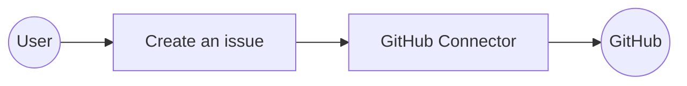

# Example

## What you'll build

Build a WSO2 Integrator automation that connects to GitHub and programmatically opens an issue against any repository. The integration uses the `ballerinax/github` connector to authenticate with a personal access token and call the Create an issue operation.

**Operations used:**
- **Create an issue** : Opens a new GitHub issue on a specified repository with a title, body, and labels.

## Architecture

## Prerequisites

- A GitHub personal access token with `repo` scope

## Setting up the GitHub integration

> **New to WSO2 Integrator?** Follow the [Create a New Integration](../../../../develop/create-integrations/create-new-integration.md) guide to set up your integration first, then return here to add the connector.

## Adding the GitHub connector

### Step 1: Open the Add Connection palette

Select **+ Add Artifact** on the Integration Design canvas. In the **Artifacts** panel, scroll to **Other Artifacts** and select **Connection**. The connector search palette appears with a search box and a grid of pre-built connectors.

## Configuring the GitHub connection

### Step 2: Fill in the connection parameters

Enter `github` in the search box to filter results, then select the **GitHub** connector card. In the connection configuration form, bind the connection fields to configurable variables:

- **auth.token** : Personal access token used to authenticate GitHub API requests
- **Connection Name** : Logical name for this connection (`githubClient`)

### Step 3: Save the connection

Select **Save Connection**. The form closes and the canvas reloads, showing the `githubClient` node.

### Step 4: Set actual values for your configurables

1. In the left panel, select **Configurations**.
2. Set a value for each configurable listed below.

- **githubAuthToken** (string) : Your GitHub personal access token with `repo` scope

## Configuring the GitHub Create an issue operation
### Step 5: Add an Automation entry point

1. Select **+ Add Artifact** on the Integration Design canvas.
2. In the **Artifacts** panel, select **Automation**.
3. In the **Create New Automation** form, leave the defaults and select **Create**.

WSO2 Integrator creates a `main` automation under **Entry Points** and opens the Automation flow canvas.

### Step 6: Select the Create an issue operation

On the Automation canvas, select the **+** between **Start** and **Error Handler** to open the node panel. Under the **Connections** section, expand `githubClient` to reveal all available operations.

### Step 7: Configure the Create an issue operation

Select **Create an issue** from the operations list and fill in all required fields in the configuration form:

- **owner** : Account owner of the repository (for example, `wso2`)
- **repo** : Repository name without the `.git` extension (for example, `ballerina-library`)
- **payload.title** : Title of the GitHub issue
- **payload.body** : Body text and description for the issue
- **payload.labels** : Array of label names to apply to the issue
- **Result** : Variable to store the API response (`issueResponse`)

Select **Save** to apply the configuration.

## Try it yourself

Try this sample in WSO2 Integration Platform.

[View source on GitHub](https://github.com/wso2/integration-samples/tree/main/connectors/github_connector_sample)

## More code examples

The `GitHub` connector provides practical examples illustrating usage in various scenarios. Explore these [examples](https://github.com/ballerina-platform/module-ballerinax-github/tree/master/examples), covering use cases like initializing a new project, creating issues, and managing pull requests.

1. [Initialize a New GitHub Project](https://github.com/ballerina-platform/module-ballerinax-github/tree/master/examples/initialize-new-project) - Create a new repository on GitHub, initialize it with a README file, and add collaborators to the repository.

2. [Create and Assign an Issue in GitHub](https://github.com/ballerina-platform/module-ballerinax-github/tree/master/examples/create-and-assign-issue) - Create a new issue on GitHub, assign it to a specific user, and add labels.

3. [Create and Manage a PullRequest in GitHub](https://github.com/ballerina-platform/module-ballerinax-github/tree/master/examples/create-and-manage-pull-request) - Create a pull request on GitHub, and request changes as necessary.

4. [Star Ballerina-Platform Repositories](https://github.com/ballerina-platform/module-ballerinax-github/tree/master/examples/star-ballerina-repositories) - Fetch all repositories under the `ballerina-platform` organization on GitHub and star each of them
