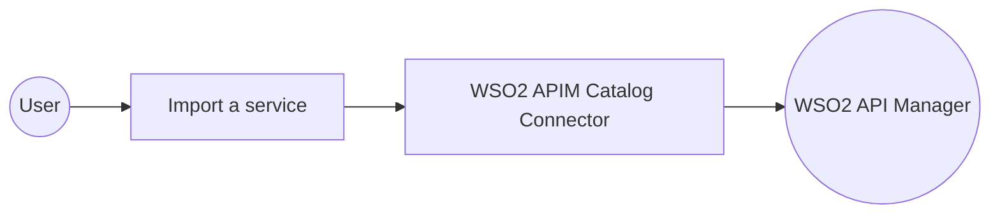

# Example

## What you'll build

Build a WSO2 Integrator automation that connects to the WSO2 API Manager Service Catalog and imports a service definition. The flow uses the `wso2.apim.catalog` connector to authenticate with a running APIM instance and upload a service definition file to the catalog.

**Operations used:**
- **Import a service** : Uploads and imports a service definition file into the WSO2 API Manager Service Catalog

## Architecture



## Prerequisites

- A running WSO2 API Manager instance (v4.x) with valid access credentials

## Setting up the WSO2 APIM catalog integration

> **New to WSO2 Integrator?** Follow the [Create a New Integration](../../../../develop/create-integrations/create-new-integration.md) guide to set up your integration first, then return here to add the connector.

## Adding the WSO2 APIM catalog connector

### Step 1: Open the add connection panel

Select the **+** (Add) icon in the **Connections** section of the side panel to open the Add Connection palette.


## Configuring the WSO2 APIM catalog connection

### Step 2: Fill in connection parameters

Enter the connection details, binding each field to a configurable variable so credentials are never hardcoded.

- **Connection Name** : A unique name for this connection instance
- **Config** : The `ConnectionConfig` record containing the `auth` block with `username` and `password` bound to configurable variables


### Step 3: Save the connection

Select **Save Connection** to persist the connection. The `catalogClient` entry appears in the **Connections** panel.


### Step 4: Set actual values for your configurables

1. In the left panel, select **Configurations**.
2. Set a value for each configurable listed below.

- **apimUsername** (string) : The WSO2 API Manager admin username
- **apimPassword** (string) : The WSO2 API Manager admin password

## Configuring the WSO2 APIM catalog import a service operation

### Step 5: Add an automation entry point

1. In the side panel, navigate to **Entry Points**.
2. Select **+** to add a new entry point.
3. Select **Automation** as the entry point type and name it `main`.

### Step 6: Select and configure the import a service operation

Expand the **catalogClient** node in the node panel to reveal all available operations, then select **Import a service** and fill in the required fields.


- **Payload** : A `Services_import_body` record containing `file.fileContent` (byte array of the service definition) and `file.fileName` (name of the service definition file)
- **Result** : Output variable that holds the `ServiceInfoList` response listing imported services


## Try it yourself

Try this sample in WSO2 Integration Platform.

[](https://console.devant.dev/new?gh=wso2/integration-samples/tree/main/connectors/wso2.apim.catalog_connector_sample)

[View source on GitHub](https://github.com/wso2/integration-samples/tree/main/connectors/wso2.apim.catalog_connector_sample)

## More code examples

```ballerina
   import ballerina/http;
   import ballerinax/wso2.apim.catalog as _;
   
   service /sales0 on new http:Listener(9000) {
       // implementation
   }
```
