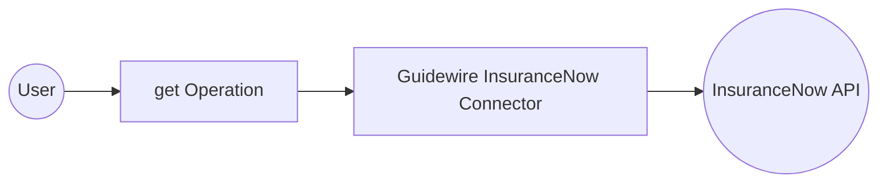

# Example

## What you'll build

Build a WSO2 Integrator automation that connects to the Guidewire InsuranceNow platform and retrieves a list of supported countries. The integration demonstrates invoking the InsuranceNow API via an Automation entry point and storing the response for downstream processing.

**Operations used:**
- **get** : Retrieves a list of supported countries from the InsuranceNow API

## Architecture

## Prerequisites

- A Guidewire InsuranceNow instance with API access
- Bearer token for authentication
- Service URL of your InsuranceNow environment

## Setting up the Guidewire InsuranceNow integration

> **New to WSO2 Integrator?** Follow the [Create a New Integration](../../../../develop/create-integrations/create-new-integration.md) guide to set up your integration first, then return here to add the connector.

## Adding the Guidewire InsuranceNow connector

### Step 1: Open the add connection panel

Select the **+** button in the **Connections** section of the WSO2 Integrator side panel to open the Add Connection palette.

## Configuring the Guidewire InsuranceNow connection

### Step 2: Fill in the connection parameters

Enter the connection parameters, binding each field to a configurable variable:

- **Config** : Authentication configuration using a Bearer token bound to `insnowAuthToken`
- **Service Url** : URL of the InsuranceNow API endpoint bound to `insnowServiceUrl`
- **Connection Name** : Identifier for the connection instance

### Step 3: Save the connection

Select **Save Connection** to persist the configuration. The `insnowClient` connection appears under the **Connections** node in the project tree and on the design canvas.

### Step 4: Set actual values for your configurables

1. In the left panel, select **Configurations**.
2. Set a value for each configurable listed below.

- **insnowServiceUrl** (string) : Base URL of the InsuranceNow API endpoint
- **insnowAuthToken** (string) : Bearer token for API authentication

## Configuring the Guidewire InsuranceNow get operation

### Step 5: Add an automation entry point

1. Select **Add Artifact** in the design view.
2. Select **Automation** from the artifact types.
3. Select **Create** to add a new Automation entry point named `main`.

### Step 6: Select and configure the get operation

1. Select the **+** button on the flow canvas to open the node panel.
2. Expand the **insnowClient** connection under **Connections** to reveal all available operations.

3. Select **Returns a list of supported countries** (`get`) as the operation.

- **Result variable** : `insnowListcountry` — stores the list of countries returned by the API

## Try it yourself

Try this sample in WSO2 Integration Platform.

[View source on GitHub](https://github.com/wso2/integration-samples/tree/main/connectors/guidewire.insnow_connector_sample)

## More code examples

The Guidewire InsuranceNow connector provides practical examples illustrating usage in various scenarios. Explore these [examples](https://github.com/ballerina-platform/module-ballerinax-guidewire.insnow/tree/main/examples/), covering the following use cases:

1. [Online application portal](https://github.com/ballerina-platform/module-ballerinax-guidewire.insnow/tree/main/examples/online-application-portal) - Implement an online insurance application portal using Guidewire InsuranceNow cloud API.
