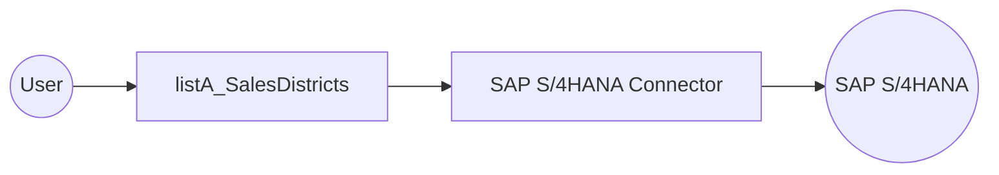

# Example

## What you'll build

This integration retrieves sales district data from an SAP S/4HANA system using the SAP S/4HANA Sales District Service API connector. The flow calls the `listA_SalesDistricts` operation and logs the results as a JSON string.

**Operations used:**
- **listA_SalesDistricts** : Retrieves all sales district records from the SAP S/4HANA system

## Architecture

## Prerequisites

- SAP S/4HANA system access with valid credentials (hostname, username, and password)

## Setting up the SAP S/4HANA sales district service API integration

> **New to WSO2 Integrator?** Follow the [Create a New Integration](../../../../develop/create-integrations/create-new-integration.md) guide to set up your integration first, then return here to add the connector.

## Adding the SAP S/4HANA sales district service API connector

### Step 1: Open the connector palette

Select **Add Connection** in the WSO2 Integrator sidebar to open the connector search palette.

### Step 2: Select the connector

Search for `api_salesdistrict_srv` and select **Api_salesdistrict_srv** from the results to open the connection form.

## Configuring the SAP S/4HANA sales district service API connection

### Step 3: Fill in the connection parameters

Enter the connection parameters using configurable variables to avoid hardcoding sensitive values:

- **Config** : Authentication object referencing `sapUsername` and `sapPassword` configurable variables
- **Hostname** : SAP S/4HANA server hostname, bound to the `sapHostname` configurable variable
- **Connection Name** : Set to `apiSalesdistrictSrvClient`

### Step 4: Save the connection

Select **Save Connection** to persist the connection. The connection `apiSalesdistrictSrvClient` now appears in the **Connections** panel and on the project canvas.

### Step 5: Set actual values for your configurables

In the left panel, select **Configurations**. Set a value for each configurable listed below:

- **sapHostname** (string) : The hostname of your SAP S/4HANA server
- **sapUsername** (string) : The username for SAP authentication
- **sapPassword** (string) : The password for SAP authentication

## Configuring the SAP S/4HANA sales district service API listA_SalesDistricts operation

### Step 6: Add an automation entry point

Select **Add Artifact** on the project overview, then select **Automation** from the artifact types, and select **Create** to add the automation entry point. This creates a `main` function that serves as the entry point for your integration.

### Step 7: Select and configure the listA_SalesDistricts operation

In the flow canvas, select the **+** button after the **Start** node to open the node panel. Expand `apiSalesdistrictSrvClient` under **Connections** to see available operations.

Select **List A Sales Districts** to add it to the flow. The operation requires no mandatory parameters; the result is stored in the variable `apiSalesdistrictSrvCollectionofaSalesdistrictwrapper` of type `api_salesdistrict_srv:CollectionOfA_SalesDistrictWrapper`. Select **Save** to confirm.

## Try it yourself

Try this sample in WSO2 Integration Platform.

[View source on GitHub](https://github.com/wso2/integration-samples/tree/main/connectors/sap.s4hana.api_salesdistrict_srv_connector_sample)

## More code examples

The S/4 HANA Sales and Distribution Ballerina connectors provide practical examples illustrating usage in various
scenarios. Explore
these [examples](https://github.com/ballerina-platform/module-ballerinax-sap.s4hana.sales/tree/main/examples), covering
use cases like accessing S/4HANA Sales Order (A2X) API.

1. [Salesforce to S/4HANA Integration](https://github.com/ballerina-platform/module-ballerinax-sap.s4hana.sales/tree/main/examples/salesforce-to-sap) -
   Demonstrates leveraging the `sap.s4hana.api_sales_order_srv:Client` in Ballerina for S/4HANA API interactions. It
   specifically showcases how to respond to a Salesforce Opportunity Close Event by automatically generating a Sales
   Order in the S/4HANA SD module.

2. [Shopify to S/4HANA Integration](https://github.com/ballerina-platform/module-ballerinax-sap.s4hana.sales/tree/main/examples/shopify-to-sap) -
   Details the integration process between [Shopify](https://admin.shopify.com/), a leading e-commerce platform,
   and [SAP S/4HANA](https://www.sap.com/products/erp/s4hana.html), a comprehensive ERP system. The objective is to
   automate SAP sales order creation for new orders placed on Shopify, enhancing efficiency and accuracy in order
   management.
