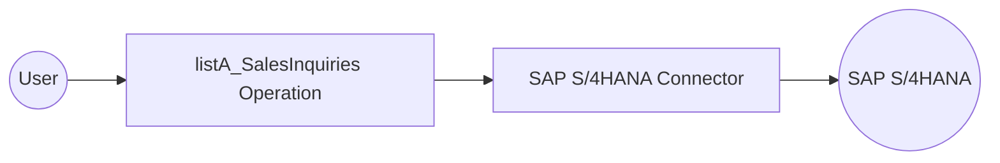

# Example

## What you'll build

Build an integration workflow that connects to an SAP S/4HANA system and retrieves sales inquiry header records. The workflow calls the Sales Inquiry API and logs the result as JSON.

**Operations used:**
- **listA_SalesInquiries** : Reads all sales inquiry headers from the SAP S/4HANA system, returning the first 10 results

## Architecture

## Prerequisites

- Access to an SAP S/4HANA system with valid credentials

## Setting up the SAP S/4HANA sales inquiry service integration

> **New to WSO2 Integrator?** Follow the [Create a New Integration](../../../../develop/create-integrations/create-a-new-integration.md) guide to set up your integration first, then return here to add the connector.

## Adding the SAP S/4HANA sales inquiry service connector

### Step 1: Open the connector palette and search for the connector

Select **Add Connection** in the WSO2 Integrator sidebar to open the connector palette, then search for `api_sales_inquiry_srv` and select the **Api_sales_inquiry_srv** connector card.

## Configuring the SAP S/4HANA sales inquiry service connection

### Step 2: Fill in the connection parameters

Enter the connection parameters, binding each field to a configurable variable:

- **Config** : `ConnectionConfig` record containing basic auth credentials; bind to configurable variables for username and password
- **Hostname** : SAP S/4HANA server hostname; bind to a configurable variable

### Step 3: Save the connection

Select **Save Connection** to persist the configuration and confirm the connector appears in the Connections panel.

### Step 4: Set actual values for your configurables

1. In the left panel, select **Configurations**.
2. Set a value for each configurable listed below:

- **sapS4HanaHostname** (string) : The hostname of your SAP S/4HANA server
- **sapS4HanaUsername** (string) : Your SAP S/4HANA login username
- **sapS4HanaPassword** (string) : Your SAP S/4HANA login password

## Configuring the SAP S/4HANA sales inquiry service listA_SalesInquiries operation

### Step 5: Add an automation entry point

Select **Add Artifact**, then select **Automation** from the artifact types and select **Create** to add the automation entry point to the canvas.

### Step 6: Select and configure the listA_SalesInquiries operation

1. On the automation canvas, select the **+** button to add a step.
2. Expand the **apiSalesInquirySrvClient** connection under **Connections**.
3. Select **List A Sales Inquiries** (`listA_SalesInquiries`).

Configure the operation parameters:

- **$top** : Limit results to the first 10 sales inquiries
- **$skip** : Start from the beginning of the result set
- **Result** : Variable name to store the response

Select **Save** to add the operation to the flow.

## Try it yourself

Try this sample in WSO2 Integration Platform.

[View source on GitHub](https://github.com/wso2/integration-samples/tree/main/connectors/sap.s4hana.api_sales_inquiry_srv_connector_sample)

## More code examples

The S/4 HANA Sales and Distribution Ballerina connectors provide practical examples illustrating usage in various
scenarios. Explore
these [examples](https://github.com/ballerina-platform/module-ballerinax-sap.s4hana.sales/tree/main/examples), covering
use cases like accessing S/4HANA Sales Order (A2X) API.

1. [Salesforce to S/4HANA Integration](https://github.com/ballerina-platform/module-ballerinax-sap.s4hana.sales/tree/main/examples/salesforce-to-sap) -
   Demonstrates leveraging the `sap.s4hana.api_sales_order_srv:Client` in Ballerina for S/4HANA API interactions. It
   specifically showcases how to respond to a Salesforce Opportunity Close Event by automatically generating a Sales
   Order in the S/4HANA SD module.

2. [Shopify to S/4HANA Integration](https://github.com/ballerina-platform/module-ballerinax-sap.s4hana.sales/tree/main/examples/shopify-to-sap) -
   Details the integration process between [Shopify](https://admin.shopify.com/), a leading e-commerce platform,
   and [SAP S/4HANA](https://www.sap.com/products/erp/s4hana.html), a comprehensive ERP system. The objective is to
   automate SAP sales order creation for new orders placed on Shopify, enhancing efficiency and accuracy in order
   management.
