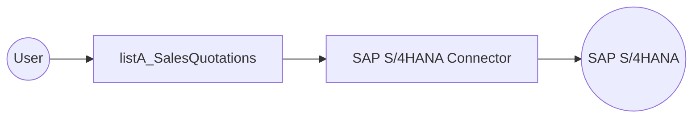

# Example

## What you'll build

Build an integration that connects to an SAP S/4HANA system and retrieves sales quotation headers using the SAP S/4HANA API Sales Quotation Service connector. The integration calls the `listA_SalesQuotations` operation to fetch sales quotation records and logs the results as JSON.

**Operations used:**
- **listA_SalesQuotations** : Retrieves a list of sales quotation headers from the SAP S/4HANA system

## Architecture

## Prerequisites

- Access to an SAP S/4HANA system with the API Sales Quotation Service enabled
- SAP authentication token and hostname

## Setting up the SAP S/4HANA API sales quotation service integration

> **New to WSO2 Integrator?** Follow the [Create a New Integration](../../../../develop/create-integrations/create-a-new-integration.md) guide to set up your integration first, then return here to add the connector.

## Adding the SAP S/4HANA API sales quotation service connector

### Step 1: Open the add connection palette

Select the **Add Connection** button (or **+** icon) next to **Connections** in the WSO2 Integrator sidebar to open the connector palette.

### Step 2: Select the SAP S/4HANA API sales quotation service connector

Search for `sap.s4hana.api_sales_quotation_srv` in the search box and select the **SAP S/4HANA API Sales Quotation Srv** connector card to open the connection form.

## Configuring the SAP S/4HANA API sales quotation service connection

### Step 3: Fill in the connection parameters

Enter the connection parameters, binding each field to a configurable variable for secure runtime supply:

- **Config** : The connection configuration object containing authentication details
- **Hostname** : The SAP S/4HANA system hostname or URL
- **Connection Name** : A name to identify this connection

### Step 4: Save the connection

Select **Save** to create the connection. The `apiSalesQuotationSrvClient` entry now appears in the **Connections** panel.

### Step 5: Set actual values for your configurables

1. In the left panel, select **Configurations**.
2. Set a value for each configurable listed below.

- **sapHostname** (string) : The hostname or URL of your SAP S/4HANA system
- **sapAuthToken** (string) : The authentication token used to access the SAP S/4HANA API

## Configuring the SAP S/4HANA API sales quotation service listA_SalesQuotations operation

### Step 6: Add an automation entry point

1. Select **Add Artifact** in the WSO2 Integrator sidebar.
2. Select **Automation** from the artifact type options.
3. In the **Create New Automation** dialog, accept the default settings and select **Create**.

### Step 7: Select and configure the listA_SalesQuotations operation

1. Select the **+** (Add Step) button on the flow canvas, expand the **Connections** section, and select **List A Sales Quotations** from the `apiSalesQuotationSrvClient` connector.

2. In the operation configuration form, set the parameters as follows:

- **$top** : Limits the number of records returned (set to `5`)
- **Result** : The variable name used to store the operation output

3. Select **Save** to apply the configuration. The completed flow appears with the operation added to the automation sequence.

## Try it yourself

Try this sample in WSO2 Integration Platform.

[View source on GitHub](https://github.com/wso2/integration-samples/tree/main/connectors/sap.s4hana.api_sales_quotation_srv_connector_sample)

## More code examples

The S/4 HANA Sales and Distribution Ballerina connectors provide practical examples illustrating usage in various
scenarios. Explore
these [examples](https://github.com/ballerina-platform/module-ballerinax-sap.s4hana.sales/tree/main/examples), covering
use cases like accessing S/4HANA Sales Order (A2X) API.

1. [Salesforce to S/4HANA Integration](https://github.com/ballerina-platform/module-ballerinax-sap.s4hana.sales/tree/main/examples/salesforce-to-sap) -
   Demonstrates leveraging the `sap.s4hana.api_sales_order_srv:Client` in Ballerina for S/4HANA API interactions. It
   specifically showcases how to respond to a Salesforce Opportunity Close Event by automatically generating a Sales
   Order in the S/4HANA SD module.

2. [Shopify to S/4HANA Integration](https://github.com/ballerina-platform/module-ballerinax-sap.s4hana.sales/tree/main/examples/shopify-to-sap) -
   Details the integration process between [Shopify](https://admin.shopify.com/), a leading e-commerce platform,
   and [SAP S/4HANA](https://www.sap.com/products/erp/s4hana.html), a comprehensive ERP system. The objective is to
   automate SAP sales order creation for new orders placed on Shopify, enhancing efficiency and accuracy in order
   management.
