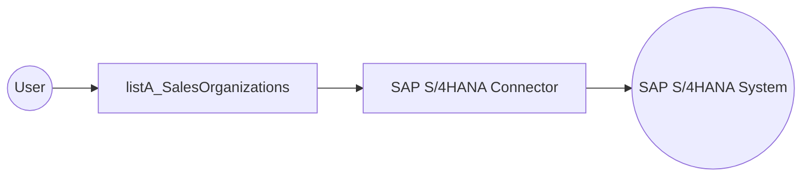

# Example

## What you'll build

Build an automation that connects to an SAP S/4HANA system and retrieves the top five sales organizations using the SAP S/4HANA API Sales Organization Service connector. The result is stored in the `listA_SalesOrganizations` variable for downstream processing or verification.

**Operations used:**
- **listA_SalesOrganizations** : Retrieves a list of sales organizations from the SAP S/4HANA `API_SALESORGANIZATION_SRV` OData service, limited to the top five results

## Architecture

## Prerequisites

- Access to an SAP S/4HANA system with the `API_SALESORGANIZATION_SRV` OData service enabled
- SAP S/4HANA hostname, username, and password

## Setting up the SAP S/4HANA API sales organization service integration

> **New to WSO2 Integrator?** Follow the [Create a New Integration](../../../../develop/create-integrations/create-a-new-integration.md) guide to set up your integration first, then return here to add the connector.

## Adding the SAP S/4HANA API sales organization service connector

### Step 1: Open the add connection panel

In the WSO2 Integrator sidebar, expand the project tree and select **Add Connection** to open the connector palette.

### Step 2: Select the SAP S/4HANA API sales organization service connector

Search for `sap.s4hana.api_salesorganization_srv` in the palette and select the **SAP S/4HANA API Sales Organization Service** connector card to open the connection form.

## Configuring the SAP S/4HANA API sales organization service connection

### Step 3: Fill in the connection parameters

Enter the connection parameters, binding each field to a configurable variable:

- **Config** : Authentication object containing `sapS4HanaUsername` and `sapS4HanaPassword` configurable variables for secure credential management
- **Hostname** : Bound to the `sapS4HanaHostname` configurable variable representing your SAP S/4HANA system hostname
- **Connection Name** : A unique name identifying this connection instance

### Step 4: Save the connection

Select **Save** to create the connection. The canvas displays `apiSalesorganizationSrvClient` under the **Connections** section.

### Step 5: Set actual values for your configurables

In the left panel, select **Configurations** and set a value for each configurable listed below:

- **sapS4HanaHostname** (string) : The hostname of your SAP S/4HANA system
- **sapS4HanaUsername** (string) : Your SAP S/4HANA username
- **sapS4HanaPassword** (string) : Your SAP S/4HANA password

## Configuring the SAP S/4HANA API sales organization service listA_SalesOrganizations operation

### Step 6: Add an automation entry point

1. In the WSO2 Integrator sidebar, select **Add Artifact**.
2. Select **Automation** as the entry point type.
3. Enter `main` as the name.

### Step 7: Select and configure the listA_SalesOrganizations operation

1. Select the **+** button on the canvas between **Start** and **Error Handler**.
2. Under **Connections**, select `apiSalesorganizationSrvClient` to expand its operations.
3. Select **listA_SalesOrganizations** from the available operations.

Configure the operation with the following values:

- **$top** : Set to `5` to limit results to the top five sales organizations
- **Result Variable** : Name of the variable that stores the operation response
- **Result Type** : The response wrapper type for the collection of sales organizations

Select **Save** to add the operation to the flow.

## Try it yourself

Try this sample in WSO2 Integration Platform.

[View source on GitHub](https://github.com/wso2/integration-samples/tree/main/connectors/sap.s4hana.api_salesorganization_srv_connector_sample)

## More code examples

The S/4 HANA Sales and Distribution Ballerina connectors provide practical examples illustrating usage in various
scenarios. Explore
these [examples](https://github.com/ballerina-platform/module-ballerinax-sap.s4hana.sales/tree/main/examples), covering
use cases like accessing S/4HANA Sales Order (A2X) API.

1. [Salesforce to S/4HANA Integration](https://github.com/ballerina-platform/module-ballerinax-sap.s4hana.sales/tree/main/examples/salesforce-to-sap) -
   Demonstrates leveraging the `sap.s4hana.api_sales_order_srv:Client` in Ballerina for S/4HANA API interactions. It
   specifically showcases how to respond to a Salesforce Opportunity Close Event by automatically generating a Sales
   Order in the S/4HANA SD module.

2. [Shopify to S/4HANA Integration](https://github.com/ballerina-platform/module-ballerinax-sap.s4hana.sales/tree/main/examples/shopify-to-sap) -
   Details the integration process between [Shopify](https://admin.shopify.com/), a leading e-commerce platform,
   and [SAP S/4HANA](https://www.sap.com/products/erp/s4hana.html), a comprehensive ERP system. The objective is to
   automate SAP sales order creation for new orders placed on Shopify, enhancing efficiency and accuracy in order
   management.
