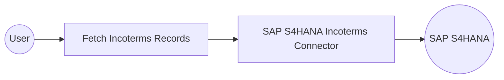

# Example

## What you'll build

This integration demonstrates how to connect to the SAP S/4HANA Sales & Distribution Incoterms API using the `ballerinax/sap.s4hana.api_sd_incoterms_srv` connector. It uses an Automation entry point to periodically fetch incoterms classification records from SAP S/4HANA and logs the retrieved data for downstream processing. The complete low-code flow runs on a schedule and chains an Automation trigger → SAP Incoterms remote function call → Log output in a single canvas.

**Operations used:**
- **listA_IncotermsClassifications** — Reads the IDs and descriptions of all Incoterms classifications from the SAP S/4HANA Sales & Distribution API

## Architecture

## Prerequisites

- A running SAP S/4HANA system accessible over the network, with the Incoterms OData service (`api_sd_incoterms_srv`) enabled and exposed via a service URL.
- Valid SAP credentials (username and password) with permission to call the Incoterms API.

## Setting up the SAP S/4HANA incoterms integration

> **New to WSO2 Integrator?** Follow the [Create a New Integration](../../../../develop/create-integrations/create-a-new-integration.md) guide to set up your integration first, then return here to add the connector.

## Adding the SAP S/4HANA incoterms connector

### Step 1: Open the add connection palette

Select the **+ Add Connection** button in the Connections section of the left sidebar to open the connector search palette.

### Step 2: Search for and select the sap.s4hana.api_sd_incoterms_srv connector

1. In the search box, enter **`incoterms`** (or **`sap.s4hana`** if no results appear).
2. Locate the **`sap.s4hana.api_sd_incoterms_srv`** connector card in the results.
3. Select the connector card to open the connection configuration form.

## Configuring the SAP S/4HANA incoterms connection

### Step 3: Bind SAP S/4HANA incoterms connection parameters to configurables

For each non-boolean field visible in the connection configuration form, open its helper panel, navigate to the **Configurables** tab, select **+ New Configurable**, enter a descriptive camelCase variable name and type, and select **Save** to auto-inject the configurable reference into the field. Repeat for every non-boolean field shown under the default auth selection.

- **Hostname** : The hostname of the SAP S/4HANA server that exposes the Incoterms OData service endpoint
- **Config** : The connection configuration record containing authentication credentials for the SAP S/4HANA API, structured as a `ConnectionConfig` with nested `CredentialsConfig`:
  - **username** : The SAP system username used to authenticate requests to the Incoterms API
  - **password** : The SAP system password associated with the username for API authentication

### Step 4: Save the connection

Select **Save** (or **Add**) to persist the SAP S/4HANA Incoterms connection. The connector entry appears in the Connections panel on the integration design canvas.

### Step 5: Set actual values for your configurables

In the left panel of WSO2 Integrator, select **Configurations** (listed at the bottom of the project tree, under Data Mappers). Set a value for each configurable:

- **sapHostname** (string) : The hostname of your SAP S/4HANA system (e.g., `my-s4hana-host.example.com`)
- **sapUsername** (string) : Your SAP system username with permission to call the Incoterms API
- **sapPassword** (string) : The password for the SAP system username

## Configuring the SAP S/4HANA incoterms listA_IncotermsClassifications operation

### Step 6: Add an automation entry point

1. In the left sidebar, hover over **Entry Points** and select **Add Entry Point** (or **+ Add Automation**).
2. Select **Automation** in the artifact selection panel.
3. Accept the default trigger settings (or set the interval to one minute) and select **Create** (or **Save**) to add the automation to the canvas.

### Step 7: Expand the connection and select the listA_IncotermsClassifications operation

1. Inside the automation body on the canvas, select the **+** (Add Step) button on the flow edge between the Start node and the Error Handler node.
2. Under **Connections** in the node panel, select the **apiSdIncotermsSrvClient** connection node to expand it and reveal all available operations.

3. Select **listA_IncotermsClassifications** from the list of available operations, then fill in the operation fields:
   - **Result** : The local variable name to store the operation's return value, set to `result`
4. Select **Save** to add the operation step to the automation flow.

### Step 8: Log the listA_IncotermsClassifications result

1. Hover over the **listA_IncotermsClassifications** node on the canvas to reveal the **+ (Add Step)** button on the connector edge between the operation and the Error Handler, then select it.
2. From the node panel, expand **Logging** and select **Log Info**.
3. Switch the **Msg** field to **Expression** mode and enter `result.toJsonString()`.
4. Select **Save** to add the Log step to the flow. The new `log : printInfo` node appears between the listA_IncotermsClassifications node and the Error Handler with no error indicator.

## Try it yourself

Try this sample in WSO2 Integration Platform.

[View source on GitHub](https://github.com/wso2/integration-samples/tree/main/connectors/sap.s4hana.api_sd_incoterms_srv_connector_sample)

## More code examples

The S/4 HANA Sales and Distribution Ballerina connectors provide practical examples illustrating usage in various
scenarios. Explore
these [examples](https://github.com/ballerina-platform/module-ballerinax-sap.s4hana.sales/tree/main/examples), covering
use cases like accessing S/4HANA Sales Order (A2X) API.

1. [Salesforce to S/4HANA Integration](https://github.com/ballerina-platform/module-ballerinax-sap.s4hana.sales/tree/main/examples/salesforce-to-sap) -
   Demonstrates leveraging the `sap.s4hana.api_sales_order_srv:Client` in Ballerina for S/4HANA API interactions. It
   specifically showcases how to respond to a Salesforce Opportunity Close Event by automatically generating a Sales
   Order in the S/4HANA SD module.

2. [Shopify to S/4HANA Integration](https://github.com/ballerina-platform/module-ballerinax-sap.s4hana.sales/tree/main/examples/shopify-to-sap) -
   Details the integration process between [Shopify](https://admin.shopify.com/), a leading e-commerce platform,
   and [SAP S/4HANA](https://www.sap.com/products/erp/s4hana.html), a comprehensive ERP system. The objective is to
   automate SAP sales order creation for new orders placed on Shopify, enhancing efficiency and accuracy in order
   management.
