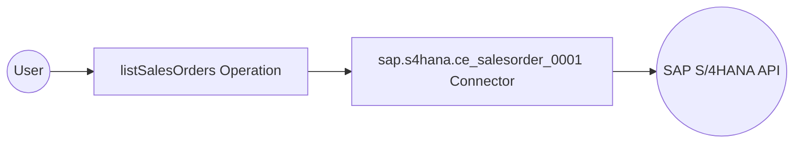

# Example

## What you'll build

Build a WSO2 Integrator automation that connects to the SAP S/4HANA Sales Order Analytics API and retrieves a list of sales orders. The workflow calls the `listSalesOrders` operation and logs the result as a JSON string.

**Operations used:**
- **listSalesOrders** : Retrieves a collection of sales orders from the SAP S/4HANA Sales Order Analytics OData API

## Architecture

## Prerequisites

- Access to an SAP S/4HANA system with the Sales Order Analytics OData API enabled
- SAP authentication token and hostname

## Setting up the sap.s4hana.ce_salesorder_0001 integration

> **New to WSO2 Integrator?** Follow the [Create a New Integration](../../../../develop/create-integrations/create-a-new-integration.md) guide to set up your integration first, then return here to add the connector.

## Adding the sap.s4hana.ce_salesorder_0001 connector

### Step 1: Search and select the connector

In the project overview canvas, select the **Connectors** section to open the connector palette. In the search box, enter `ce_salesorder_0001` to filter connectors, then select the **sap.s4hana.ce_salesorder_0001** connector card.

## Configuring the sap.s4hana.ce_salesorder_0001 connection

### Step 2: Fill in the connection parameters

Configure the connection form by binding each field to a configurable variable:

- **connectionName** : Enter `ceSalesorder0001Client` as the connection name
- **config** : Set to `{auth: {token: sapAuthToken}}` in Expression mode, referencing the `sapAuthToken` configurable variable
- **hostname** : Set to `${sapHostname}`, referencing the `sapHostname` configurable variable for the SAP system hostname

### Step 3: Save the connection

Select **Save** to create the connection. The canvas updates to show the `ceSalesorder0001Client` connection card in the Connections panel.

### Step 4: Set actual values for your configurables

1. In the left panel, select **Configurations**.
2. Set a value for each configurable listed below.

- **sapHostname** (string) : The hostname of your SAP S/4HANA system
- **sapAuthToken** (string) : The SAP authentication token used to authorize API requests

## Configuring the sap.s4hana.ce_salesorder_0001 listSalesOrders operation

### Step 5: Add an automation entry point

In the project overview canvas, select **Add Entry Point**, choose **Automation** as the entry point type, and keep the default name `main`. Select **Save** to create the Automation entry point. The canvas shows an empty automation flow with a **Start** node.

### Step 6: Select and configure the listSalesOrders operation

1. Select the **+** button on the **Start** node to add a new step.
2. In the action panel, expand the **ceSalesorder0001Client** connection to view available operations.

3. Select the **listSalesOrders** operation from the list and configure the following fields:

- **resultVariable** : `ceSalesorder0001Collectionofsalesorder` — the variable that stores the returned sales order collection
- **resultType** : `ce_salesorder_0001:CollectionOfSalesOrder` — the expected result type for the response

Leave the optional query parameters (filter, orderby, select, skip, top) empty. Select **Save** to add the operation to the flow.

## Try it yourself

Try this sample in WSO2 Integration Platform.

[View source on GitHub](https://github.com/wso2/integration-samples/tree/main/connectors/sap.s4hana.sales.order.analytics_connector_sample)
