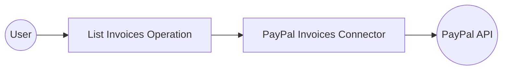

# Example

## What you'll build

Build an integration that authenticates with PayPal using OAuth2 Client Credentials and retrieves a list of invoices, logging the result as JSON. The workflow connects to the PayPal Invoices API and binds the response to a result variable for downstream processing.

**Operations used:**
- **List invoices** : Retrieves a list of invoices from the PayPal Invoices API and binds the response to a configurable result variable

## Architecture

## Prerequisites

- A PayPal developer account with an app configured for OAuth2 (Client ID and Client Secret)

## Setting up the PayPal invoices integration

> **New to WSO2 Integrator?** Follow the [Create a New Integration](../../../../develop/create-integrations/create-new-integration.md) guide to set up your integration first, then return here to add the connector.

## Adding the PayPal invoices connector

### Step 1: Open the add connection palette

Select the **+** button in the Connections panel to open the **Add Connection** palette.

## Configuring the PayPal invoices connection

### Step 2: Fill in the connection parameters

Enter the connection parameters, binding each field to a configurable variable so credentials aren't hard-coded:

- **Config** : The OAuth2 client credentials configuration expression, referencing `paypalClientId` and `paypalClientSecret` configurable variables
- **Connection Name** : A name that identifies this connection on the canvas

### Step 3: Save the connection

Select **Save** to persist the connection. The canvas updates to show the `invoicesClient` connection node, and the sidebar lists it under **Connections**.

### Step 4: Set actual values for your configurables

In the left panel, select **Configurations**. Set a value for each configurable listed below:

- **paypalClientId** (string) : Your PayPal app's OAuth2 client ID
- **paypalClientSecret** (string) : Your PayPal app's OAuth2 client secret

## Configuring the PayPal invoices list invoices operation

### Step 5: Add an automation entry point and select the list invoices operation

1. Navigate to the **Automation** canvas under **Entry Points**.
2. Select the **+** add button on the canvas flow line to open the node panel.
3. Expand the `invoicesClient` connection section to reveal available operations.
4. Select **List invoices**.

### Step 6: Configure the list invoices operation and add a log step

1. In the **List invoices** form, set the **Result Variable** to `result` so the API response is bound for downstream use.
2. Select **Save**.
3. Select the **+** add button between the `invoices:get` node and the **Error Handler** node to insert a new step.
4. From the **Logging** section, select **Log Info**.
5. In the **Log Info** form, switch the **Msg** field to **Expression** mode and enter `result.toJsonString()`.
6. Select **Save**.

## Try it yourself

Try this sample in WSO2 Integration Platform.

[View source on GitHub](https://github.com/wso2/integration-samples/tree/main/connectors/paypal.invoices_connector_sample)

## More code examples

The `PayPal Invoices` connector provides practical examples illustrating usage in various scenarios. Explore these [examples](https://github.com/ballerina-platform/module-ballerinax-paypal.invoices/tree/main/examples/), covering the following use cases:

1. [**Record invoice**](https://github.com/ballerina-platform/module-ballerinax-paypal.invoices/tree/main/examples/paypal-record-invoice): Create and manage draft invoices with detailed billing information and line items.

2. [**Send and cancel invoice**](https://github.com/ballerina-platform/module-ballerinax-paypal.invoices/tree/main/examples/paypal-send-cancel-invoice): Send invoices to customers and handle cancellation scenarios.
