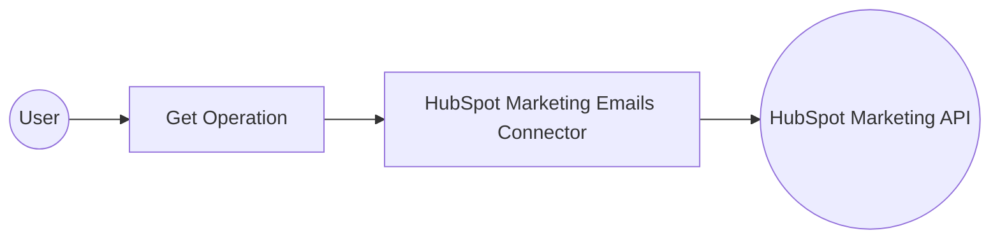

# Example

## What you'll build

Build a WSO2 Integrator automation that connects to HubSpot and retrieves all marketing emails from a HubSpot account using the `ballerinax/hubspot.marketing.emails` connector. The integration uses a Bearer Token for authentication and stores connection credentials as configurable variables. The automation runs as an Automation entry point and returns a paginated list of marketing emails.
**Operations used:**
- **get** : Retrieves all marketing emails for a HubSpot account

## Architecture

## Prerequisites

- A HubSpot account with a valid Bearer Token (Private App token with `marketing-email` scope)

## Setting up the HubSpot marketing emails integration

> **New to WSO2 Integrator?** Follow the [Create a New Integration](../../../../develop/create-integrations/create-new-integration.md) guide to set up your integration first, then return here to add the connector.

## Adding the HubSpot marketing emails connector

### Step 1: Open the add connection dialog

Select the **+** (Add Connection) button in the **Connections** section of the WSO2 Integrator side panel to open the connector palette.

## Configuring the HubSpot marketing emails connection

### Step 2: Configure the connection auth token

Select the **Emails** connector card (package: `ballerinax/hubspot.marketing.emails`) from the palette to open the **Configure Emails** form. In the **Config** field, ensure the **Record** tab is selected, then open the **Record Configuration** modal. Use the **Configurables** tab to create a new configurable variable and bind it to the `token` field inside `auth`.

- **Config** : The connection configuration record containing the Bearer Token under `auth.token`, bound to a configurable variable

### Step 3: Configure the service URL

In the connection form, select **Expand** next to **Advanced Configurations** to reveal the **Service Url** field. Open the **Configurables** tab and create a new configurable variable, then bind it to the **Service Url** field.

- **serviceUrl** : The base URL for the HubSpot marketing emails API, bound to a configurable variable

### Step 4: Save the connection

Verify the completed connection form and select **Save Connection** to persist the connection. The canvas returns to the integration overview, showing the `emailsClient` connection card.

### Step 5: Set actual values for your configurables

1. In the left panel, select **Configurations**.
2. Set a value for each configurable listed below.

- **hubspotBearerToken** (string) : Your HubSpot Private App token with the `marketing-email` read scope
- **hubspotServiceUrl** (string) : The HubSpot marketing emails API base URL, for example `https://api.hubapi.com/marketing/v3/emails`

## Configuring the HubSpot marketing emails get operation

### Step 6: Add an automation entry point

Select **+ Add Artifact** on the canvas, then select **Automation** from the artifact panel and select **Create**. The automation flow canvas opens with a `main` function.

### Step 7: Select and configure the get operation

Select the **+** node in the flow to open the node panel, then expand **emailsClient** under **Connections** and select **Get all marketing emails for a HubSpot account**. In the operation form, enter `emailsResponse` in the **Result** field, then select **Save**.

- **Result** : The variable name that stores the paginated response containing the list of marketing emails

## Try it yourself

Try this sample in WSO2 Integration Platform.

[View source on GitHub](https://github.com/wso2/integration-samples/tree/main/connectors/hubspot.marketing.emails_connector_sample)

## More code examples

The `Hubspot Marketing Emails` connector provides practical examples illustrating usage in various scenarios. Explore these examples, covering use cases:

1. [Bulk Change Reply To Email](https://github.com/ballerina-platform/module-ballerinax-hubspot.marketing.emails/tree/main/examples/bulk_change_reply_email/) - Change the Reply To and Custom Reply To email address of all draft emails

2. [Marketing Email Statistics Logger](https://github.com/ballerina-platform/module-ballerinax-hubspot.marketing.emails/tree/main/examples/email_stat_logger/) - Retrieve and log the statistics of marketing emails during a specific time period.
