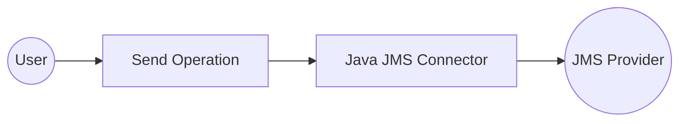
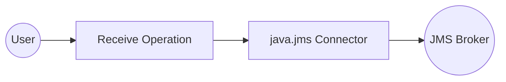

# Example

## Table of Contents

- [Jms MessageProducer Example](#jms-messageproducer-example)
- [Jms MessageConsumer Example](#jms-messageconsumer-example)

## Jms MessageProducer Example

### What you'll build

Build a JMS message producer integration that sends a text message to a JMS provider using the `ballerinax/java.jms` connector in WSO2 Integrator. The integration creates a JMS connection, establishes a session, and sends a message through a `MessageProducer`. This automation runs as a single-execution entry point and logs the result.

**Operations used:**
- **jmsMessageproducer->send** : Sends a JMS text message to the configured JMS provider

### Architecture

### Prerequisites

- A running JMS provider (e.g., Apache ActiveMQ) accessible for runtime execution

### Setting up the Java JMS integration

> **New to WSO2 Integrator?** Follow the [Create a New Integration](../../../../develop/create-integrations/create-new-integration.md) guide to set up your integration first, then return here to add the connector.

### Adding the Java JMS connector

#### Step 1: Open the connector palette

Select the **+ Add Connection** button on the integration canvas to open the connector palette.

#### Step 2: Select the Java JMS connector

Search for "jms" in the palette and select the **java.jms** connector card to open the connection form.

### Configuring the Java JMS connection

#### Step 3: Fill in the connection parameters

Bind each connection parameter to a configurable variable so credentials stay out of source code.

- **initialContextFactory** : The fully qualified class name of the JMS initial context factory
- **providerUrl** : The URL of the JMS provider (e.g., the ActiveMQ broker URL)

#### Step 4: Save the connection

Select **Save** to persist the connection. The `jmsMessageproducer` entry appears in the **Connections** panel.

#### Step 5: Set actual values for your configurables

1. In the left panel, select **Configurations**.
2. Set a value for each configurable listed below.

- **jmsInitialContextFactory** (string) : The initial context factory class name for your JMS provider (e.g., `org.apache.activemq.jndi.ActiveMQInitialContextFactory`)
- **jmsProviderUrl** (string) : The connection URL for your JMS provider (e.g., `tcp://activemq-host:61616`)

### Configuring the Java JMS send operation

#### Step 6: Add an Automation entry point

1. On the integration canvas, select **+ Add Artifact**.
2. Under **Automation**, select **Automation**.
3. In the **Create New Automation** dialog, leave all defaults and select **Create**.

The canvas opens for the new `main` automation, showing a **Start** node and an **Error Handler** node.

#### Step 7: Select and configure the send operation

1. Select the **+** button between **Start** and **Error Handler** to open the node selection panel.
2. Under **Connections**, expand **jmsMessageproducer** to reveal available operations.
3. Select **Send** to open the `jmsMessageproducer → send` form.
4. In the **Message** field, select the **Expression** tab and enter the message record value.

- **message** : A `jms:TextMessage` record literal, for example `{"content": "Hello from WSO2 Integrator!"}`

Select **Save** to add the step to the canvas.

### Try it yourself

Try this sample in WSO2 Integration Platform.

[View source on GitHub](https://github.com/wso2/integration-samples/tree/main/connectors/java.jms_message_producer_connector_sample)

## Jms MessageConsumer Example

### What you'll build

Build a JMS message consumer integration using the `java.jms` connector in WSO2 Integrator. The integration connects to a JMS broker, creates a session and destination queue, and receives messages from it.

**Operations used:**
- **Receive** : Waits for and retrieves the next message from the configured JMS queue within the specified timeout interval.

### Architecture

### Prerequisites

- A running JMS broker (e.g., Apache ActiveMQ)
- Access to the JMS broker's initial context factory class and provider URL

### Setting up the java.jms integration

> **New to WSO2 Integrator?** Follow the [Create a New Integration](../../../../develop/create-integrations/create-new-integration.md) guide to set up your integration first, then return here to add the connector.

### Adding the java.jms connector

#### Step 1: Open the connector palette

Open the connector palette by selecting the connector icon in the sidebar. Search for **JMS** or **java.jms** to locate the `ballerinax/java.jms` connector.

#### Step 2: Add an automation entry point

1. In the WSO2 Integrator design canvas, select **Add Artifact**.
2. From the artifact picker, select **Automation** under the **Automation** category.
3. Select **Create** to create the automation with default settings.

The canvas now shows an **Automation** flow with a **Start** node and an **Error Handler** node.

### Configuring the java.jms connection

#### Step 3: Fill in the connection parameters

Select the **JMS MessageConsumer** connector entry to open its connection configuration form. Bind each field to a configurable variable:

- **session** : The `jms:Session` object used to create the consumer
- **acknowledgementMode** : The session acknowledgement mode (e.g., `AUTO_ACKNOWLEDGE`)

#### Step 4: Save the connection

Select **Save** to persist the connection. The connector is now visible in the **Connections** panel on the canvas.

#### Step 5: Set actual values for your configurables

1. In the left panel, select **Configurations**.
2. Set a value for each configurable listed below.

- **jmsInitialContextFactory** (string) : The fully-qualified class name of the JNDI initial context factory (e.g., `org.apache.activemq.jndi.ActiveMQInitialContextFactory`)
- **jmsProviderUrl** (string) : The broker URL used to connect to the JMS provider
- **jmsQueueName** (string) : The name of the queue to consume messages from

### Configuring the java.jms Receive operation

#### Step 6: Select and configure the Receive operation

1. Select the **+** button between the **Start** and **Error Handler** nodes to open the node picker panel.
2. In the **Connections** section, expand **jmsMessageconsumer** and select **Receive**.
3. In the **Result** field, clear the default value and enter `result`.

The **Result Type** is automatically set to `jms:Message|()`.

- **result** : The variable name that holds the received message

Select **Save**. The canvas shows a new `jms : receive` node with the label `result` connected to the `jmsMessageconsumer` icon.

### Try it yourself

Try this sample in WSO2 Integration Platform.

[View source on GitHub](https://github.com/wso2/integration-samples/tree/main/connectors/java.jms_message_consumer_connector_sample)
