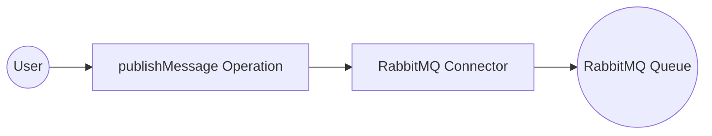
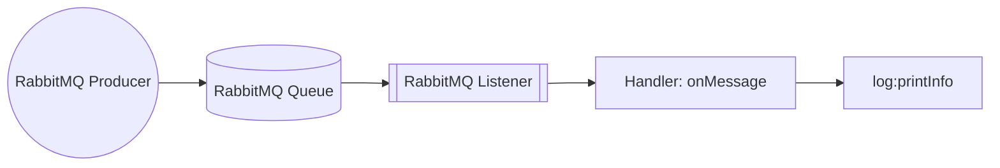

# Example

## Table of Contents

- [RabbitMQ Example](#rabbitmq-example)
- [RabbitMQ Trigger Example](#rabbitmq-trigger-example)

## RabbitMQ Example

### What you'll build

Build a WSO2 Integrator automation that publishes a message to a RabbitMQ queue using the **ballerinax/rabbitmq** connector. The integration sends `"Hello, RabbitMQ!"` to a queue named `myQueue`, with all connection credentials bound to configurable variables so no secrets are hard-coded.

**Operations used:**
- **publishMessage** : Publishes a message to a specified RabbitMQ queue using a routing key

### Architecture

### Prerequisites

- A running RabbitMQ server accessible from your integration environment
- RabbitMQ credentials (username, password, virtual host, host, and port)

### Setting up the RabbitMQ integration

> **New to WSO2 Integrator?** Follow the [Create a New Integration](../../../../develop/create-integrations/create-new-integration.md) guide to set up your integration first, then return here to add the connector.

### Adding the RabbitMQ connector

#### Step 1: Open the Add Connection panel

In the left sidebar, under **Connections**, select **+ Add Connection** to open the connector palette.

#### Step 2: Add an Automation entry point

In the left sidebar, hover over **Entry Points** and select **+ Add Entry Point**. On the artifact selection panel, choose **Automation**, then select **Create**.

A new automation named `main` appears in the sidebar under **Entry Points**, and the low-code flow canvas opens showing a **Start → Error Handler** skeleton.

### Configuring the RabbitMQ connection

#### Step 3: Fill in the connection parameters

Search for `RabbitMQ`, select the **ballerinax/rabbitmq** connector card, and bind each field to a configurable variable using the **Helper Panel**.

- **host** : The RabbitMQ server hostname, bound to a configurable variable
- **port** : The RabbitMQ server port (switch to **Expression** mode to access the Helper Panel for `int` fields), bound to a configurable variable
- **username** : The RabbitMQ username (expand **Advanced Configurations**), bound to a configurable variable
- **password** : The RabbitMQ password, bound to a configurable variable
- **virtualHost** : The RabbitMQ virtual host, bound to a configurable variable

Set the **Connection Name** to `rabbitmqClient`.

#### Step 4: Save the connection

Select **Save Connection**. The canvas returns to the overview, showing the `rabbitmqClient` connection node.

#### Step 5: Set actual values for your configurables

1. In the left panel, select **Configurations**.
2. Set a value for each configurable listed below.

- **rabbitmqHost** (string) : The hostname or IP address of your RabbitMQ server
- **rabbitmqPort** (int) : The port your RabbitMQ server listens on
- **rabbitmqUsername** (string) : The username for authenticating with RabbitMQ
- **rabbitmqPassword** (string) : The password for authenticating with RabbitMQ
- **rabbitmqVirtualHost** (string) : The virtual host to connect to on the RabbitMQ server

### Configuring the RabbitMQ publishMessage operation

#### Step 6: Select the publishMessage operation and configure it

On the flow canvas, select the **+** button between **Start** and **Error Handler**. Under **Connections → rabbitmqClient**, expand the connection to see all available operations.

Select **Publish Message** and configure the **Message** field by switching to **Expression** mode and entering the record literal with the fields below.

- **content** : The message payload to publish — set to `"Hello, RabbitMQ!"`
- **routingKey** : The target queue name — set to `"myQueue"`

Select **Save**. The `publishMessage` node appears on the canvas connected to `rabbitmqClient`.

### Try it yourself

Try this sample in WSO2 Integration Platform.

[View source on GitHub](https://github.com/wso2/integration-samples/tree/main/integrator-default-profile/connectors/rabbitmq_connector_sample)

---
## RabbitMQ Trigger Example
### What you'll build

This integration uses a RabbitMQ broker as the event source. When a message arrives on a configured RabbitMQ queue, the RabbitMQ listener dispatches it to an `onMessage` handler, which logs the message payload as a JSON string. The overall flow is: RabbitMQ Producer → RabbitMQ Queue → RabbitMQ Listener → `onMessage` handler → `log:printInfo`.

### Architecture

### Prerequisites

- A running RabbitMQ broker with the host, port, and queue name available.

### Setting up the RabbitMQ integration

> **New to WSO2 Integrator?** Follow the [Create a New Integration](../../../../develop/create-integrations/create-new-integration.md) guide to set up your integration first, then return here to add the trigger.

### Adding the RabbitMQ trigger

#### Step 1: Open the artifacts palette and select the RabbitMQ trigger

Select **Add Artifact** in the WSO2 Integrator panel. In the artifacts palette, expand the **Event Integration** category and locate the **RabbitMQ** trigger card.

### Configuring the RabbitMQ listener

#### Step 2: Bind listener parameters to configuration variables

Select the **RabbitMQ** trigger card to open the trigger configuration form. Bind each listener parameter to a configuration variable:

- **Host** : the RabbitMQ broker hostname
- **Port** : the RabbitMQ broker port number
- **Queue Name** : the name of the queue to subscribe to

#### Step 3: Set actual values for your configurations

In the left panel, select **Configurations** to open the Configurations panel. Set a value for each configuration listed below:

- **rabbitmqHost** (string) : the hostname or IP address of your RabbitMQ broker
- **rabbitmqPort** (int) : the port your RabbitMQ broker listens on
- **queueName** (string) : the name of the queue the listener subscribes to

#### Step 4: Create the trigger service

Select **Create** to generate the trigger service.

### Handling RabbitMQ events

#### Step 5: Add the onMessage handler

In the **RabbitMQ Event Integration** service view, select **+ Add Handler**. The **Select Handler to Add** side panel opens and lists the available handlers.

#### Step 6: Define the message type schema

Select **onMessage** from the side panel. The **Message Handler Configuration** panel opens. Under **Message Configuration**, select **Define Value**. In the modal, select the **Create Type Schema** tab. Enter `RabbitMQMessage` as the **Name**, then select the **+** icon next to **Fields** to add each field:

- **routingKey** : `string`
- **content** : `string`

Select **Save** to create the `RabbitMQMessage` type, then select **Save** on the handler configuration panel to register the handler.

#### Step 7: Add a log statement to the handler

Select the **+** icon in the flow chart, and in the side panel that opens, choose **Log Info** from the **Logging** section, then enter `message.toJsonString()` as the message.

#### Step 8: Confirm the registered handler in the service view

Navigate back to the **RabbitMQ Event Integration** service view. Confirm that the `Event — onMessage` handler row appears under **Event Handlers**, with the listener and queue name badges visible.

### Running the integration

Run the integration from WSO2 Integrator by selecting **Run** in the project panel. The service connects to the RabbitMQ broker, subscribes to the configured queue, and logs every incoming message as a JSON string.

To fire a test event, use one of the following approaches:

1. **WSO2 Integrator RabbitMQ publisher template** — create a new integration using the RabbitMQ publisher template, configure it to point to the same broker and queue, and publish a sample message.
2. **RabbitMQ CLI (`rabbitmqadmin`)** — use the `rabbitmqadmin` command-line tool to publish a message directly to the queue.
3. **RabbitMQ Management Console** — open the RabbitMQ Management UI in your browser, navigate to the **Queues** tab, select your queue, and use the **Publish message** form to send a test payload.

Watch the WSO2 Integrator log output to see the incoming message printed as a JSON string by `log:printInfo`.

### Try it yourself

Try this sample in WSO2 Integration Platform.

[View source on GitHub](https://github.com/wso2/integration-samples/tree/main/integrator-default-profile/connectors/rabbitmq_trigger_sample)
