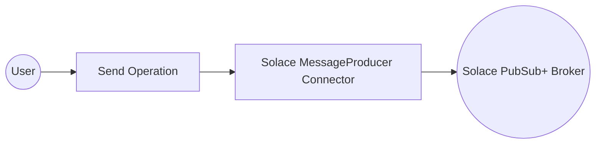
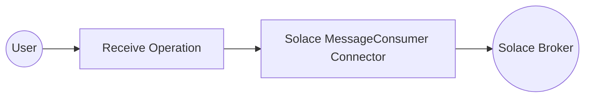
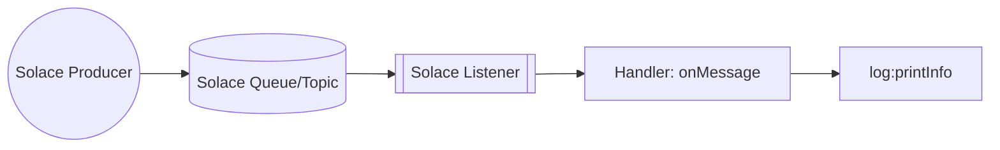

# Examples

- [Solace Producer Example](#solace-producer-example)
- [Solace Consumer Example](#solace-consumer-example)
- [Solace Trigger Example](#solace-trigger-example)

## Solace Producer Example

#### What you'll build

Build a Solace PubSub+ message-publishing integration using the WSO2 Integrator low-code visual designer. The integration connects to a Solace PubSub+ broker and publishes a message to a configured topic, with all connection parameters stored as configurable variables.

**Operations used:**
- **Send** : Publishes a message to the Solace PubSub+ broker on a configured topic

#### Architecture

#### Prerequisites

- A running Solace PubSub+ broker with access to a host URL, message VPN, username, and password

#### Setting up the Solace MessageProducer integration

> **New to WSO2 Integrator?** Follow the [Create a New Integration](../../../../develop/create-integrations/create-new-integration.md) guide to set up your integration first, then return here to add the connector.

#### Adding the Solace MessageProducer connector

##### Step 1: Open the connector palette

1. Navigate to the **Connections** section in the WSO2 Integrator panel.
2. Select **+ Add Connection** to open the connector marketplace palette.
3. Enter `solace` in the search box to filter results.
4. Select **Solace MessageProducer** from the list.

#### Configuring the Solace MessageProducer connection

##### Step 2: Fill in connection parameters

Bind all sensitive parameters to configurable variables so they can be overridden at runtime without code changes. Use the **Configurables** panel to create each variable, then inject it into the corresponding field.

- **Host URL** : The Solace broker host URL
- **Message VPN** : The message VPN name on the broker
- **Auth** : Authentication configuration — enter the record literal referencing `solaceUsername` and `solacePassword` configurable variables in Expression mode
- **Username** (inside Auth) : Username for basic authentication
- **Password** (inside Auth) : Password for basic authentication

##### Step 3: Save the connection

Select **Save Connection** to persist the connection. The **Connections** panel now shows `solaceMessageproducer` as an available connection in the project.

##### Step 4: Set actual values for your configurables

1. In the left panel, select **Configurations**.
2. Set a value for each configurable listed below.

- **solaceHostUrl** (string) : The Solace broker host URL (for example, `tcp://your-host:55555`)
- **solaceMessageVpn** (string) : The message VPN name on the broker
- **solaceUsername** (string) : Username for basic authentication
- **solacePassword** (string) : Password for basic authentication
- **solaceTopicName** (string) : Topic name to publish messages to

#### Configuring the Solace MessageProducer Send operation

##### Step 5: Add the Automation entry point

Open the **Automation** entry point (`main`) in the WSO2 Integrator panel under **Entry Points**. The flow canvas opens. Select the **+** button on the canvas to open the operations node panel. Under **Connections**, select `solaceMessageproducer` to expand its available operations.

##### Step 6: Select the Send operation and configure its parameters

Select **Send** from the operations list. The **Send** operation form opens with the title `solaceMessageproducer → send`. Configure the following parameter:

- **Message** : A `solace:Message` record — set the `payload` field to `"Hello from Solace!"`

Select **Save** to add the node to the flow.

#### Try it yourself

Try this sample in WSO2 Integration Platform.

[View source on GitHub](https://github.com/wso2/integration-samples/tree/main/integrator-default-profile/connectors/solace_message_producer_connector_sample)

## Solace Consumer Example

#### What you'll build

Build a Solace MessageConsumer integration that connects to a Solace broker, receives a message from a queue, and logs the result. This integration uses the WSO2 Integrator low-code canvas to configure the connection and operation visually.

**Operations used:**
- **Receive** : Receives a message from the configured Solace queue, blocking until a message arrives or a timeout occurs

#### Architecture

#### Prerequisites

- A Solace broker accessible via a host URL

#### Setting up the Solace MessageConsumer integration

> **New to WSO2 Integrator?** Follow the [Create a New Integration](../../../../develop/create-integrations/create-new-integration.md) guide to set up your integration first, then return here to add the connector.

#### Adding the Solace MessageConsumer connector

##### Step 1: Open the Add connection panel

In the WSO2 Integrator sidebar, hover over **Connections** and select the **+** icon to open the Add Connection panel.

#### Configuring the Solace MessageConsumer connection

##### Step 2: Fill in the connection form

Enter the following parameters, binding each field to a configurable variable:

- **Connection Name** : Auto-filled name for this connection instance
- **Url** : The Solace broker host URL, bound to a configurable variable
- **Subscription Config** : Queue or topic subscription record, bound to a configurable variable

##### Step 3: Save the connection

Select **Save** to persist the connection. The `solaceMessageconsumer` node appears in the Connections list on the canvas.

##### Step 4: Set actual values for your configurables

In the left panel, select **Configurations** and set a value for each configurable listed below:

- **solaceHostUrl** (string) : The full host URL of your Solace broker (for example, `tcp://<broker-host>`)
- **solaceQueueName** (string) : The name of the Solace queue to subscribe to

#### Configuring the Solace MessageConsumer Receive operation

##### Step 5: Add an automation entry point

1. In the WSO2 Integrator sidebar, hover over **Entry Points** and select the **+** icon.
2. Select **Automation** from the artifact type panel.
3. Select **Create** to create the automation (named `main` by default).

##### Step 6: Select and configure the Receive operation

1. Select the **+** icon on the placeholder node between **Start** and **Error Handler** on the canvas.
2. Under **Connections** in the node panel, expand **solaceMessageconsumer** to reveal available operations.

3. Select **Receive** to open the operation configuration panel.
4. Configure the following parameter:

- **Result** : Variable name to store the received message

5. Select **Save** to add the `solace : receive` node to the automation flow.

#### Try it yourself

Try this sample in WSO2 Integration Platform.

[View source on GitHub](https://github.com/wso2/integration-samples/tree/main/integrator-default-profile/connectors/solace_message_consumer_connector_sample)

---
## Solace Trigger Example
### What you'll build

This integration connects to a Solace PubSub+ broker as an event consumer. When a message is published to a configured Solace queue or topic by an external producer, the trigger listener receives it and routes it to the `onMessage` handler. The handler deserializes the incoming message as a `SolaceMessagePayload` record and logs the full payload as a JSON string using `log:printInfo`, providing a foundation for building event-driven processing pipelines on top of Solace PubSub+.

### Architecture

### Prerequisites

- A running **Solace PubSub+ broker** (self-hosted, Docker, or Solace Cloud) accessible from the integration host.
- A **message VPN** configured on the broker with a queue or topic the integration can subscribe to.
- A **client username and password** with `Guaranteed Endpoint Permission` (for queues) or `Subscribe` permission (for topics) on the target destination.
- The broker's **SMF (Solace Message Format) host URL**.

### Setting up the Solace integration

> **New to WSO2 Integrator?** Follow the [Create a New Integration](../../../../develop/create-integrations/create-new-integration.md) guide to set up your integration first, then return here to add the trigger.

### Adding the Solace trigger

#### Step 1: Open the Artifacts palette and select the Solace trigger

1. On the integration canvas, select **+ Add Artifact** to open the Artifacts palette.
2. In the **Event Integration** category, locate and select the **Solace** card.

### Configuring the Solace listener

#### Step 2: Bind Solace listener parameters to configuration variables

For each required listener field, open the **Helper Panel** next to the field, select the **Configurables** tab, select **+ New Configurable**, enter a camelCase variable name and the correct primitive type (`configurable string` for text/URL/credential fields), and select **Save**. The configuration name is then placed in the field as a reference.

- **Broker URL** : The Solace broker's SMF host URL, bound to a `configurable string`
- **Message VPN** : The Solace message VPN the client connects to, bound to a `configurable string`
- **Username** : The client username used for broker authentication, bound to a `configurable string`
- **Password** : The client password for broker authentication, bound to a `configurable string`
- **Queue Name** : The name of the Solace queue or topic the integration subscribes to, bound to a `configurable string`

#### Step 3: Set actual values for your configurations

In the left panel of WSO2 Integrator, select **Configurations** (at the bottom of the project tree, under Data Mappers) and select **View Configuration**. The Configurations panel opens where you can set a value for each configuration:

- **solaceHost** (string) : The full SMF URL of your Solace broker
- **solaceVpnName** (string) : The message VPN name configured on your broker
- **solaceUsername** (string) : The Solace client username with subscription permissions
- **solacePassword** (string) : The password for the Solace client username
- **solaceQueueName** (string) : The name of the queue or topic to consume messages from

#### Step 4: Select Create to register the listener and open the Service view

After binding all parameters and setting configuration values, select **Create** on the trigger configuration form. The Solace listener is automatically registered and the Service view opens, showing the listener chip—no separate "Add Listener" step is required.

### Handling Solace events

#### Step 5: Open the Add Handler side panel

1. In the Service view, select **+ Add Handler** on the right side of the Event Handlers section.
2. The **Select Handler to Add** side panel opens, listing the available handler options for the Solace trigger (for example, `onMessage` and `onError`).

#### Step 6: Select the onMessage handler and define the SolaceMessagePayload record type

1. In the **Select Handler to Add** side panel, select **onMessage** to open the Message Handler Configuration panel.
2. In the **Message Configuration** section, select **Define Value** to open the modal.
3. Select the **Create Type Schema** tab.
4. In the **Name** field, enter `SolaceMessagePayload`.
5. Select the **+** icon next to **Fields** to add each payload field—enter the field name and a type for each. Add the following fields:
   - `messageId` — `string`
   - `content` — `string`
   - `destination` — `string`
6. Select **Save** to create the record type and close the modal.

#### Step 7: Save the handler configuration and add a log statement to the flow

1. In the Message Handler Configuration panel, select **Save** to open the flow canvas for the `onMessage` handler.
2. In the handler body, add a `log:printInfo(message.toJsonString())` step using the flow canvas.
3. Verify the `log:printInfo` node appears between **Start** and **Error Handler** on the canvas.

#### Step 8: Confirm the onMessage handler is registered in the Service view

Select the back arrow in the canvas header (or re-select the Solace trigger service in the project tree) to return to the Service view. The Event Handlers list now shows the registered **`onMessage`** handler row, confirming the handler is active and ready to receive Solace messages.

### Running the integration

#### Step 9: Run the integration and trigger a test Solace message

1. In the WSO2 Integrator panel, select **Run** to start the integration. Wait for the listener to connect to the Solace broker (watch for a "Listening on queue/topic" log line).
2. Send a test message using one of the following approaches:
   - **A separate WSO2 Integrator Solace Producer integration** (recommended)—assemble a Solace producer from the same low-code canvas and publish a test message to the same queue or topic.
   - **Solace's `sdkperf` CLI tool**—run the tool targeting your broker's SMF host, client username, password, and queue name to publish a single persistent message.
   - **The Solace PubSub+ Manager web console**—navigate to **Queues → Try Me** (for queues) or **Try Me** (for direct topics) in the broker's management UI and publish a test message body such as `{"messageId":"msg-001","content":"hello solace","destination":"test/queue"}`.
3. Observe the integration's log output—the payload JSON string should appear printed by `log:printInfo`, confirming end-to-end message receipt and deserialization.
