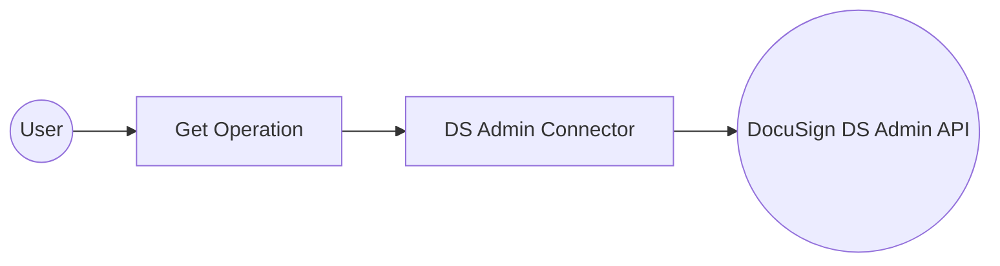

# Example

## What you'll build

Build a WSO2 Integrator automation that connects to the DocuSign DS Admin API and retrieves a list of organizations for the authenticated user. The integration uses configurable variables to securely manage credentials and invokes the DS Admin connector's get operation via an Automation entry point.

**Operations used:**
- **get** : Returns a list of organizations that the authenticated user belongs to

## Architecture

## Prerequisites

- A DocuSign account with Admin API access
- A valid OAuth 2.0 bearer token from the DocuSign Identity Provider

## Setting up the DS admin integration

> **New to WSO2 Integrator?** Follow the [Create a New Integration](../../../../develop/create-integrations/create-new-integration.md) guide to set up your integration first, then return here to add the connector.

## Adding the DS admin connector

### Step 1: Open the connector palette

Select **+ Add Connection** in the **Connections** section to open the connector palette.

### Step 2: Search for and select the DS admin connector

1. Enter `docusign` in the search field.
2. Select the **DS Admin** card (`ballerinax/docusign.dsadmin`) to open the connection form.

## Configuring the DS admin connection

### Step 3: Fill in the connection parameters

Bind each connection parameter to a configurable variable so no secrets are hard-coded.

- **serviceUrl** : Enter the DocuSign Admin API base URL, bound to the `docusignServiceUrl` configurable variable
- **auth** : Set to the bearer token expression referencing the `docusignBearerToken` configurable variable using `BearerTokenConfig`
- **connectionName** : Pre-filled as `dsadminClient` — no change required

### Step 4: Save the connection

Select **Save Connection** to persist the connection. The `dsadminClient` node appears on the integration canvas.

### Step 5: Set actual values for your configurables

1. In the left panel, select **Configurations** (at the bottom of the project tree, under Data Mappers).
2. Set a value for each configurable listed below.

- **docusignServiceUrl** (string) : The DocuSign Admin API base URL, for example `https://api.docusign.net/Management`
- **docusignBearerToken** (string) : A valid OAuth 2.0 bearer token obtained from the DocuSign Identity Provider

## Configuring the DS admin get operation

### Step 6: Add an automation entry point

1. Select **+ Add Artifact** on the canvas toolbar.
2. Select **Automation** from the artifact type list.
3. Leave the defaults as-is and select **Create**.

### Step 7: Select and configure the get operation

1. Select the **+** button between **Start** and **Error Handler** to open the step-addition panel.
2. Under **Connections**, expand **dsadminClient** to see all available operations.

3. Select **"Returns a list of organizations that the authenticated user belongs to."** (maps to `get()`).
4. In the operation configuration panel, set the result variable to `dsAdminResult`. This operation requires no additional parameters.

5. Select **Save**.

## Try it yourself

Try this sample in WSO2 Integration Platform.

[View source on GitHub](https://github.com/wso2/integration-samples/tree/main/connectors/docusign.dsadmin_connector_sample)

## More code examples

The DocuSign Admin connector provides practical examples illustrating usage in various scenarios. Explore these [examples](https://github.com/ballerina-platform/module-ballerinax-docusign.dsadmin/tree/main/examples).

1. [Manage user information with DocuSign Admin](https://github.com/ballerina-platform/module-ballerinax-docusign.dsadmin/tree/main/examples/manage-user-information)
    This example shows how to use the DocuSign Admin API to create users and retrieve user information related to eSignature tasks.

2. [Access permissions in user accounts](https://github.com/ballerina-platform/module-ballerinax-docusign.dsadmin/tree/main/examples/permissions-in-organizations)
    This example shows how to use the DocuSign Admin API to view permission details of user accounts.
