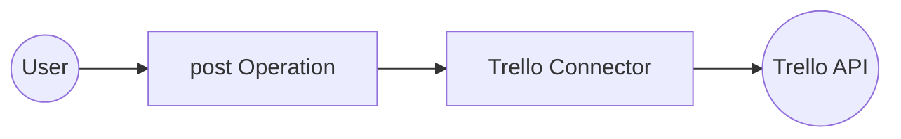

# Example

## What you'll build

Build a WSO2 Integrator automation that creates a new card in a Trello list using the **ballerinax/trello** connector. The integration authenticates with the Trello API using an API key and token, then posts a new card with a name and description to a specified list.

**Operations used:**
- **post** : Creates a new card in a specified Trello list using the card's list ID, name, and description.

## Architecture

## Prerequisites

- A Trello account with an API key and token

## Setting up the Trello integration

> **New to WSO2 Integrator?** Follow the [Create a New Integration](../../../../develop/create-integrations/create-new-integration.md) guide to set up your integration first, then return here to add the connector.

## Adding the Trello connector

### Step 1: Open the add connection panel

In the WSO2 Integrator sidebar, expand your project and select **Connections → + Add Connection** to open the connector palette.

### Step 2: Select the Trello connector

Enter `trello` in the search box and select **ballerinax/trello** from the results to open the connection form.

## Configuring the Trello connection

### Step 3: Fill in the connection parameters

In the **Configure Trello** form, bind each field to a configurable variable:

- **connectionName** : Enter `trelloClient` as the connection name
- **apiKeyConfig** : Set to the `ApiKeysConfig` record referencing `trelloApiKey` and `trelloApiToken` configurable variables

### Step 4: Save the connection

Select **Save Connection** to persist the connection. Confirm that `trelloClient` appears in the **Connections** panel and on the canvas.

### Step 5: Set actual values for your configurables

1. In the left panel, select **Configurations**.
2. Set a value for each configurable listed below.

- **trelloApiKey** (string) : Your Trello API key
- **trelloApiToken** (string) : Your Trello API token
- **trelloListId** (string) : The ID of the Trello list where the card will be created

## Configuring the Trello post operation

### Step 6: Add an automation entry point

1. In the sidebar, select **Entry Points → + Add Entry Point**.
2. Select **Automation** as the entry point type.
3. Accept the default name (`main`) or enter a custom name.
4. Select **Save**. The Automation canvas opens showing a **Start** node and an **Error Handler**.

### Step 7: Select and configure the post operation

On the Automation canvas, select the **+** button between **Start** and **Error Handler** to open the node panel. Expand **trelloClient** to see available operations, then select **Create a new Card** (`post`).

In the configuration form, fill in the following fields:

- **idList** : Set to the `trelloListId` configurable variable to specify which list receives the card
- **name** : Enter `Integration Test Card`
- **desc** : Enter `Sample card created by Trello connector integration`
- **result** : Accept the pre-filled value `trelloCard` to hold the API response

Select **Save** to add the operation to the canvas flow.

## Try it yourself

Try this sample in WSO2 Integration Platform.

[View source on GitHub](https://github.com/wso2/integration-samples/tree/main/connectors/trello_connector_sample)

## More code examples

The `Trello` connector provides practical examples illustrating usage in various scenarios. Explore these [examples](https://github.com/ballerina-platform/module-ballerinax-trello/tree/main/examples/), covering the following use cases:

1. [**Create and retrieve a list and cards in Trello**](https://github.com/ballerina-platform/module-ballerinax-trello/tree/main/examples/create_list) - Create a new list in a specific Trello board and retrieve its details using the list ID.
2. [**Create, update fetch and add a label to a card in Trello**](https://github.com/ballerina-platform/module-ballerinax-trello/tree/main/examples/create_card) - Create a new card in a Trello list and update the card's name add a label to it and view it.
