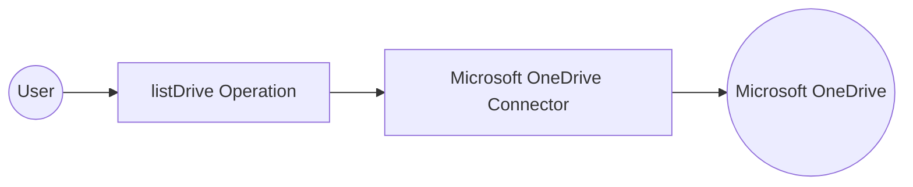

# Example

## What you'll build

Build an integration in WSO2 Integrator that uses the **Microsoft OneDrive** connector to list all available drives. The integration uses an **Automation** entry point to invoke the `listDrive` operation and log the results.

**Operations used:**
- **listDrive** : Retrieves all available drives from Microsoft OneDrive

## Architecture

## Prerequisites

- A Microsoft OneDrive account with a valid access token

## Setting up the Microsoft OneDrive integration

> **New to WSO2 Integrator?** Follow the [Create a New Integration](../../../../develop/create-integrations/create-a-new-integration.md) guide to set up your integration first, then return here to add the connector.

## Adding the Microsoft OneDrive connector

### Step 1: Add the Microsoft OneDrive connection

Select **+** in the **Connections** section to open the Add Connection panel.

## Configuring the Microsoft OneDrive connection

### Step 2: Fill in the connection parameters

Enter the connection details, binding each field to a configurable variable:

- **connectionName** : Enter `onedriveClient` as the connection name
- **config** : Switch to **Expression** mode and enter `{auth: {token: oneDriveToken}}`, referencing the `oneDriveToken` configurable variable that holds your access token at runtime

### Step 3: Save the connection

Select **Save** to create the connection. The `onedriveClient` entry now appears under the **Connections** section.

### Step 4: Set actual values for your configurables

In the left panel, select **Configurations**. Set a value for each configurable listed below:

- **oneDriveToken** (string) : Your Microsoft OneDrive access token

## Configuring the Microsoft OneDrive listDrive operation

### Step 5: Add an Automation entry point

Select **Add Artifact** and choose **Automation** as the entry point type. Enter `main` as the function name, then select **Create** to generate the automation entry point.

### Step 6: Select and configure the listDrive operation

Expand the **onedriveClient** connection node on the canvas to view available operations, then select **List Drive** to add it to the flow.

Configure the operation parameters:

- **resultVariable** : Enter `result` as the variable name to store the response
- **resultType** : Set to `onedrive:DriveCollectionResponse`

Select **Save** to add the operation to the flow.

## Try it yourself

Try this sample in WSO2 Integration Platform.

[View source on GitHub](https://github.com/wso2/integration-samples/tree/main/connectors/microsoft_onedrive_connector_sample)

## More code examples

The `microsoft.onedrive` connector provides practical examples illustrating usage in various scenarios. Explore these [examples](https://github.com/ballerina-platform/module-ballerinax-microsoft.onedrive/tree/master/examples/), covering the following use cases:

1. [Upload File](https://github.com/ballerina-platform/module-ballerinax-microsoft.onedrive/tree/master/examples/upload-file) - This example demonstrates how to use the Ballerina Microsoft OneDrive connector to upload a file from your local system to your OneDrive account.
