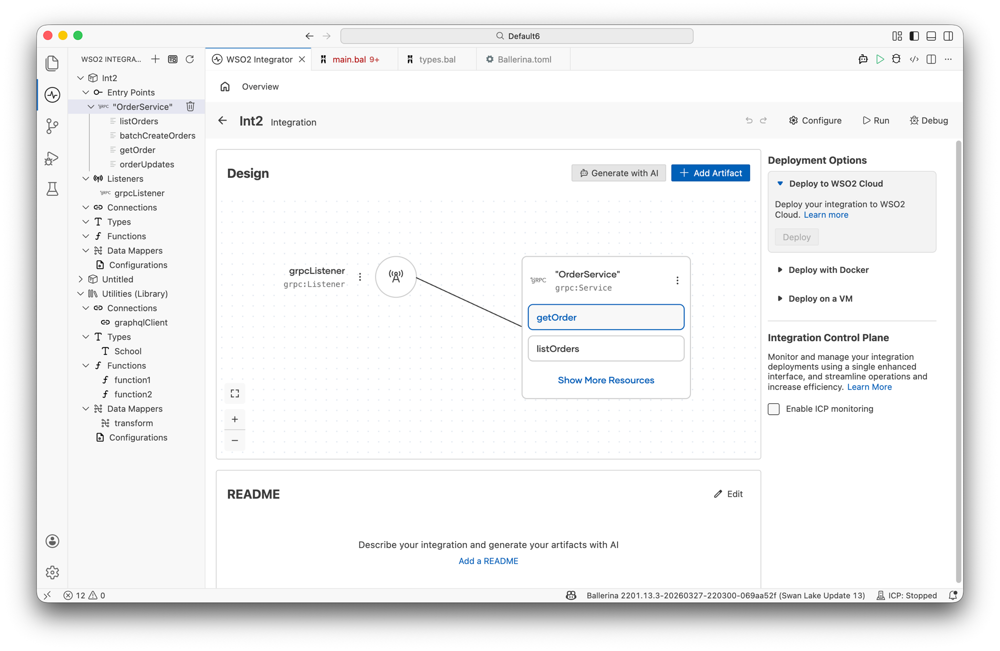
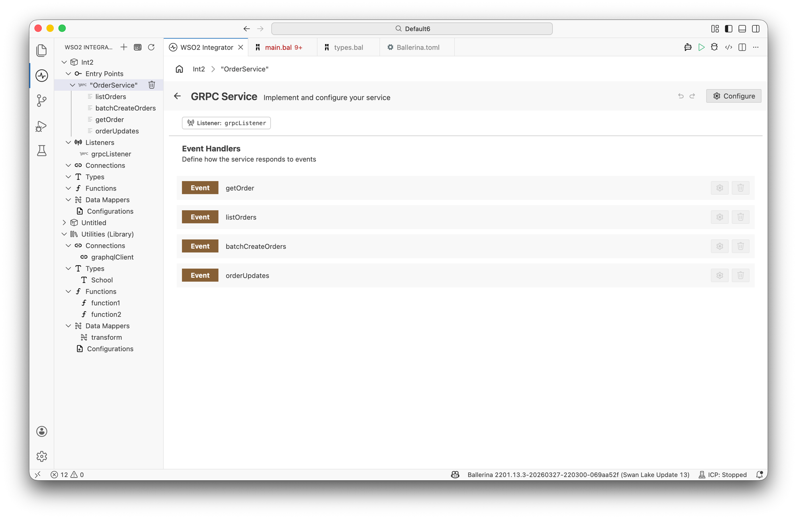
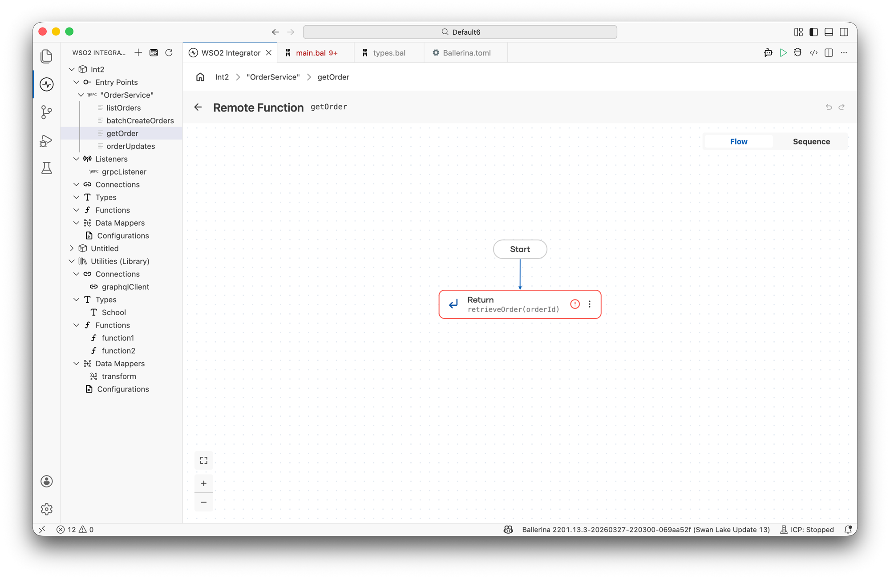

# gRPC Service

gRPC services use Protocol Buffers (protobuf) to define strongly-typed contracts and support four communication patterns: unary, server streaming, client streaming, and bidirectional streaming. WSO2 Integrator generates Ballerina service stubs from your `.proto` files, which you implement using Ballerina code.

:::note
Creating a gRPC service requires Ballerina code. Once the service exists, you can use the visual designer to implement logic for individual remote functions.
:::

## Creating a gRPC service

Generate a Ballerina service stub from your `.proto` file using the `bal grpc` tool, then implement the generated remote functions.

```ballerina
import ballerina/grpc;

configurable int port = 9090;

listener grpc:Listener grpcListener = new (port);

@grpc:Descriptor {value: PRODUCT_SERVICE_DESC}
service "ProductService" on grpcListener {

    remote function getProduct(string id) returns Product|error {
        return findProduct(id);
    }
}
```

The `@grpc:Descriptor` annotation and the descriptor constant (`PRODUCT_SERVICE_DESC`) are generated automatically by the `bal grpc` tool — you do not write them manually.

## Generating code from a proto file

Use the `bal grpc` command to generate Ballerina service stubs from a `.proto` definition:

```bash
bal grpc --input order_service.proto --output gen/ --mode service
```

This generates two files in the output directory:

| File | Contents |
|---|---|
| `OrderService.bal` | Service interface with all RPC remote functions to implement |
| `order_service_pb.bal` | Message types and the descriptor constant required by `@grpc:Descriptor` |

## RPC communication patterns

| Pattern | Request | Response | Use case |
|---|---|---|---|
| **Unary** | Single message | Single message | Standard CRUD operations |
| **Server streaming** | Single message | Stream of messages | Large result sets, real-time feeds |
| **Client streaming** | Stream of messages | Single message | Bulk uploads, batch inserts |
| **Bidirectional streaming** | Stream of messages | Stream of messages | Chat, real-time collaboration |

## Implementing service logic

Implement each RPC method as a `remote function` inside the generated service. The function signature depends on the communication pattern defined in the proto file.

```ballerina
@grpc:Descriptor {value: ORDER_SERVICE_DESC}
service "OrderService" on grpcListener {

    // Unary — single request, single response
    remote function getOrder(string orderId) returns Order|error {
        return retrieveOrder(orderId);
    }

    // Server streaming — single request, stream of responses
    remote function listOrders(OrderFilter filter) returns stream<Order, error?> {
        return streamOrders(filter);
    }

    // Client streaming — stream of requests, single response
    remote function batchCreateOrders(stream<Order, grpc:Error?> orders)
            returns BatchResult|error {
        return processBatch(orders);
    }

    // Bidirectional streaming — stream of requests and responses
    remote function orderUpdates(stream<OrderRequest, grpc:Error?> requests)
            returns stream<Order, error?> {
        return handleUpdates(requests);
    }
}
```

## Designing logic with the visual designer

Although gRPC service creation is not supported in the visual designer, you can use it to implement logic for remote functions defined in code. Once a gRPC service exists in the project, it appears in the **Entry Points** sidebar and on the design canvas.



Click the service node on the canvas (or click the service name in the sidebar) to open the **gRPC Service** designer, which lists all remote functions as event handlers.



Click any handler row (for example, `getOrder`) to open its **flow designer view**, where you can define the integration logic visually.



:::note
Not all gRPC service configuration options are available through the visual designer. For full control — including listener configuration and descriptor settings — use Ballerina code directly.
:::

## For more details

See the [Ballerina gRPC specification](https://ballerina.io/spec/grpc/) for the complete language-level reference, including advanced configuration, TLS, authentication, and interceptors.
